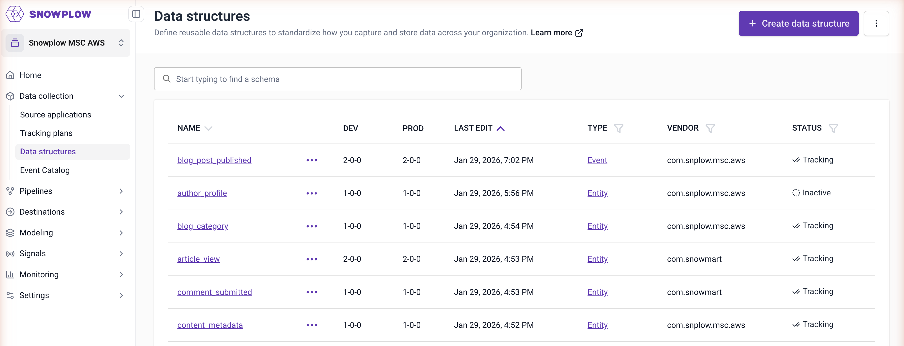
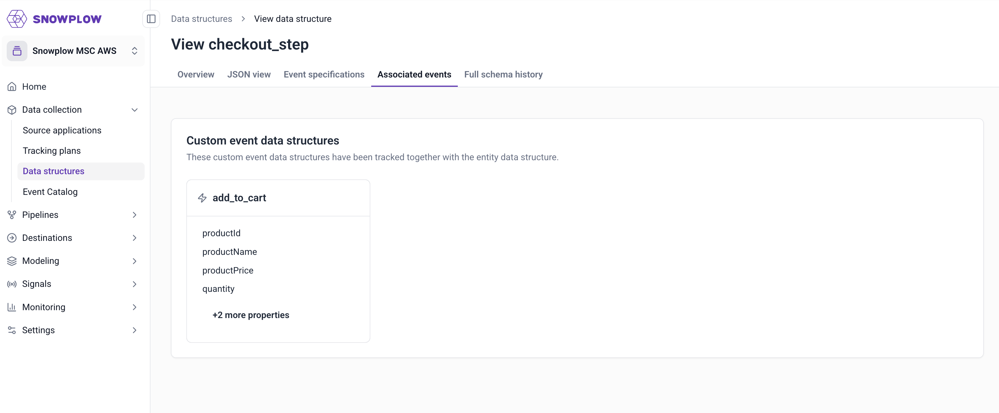

We have made two updates to simplify how you design and manage your tracking in Snowplow Console: renaming Data Products to Tracking Plans, and merging the Tracking Catalog functionality into Data Structures.

## What's changed

### Data Products are now Tracking Plans

Data Products have been renamed to Tracking Plans across the Snowplow platform. This includes the Console interface, documentation, and support materials. The feature previously known as Data Product Studio is now Event Studio.

We're making these changes to align with how you think about and use these features. "Tracking plans" matches industry-standard terminology, and “Event Studio” more clearly describes what it does: where you design and manage your tracking implementation.

Your existing tracking plans, workflows, and data remain unchanged. This is a naming update only.

### Tracking Catalog merged into Data Structures

Tracking Catalog has been removed from the navigation bar. Its functionality is now available directly within the Data Structures list view, giving you immediate visibility into which schemas are being tracked without navigating to a separate area.

You can now:

* **Filter by tracking status**: Use the filter options to show only schemas that are Tracking (received data in the last 90 days) or Inactive (no data received in the last 90 days).
* 
* **View associated schemas**: Each data structure now includes a tab showing schemas that have been sent within the same event payload. For events, this tab is called Associated entities. For entities, it is called Associated events.

