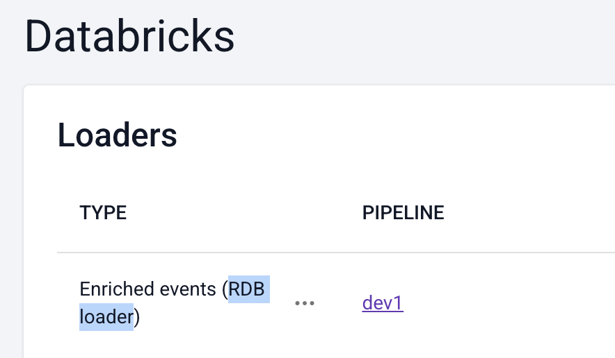
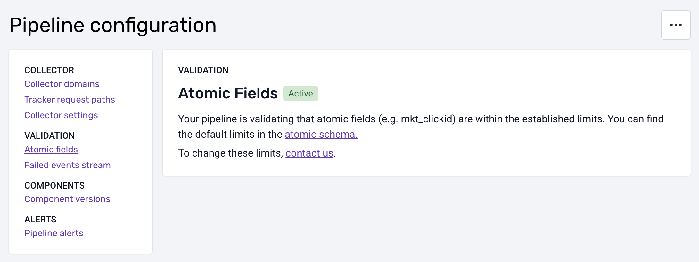

> **This notice only applies to Databricks customers using RDB Loader.**
>
> **It does NOT apply to customers using Lake Loader (e.g. any Azure customers).**

On June 9, 2025, we are making a change to how your data is stored in Databricks. You might need to ensure that your downstream models are compatible with this change, depending on your pipeline settings (see below).

## Applicability

The changes only apply to RDB Loader, and only if your Databricks destination was set up before September 2024. You can check which loader you have by going to [Destinations](https://console.snowplowanalytics.com/destinations) in the Console:

* If there is no “Databricks” destination in the “added” tab (and there is a “Delta” destination instead), then you are using Lake Loader and this notice does not apply to you.
* If there is a “Databricks” destination, check whether you have RDB Loader under it. If so, read on.

## Context

In Snowplow data, many atomic fields, e.g. `mkt_clickid`, have length limits. Up until September 2024, we’ve always applied these limits when creating Databricks columns, e.g. `mkt_clickid VARCHAR(128)`.

Some of these limits, however, are not ideal. For example, these days, `mkt_clickid` is in practice often longer than 128 characters. Because of this, we are introducing a way to increase the limits.

To make the limits flexible and configurable via Console, we must apply them during event validation in the pipeline, rather than in the warehouse. (This would also benefit other destinations like event forwarding.)

## The change

In order for you to benefit from configurable limits in the future, we will first need to remove the limits in Databricks, i.e. change from VARCHAR(128) to STRING.

This can affect your data models or other applications downstream of Databricks.

## Determining if you are affected

For each pipeline loading data into Databricks, navigate to “Pipeline configuration” in Console and select “Atomic fields” under “Validation”.

### If validation is enabled (active)

The length limits of atomic fields are are already enforced by your pipeline. For example, any `mkt_clickid` value above 128 characters would be rejected and would result in a failed event.

This means that we can safely remove the limits in Databricks, as no oversized data will reach it.

You only need to accommodate this change if you’d like to increase any of the default limits (now or later). Refer to the steps described below to make sure your data models and any other downstream applications work with larger strings.

### If validation is not enabled

Validation of atomic fields is a newer feature and historically, the limits were not enforced during validation. To prevent errors with overly long string values, your Databricks Loader is currently configured to truncate oversized atomic fields to match the limit in the warehouse. For example, any `mkt_clickid` value would be truncated to 128 characters.

Truncation is not an ideal solution, as it can discard useful data. And truncation does not allow to configure the limits. We recommend to enable validation in the pipeline instead. Future integrations with Databricks will not support truncation.

You will need to accommodate the change to the Databricks columns to make sure that your data models and downstream applications can deal with larger strings without truncation.

## Accommodating the change

### dbt

If you are using our dbt models, then they are already prepared for this and there is no action needed.

### Custom models

You will need to review any custom data models, views or tables downstream of your Databricks atomic events table and ensure that they are not imposing limits on the atomic fields.

---

In case of any doubt, please don’t hesitate to contact us at [support@snowplow.io](mailto:support@snowplow.io).
