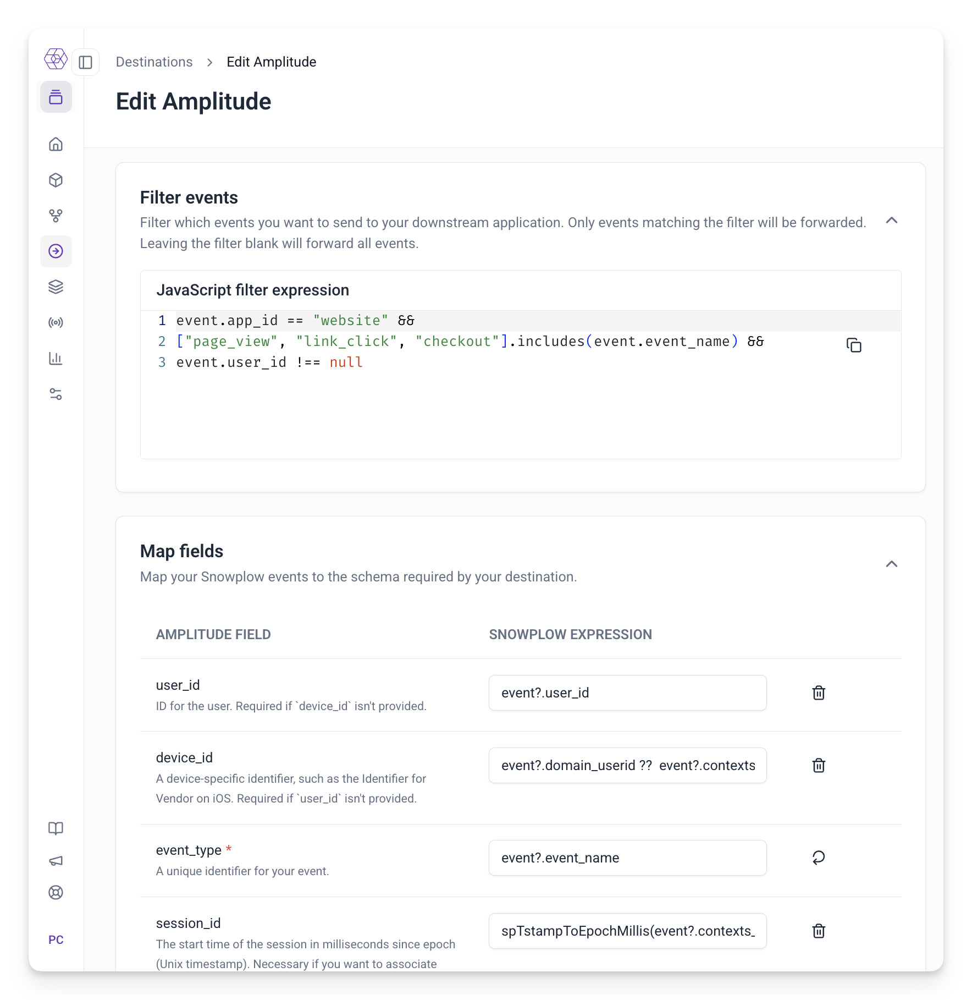
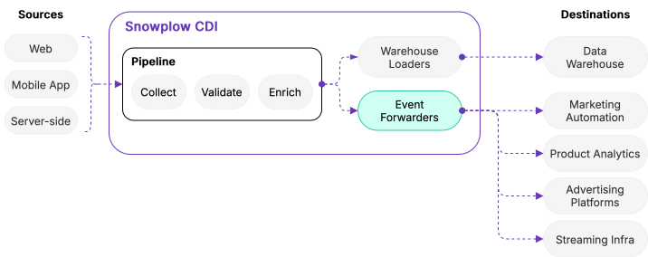

We're excited to announce that self-service Event Forwarding is now generally available. You can now configure and deploy real-time event delivery to third-party platforms directly within Snowplow Console.

## What's new

**Self-service configuration** – create and deploy event forwarders directly in Console. Define filters, apply field mappings with JavaScript expressions, and monitor delivery—no custom code or separate infrastructure required.

**Out-of-the-box integrations** – Braze and Amplitude destinations are now available with pre-configured field mappings and retry logic. We'll be adding support for additional destinations regularly.

**Real-time delivery** – events flow from your Snowplow collector to destination APIs with end-to-end latency measured in seconds. All events pass through existing schema validation and enrichment before delivery.

## How it works

Event forwarders consume events from your enriched stream (Kinesis, Pub/Sub, or EventHub), apply filters to determine which events to forward, transform matching events using pre-defined or custom field mapping logic, and deliver to destination APIs with automatic retry handling for transient failures.

Forwarders run as managed [Snowbridge ](/docs/api-reference/snowbridge/)apps within your Snowplow cloud account, deployed alongside your existing warehouse loaders.

## What you can use it for

Event forwarding works best for use cases where you events delivered with low latency and want to optionally apply per-event transformations and filters:

* **Product analytics** – forward user actions to analytics tools for product insights and testing platforms real-time optimization
* **Marketing engagement triggers** – send events to marketing automation and customer engagement platforms for immediate campaign triggers
* **Internal streaming infrastructure** – forward events to power internally built real-time analytics, fraud detection, or personalization apps and services

## Availability

Event Forwarding is available for Snowplow Cloud and Private Managed Cloud customers running pipelines on AWS or GCP.

For more information, see the [Event Forwarding documentation](/docs/destinations/forwarding-events/) or contact your account team for a demo.
