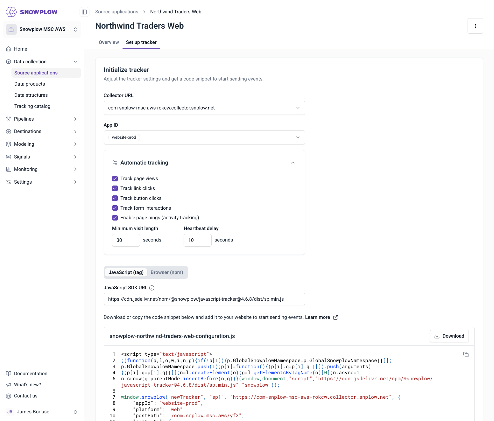

We have released a new Source Application Setup tab that simplifies tracker initialization for JavaScript implementations allowing you to start tracking Snowplow events in minutes. This feature provides a guided configuration experience directly in Console, generating ready-to-use tracking code snippets based on your selections, configurable automatic tracking, and setting of global entities..

## Key Capabilities

The Setup tab enables you to configure your JavaScript tracker without leaving Console. As you adjust settings, the code snippet updates in real time, ready to copy and integrate into your website or application.

* **Tracker initialization:** allows you to select your Collector URL from available endpoints and choose which App ID to initialize the tracker with from your associated IDs.
* **Automatic tracking configuration:** provides toggles to enable or disable out-of-the-box tracking features including page views, link clicks, button clicks, form interactions, and page pings.
* **Implementation options:** let you choose between a tag-based implementation using a script tag or a package-based implementation.

## Getting Started

To use the Setup tab when creating a new source application:

1. Navigate to **Source applications** and select **Create source application**.
2. Select **JavaScript** from the **Tracker** dropdown.
3. Complete the remaining fields including name, owner, and associated App IDs.
4. After creating the source application, open the **Setup** tab.
5. Configure your tracker initialization settings, automatic tracking preferences, and implementation type.
6. Copy the generated code snippet and add it to your website or application.

For existing source applications, you can edit the source application to specify JavaScript as the tracker type. Once saved, the Setup tab becomes available with the code generation functionality.
