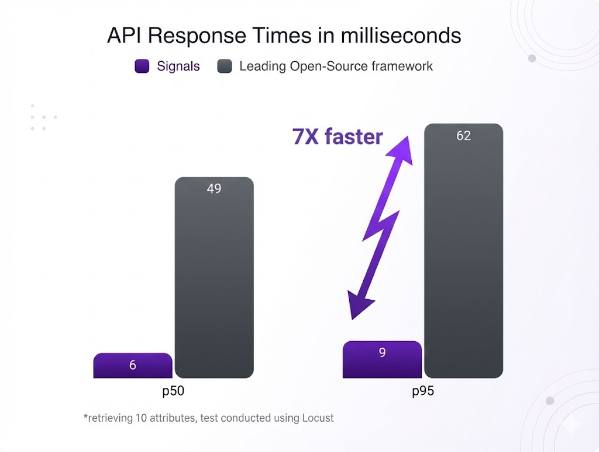
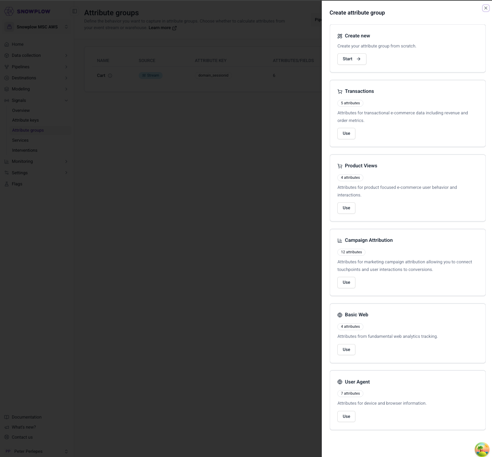
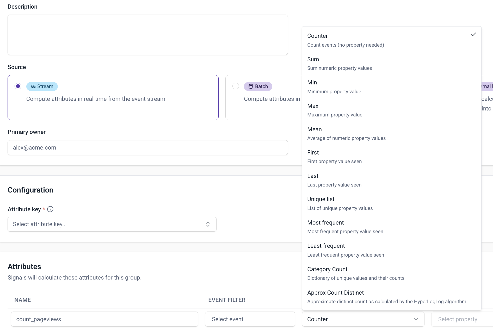
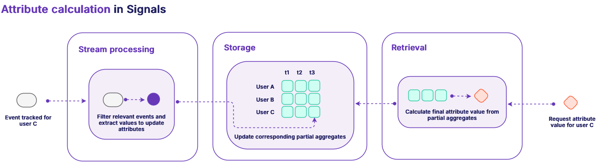

We're continuing to invest in Signals to make it faster, more powerful, and easier to use. This release adds templated attribute groups, new aggregation functions and filtering criteria, improved windowing accuracy, and Profiles API performance optimizations.

##

### **10X Latency Reduction in Profiles API**

The Signals Profiles API has been rearchitected for faster response times when retrieving customer attributes at scale. This enables more responsive real-time personalization experiences e.g. deciding on which content to serve users before the page has loaded.

Early testing shows a \~10X improvement in **latency,** bringing us to **sub-10ms p95 latency** for simple attribute retrievals (larger attribute groups with longer windows might see slightly higher latency). This puts us well ahead of open-source feature store frameworks. No code changes or configuration updates are required.

###

### **Templated Attribute Groups**

Templated Attribute Groups provide pre-built attribute configurations for common use cases. Instead of manually configuring individual attributes, apply a template to generate a complete attribute set. This reduces initial setup time from hours to minutes.

Available templates include:

* **Transactions** (5 attributes) - Transactional and e-commerce data including revenue and order metrics

* **Product Views** (4 attributes) - Product-focused e-commerce behavior and interactions

* **Campaign Attribution** (12 attributes) - Marketing campaign attribution connecting touchpoints to conversions

* **Basic Web** (4 attributes) - Fundamental web analytics tracking

* **User Agent** (7 attributes) - Device and browser information

All generated attributes can be customized after creation, and apply to both stream and batch use-cases.

###

### **New Aggregation Functions and Filtering Criteria**

The Signals attribute engine now supports four new aggregation functions and two new filtering criteria. These enable new categories of real-time behavioral analysis that were previously difficult to compute.

**New aggregation functions:**

* `most_frequent` / `least_frequent` - Identify the most or least common value (e.g., preferred product category, most-viewed content type)

* `category_count` - Count distinct categories (e.g., number of different product categories explored)

* `approx_count_distinct` - Approximate count of unique values (e.g., unique pages visited)

**New filtering criteria:**

* `is_null` / `is_not_null` - Filter based on presence or absence of data (e.g., customers who have never completed a purchase)

**Example use-cases:**

* Cross-sell recommendations based on category breadth: Identify customers who have browsed 5+ product categories but purchased from only one, then recommend products from their browsed categories

* Channel preference optimization: Detect when a customer's most frequent browsing device (mobile) differs from their purchase device (desktop), then optimize the mobile-to-desktop handoff

* Engagement gap identification: Use `is_null` to find customers who have added items to cart but never completed checkout, triggering cart abandonment workflows

* Content affinity scoring: Calculate `category_count` of viewed content types to segment users by interest breadth (specialists vs. browsers)

### **Improved Windowed Attribute Accuracy**

Windowed attributes (e.g., "last 7 days" or "last 30 days") previously processed only the most recent 100 events, which could cause inaccuracy for high-activity customers or longer time windows. They also only updated when a new event was received rather than at query time, meaning often the API would return stale values.

The new implementation removes this limitation by calculating 'partial aggregates' inside the profile store, and then aggregating at read-time. This means that windowed attributes now maintain accuracy regardless of event volume or window length. This ensures your most active customers—often your most valuable—receive accurate engagement scoring and behavioral analysis. For example, "page views in the last 30 days" now correctly counts all page views in that window, even for users generating thousands of events.

## **Availability**

All features are available now in Snowplow Signals. See the documentation for updates.

For questions or feedback, contact your account team or request a demo.
