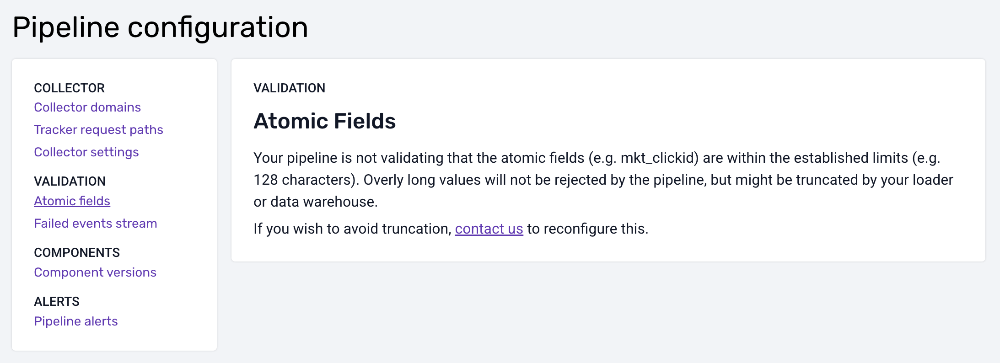

> **This notice only applies to Snowflake customers.**

On March 10, 2025, we are making a change to how your data is stored in Snowflake. You might need to ensure that your downstream models are compatible with this change, depending on your pipeline settings (see below).

## Context

In Snowplow data, many atomic fields, e.g. `mkt_clickid`, have length limits. We’ve always applied these limits when creating Snowflake columns, e.g. `mkt_clickid VARCHAR(128)`.

Some of these limits, however, are not ideal. For example, these days, `mkt_clickid` is in practice often longer than 128 characters. Because of this, we are introducing a way to increase the limits.

To make the limits flexible and configurable via Console, we must apply them during event validation in the pipeline, rather than in the warehouse. (This would also benefit other destinations like event forwarding.)

## The change

In order for you to benefit from configurable limits in the future, we will first need to remove the limits in Snowflake, i.e. change from VARCHAR(128) to VARCHAR. (Note that as per [Snowflake documentation](https://docs.snowflake.com/en/user-guide/table-considerations#when-to-specify-column-lengths), there is no performance impact of doing so.)

This can affect your data models or other applications downstream of Snowflake.

## Determining if you are affected

For each pipeline loading data into Snowflake, navigate to “Pipeline configuration” in Console and select “Atomic fields” under “Validation”.

### If validation is enabled (active)

The length limits of atomic fields are are already enforced by your pipeline. For example, any `mkt_clickid` value above 128 characters would be rejected and would result in a failed event.

This means that we can safely remove the limits in Snowflake, as no oversized data will reach it.

You only need to accommodate this change if you’d like to increase any of the default limits (now or later). Refer to the steps described [below](#accommodating-the-change) to make sure your data models and any other downstream applications work with larger strings.

### If validation is not enabled

Validation of atomic fields is a newer feature and historically, the limits were not enforced during validation. To prevent errors with overly long string values, your Snowflake Loader is currently configured to truncate oversized atomic fields to match the limit in the warehouse. For example, any `mkt_clickid` value would be truncated to 128 characters.

Truncation is not an ideal solution, as it can discard useful data. And truncation does not allow to configure the limits. We recommend to enable validation in the pipeline instead. Future versions of the Snowflake Loader, including the latest Snowflake Streaming Loader, will not support truncation.

You will need to accommodate the change to the Snowflake columns to make sure that your data models and downstream applications can deal with larger strings without truncation.

## Accommodating the change

### dbt

If you are using our dbt models, then they are already prepared for this and there is no action needed.

### SQL Runner

If you are using our SQL Runner models, we strongly recommend moving to the dbt models as soon as possible, as SQL Runner models have not been actively maintained for some time and will be fully deprecated in the future.

That said, we have prepared an update that illustrates the changes that you will need to make to any SQL Runner models still in place by March 10, 2025. This [Pull Request](https://github.com/snowplow/data-models/pull/146) and the accompanying migration scripts ([web](https://github.com/snowplow/data-models/blob/master/web/v1/snowflake/sql-runner/sql/standard/99-migrations/1.0.3-migration/alter-tables.sql) and [mobile](https://github.com/snowplow/data-models/blob/master/mobile/v1/snowflake/sql-runner/sql/standard/99-migrations/1.1.1-migration/alter-tables.sql)) will alter all the standard columns used internally by the models.

If you have modified these models, you will need to identify any other columns with `VARCHAR` limits and alter them to remove the limits.

### Custom models

You will need to review any custom data models, views or tables downstream of your Snowflake atomic events table and ensure that they are not imposing limits on the atomic fields.

---

In case of any doubt, please don’t hesitate to contact us at [support@snowplow.io](mailto:support@snowplow.io).
