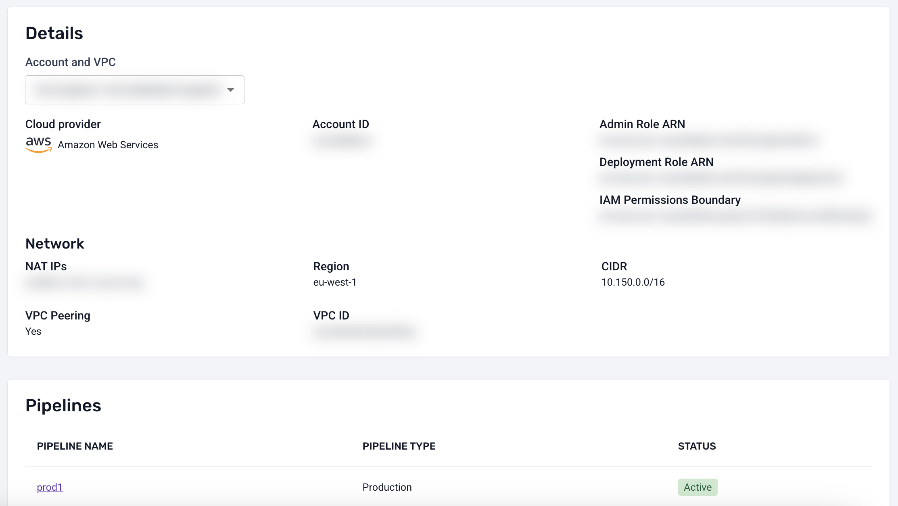
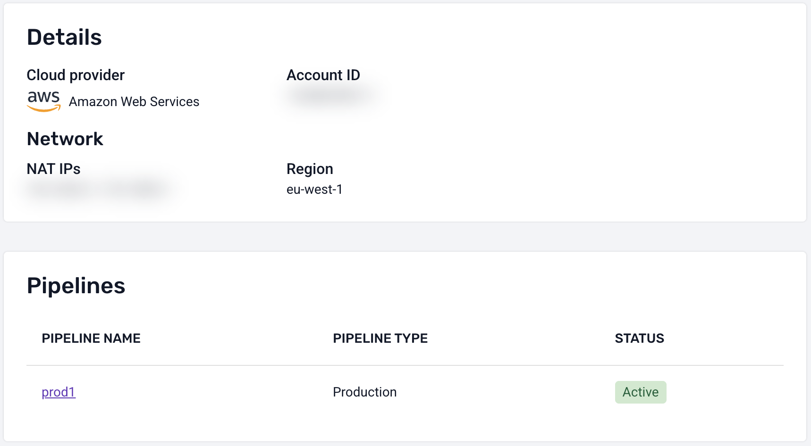

> **This update only applies to Snowplow CDI customers.**

It is sometimes useful to revisit key details of your cloud account (AWS, GCP, Azure) associated with Snowplow. For example, the NAT (Network Address Translation) IP addresses often need to be added to an allow list in your warehouse.

The cloud account and network details are part of the concept of a Snowplow _workspace_, which also includes all your pipelines deployed in that account and network.

To make it easy to see this information for each workspace, we’ve added a new “Workspaces” page (in the “Account” section of the sidebar). Customers on PMC (Private Managed Cloud) can see additional data related to networking and permissions.

|                            |                              |
| -------------------------- | ---------------------------- |
|  |  |
| Private Managed Cloud view | Cloud (SaaS) view            |

In the future, we will be extending this page to allow managing certain aspects of your setup (e.g. adding pipelines).
