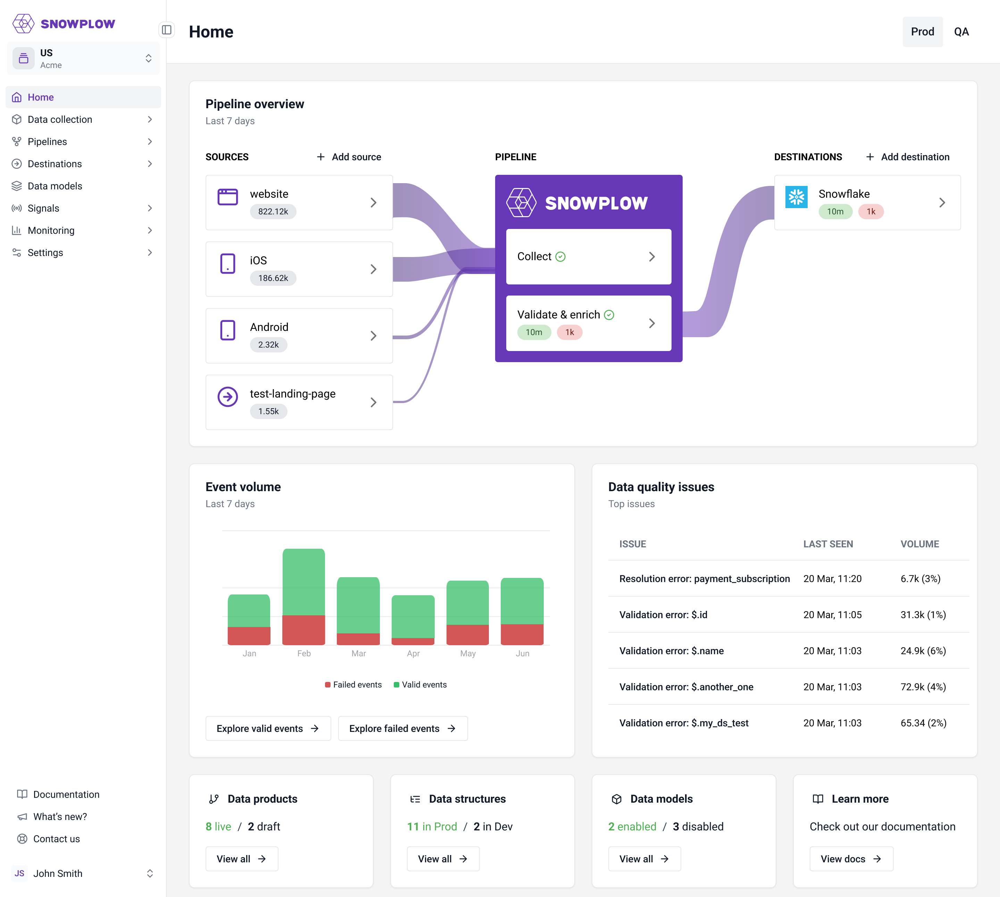

Snowplow has launched a new version of the Console. Changes include:

* **New home page:** this provides you with key insights and alerts about your Snowplow setup and a starting point for many workflows
* **Updated sidebar navigation:** we have streamlined and renamed the list of pages, with the goal of prioritizing the most frequently accessed pages.
* **New design system:** we have added new components and styling to provide a clearer and more consistent visual interface

Overall we expect these changes will make the Snowplow Console more intuitive and easier to use for common workflows. The changes to the sidebar will mean that some of your familiar pages have been moved, see a summary below:

* Data Product Studio is renamed to Data Collection
* Monitoring has been introduced as a new section
* Pipelines now have a page per pipeline
* Data Models are moved into their own section
* Environments, Sources Catalog and Infrastructure Overview pages are deprecated

Redirects have been added so old URLs will continue to work. Here’s a detailed list of the locations of each page in the old vs the new navigation:

| Page                   | Old section                    | New section               |
| ---------------------- | ------------------------------ | ------------------------- |
| Home                   | -                              | Home                      |
| Source applications    | Data Product Studio            | Data Collection           |
| Data products          | Data Product Studio            | Data Collection           |
| Data structures        | Data Product Studio            | Data Collection           |
| Data models            | Data Product Studio            | Data Models               |
| Tracking catalog       | Data Product Studio            | Data Collection           |
| Reverse ETL            | Extensions                     | Destinations              |
| Environments           | Infrastructure                 | \{Deprecated\}              |
| Jobs                   | Infrastructure                 | Monitoring                |
| Sources catalog        | Infrastructure                 | \{Deprecated\}              |
| Destinations           | Infrastructure                 | Destinations              |
| Connections            | Infrastructure                 | Destinations              |
| Failed Event Recovery  | Infrastructure                 | Monitoring → Data Quality |
| Overview               | Pipeline: \{Your Pipeline Name\} | Pipelines → Prod/QA       |
| Enrichments            | Pipeline: \{Your Pipeline Name\} | Pipelines → Prod/QA       |
| Failed Events          | Pipeline: \{Your Pipeline Name\} | Monitoring → Data Quality |
| Infrastructure         | Pipeline: \{Your Pipeline Name\} | \{Deprecated\}              |
| Collection Volumes     | Pipeline: \{Your Pipeline Name\} | Monitoring                |
| Pipeline Configuration | Pipeline: \{Your Pipeline Name\} | Pipelines → Prod/QA       |
| Workspaces             | Account                        | Settings                  |
| Users                  | Account                        | Settings                  |
| Manage organization    | Account                        | Settings                  |

If you have any questions or concerns about this change, please contact our support team.
