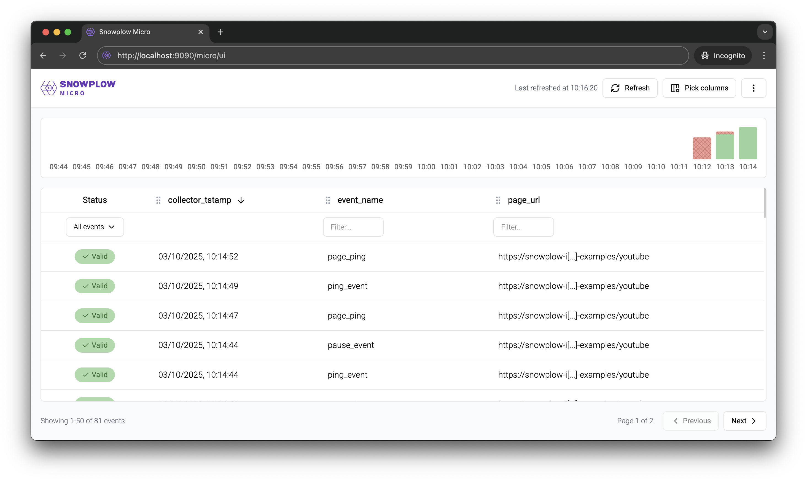

Snowplow Micro is a convenient and super-portable tool for testing and debugging your tracking code, enrichments, and so on. Over the past weeks, we’ve released Micro 2.4.0, 3.0.0 and 3.0.1.

Here’s what’s new.

## Revamped user interface

The new interface addresses a few common pain points. Highlights:

* We’ve increased information density, so that more data fits into a single screen.
* Data format for valid and failed events now more closely matches what you see in the warehouse or in Snowbridge / Event Forwarding.
* In the events table, you can configure any number of custom columns, including `contexts_...` and `unstruct_event_...` or their top-level fields. This is handy for reviewing your custom events and entities at a glance.
* Getting to the relevant part of an event (or failure) is much quicker.

Check the [documentation](/docs/testing/snowplow-micro/ui/) for a quick overview video.

## New output options

You could already use `--output-tsv` to output enriched events in TSV format. Micro 2.4.0 added a couple of new options:

* `--output-json` outputs JSON events (the same format as with our [Analytics SDK](/docs/api-reference/analytics-sdk/)s)
* `--destination` allows to send data to any HTTP endpoint, in either TSV or JSON format

The latter option also allows to use Micro in conjunction with Snowbridge, making it easier to test Snowbridge integrations locally. Refer to [this guide](/docs/api-reference/snowbridge/testing/#using-docker-compose) for more details.

## Shortcut for enabling the YAUAA enrichment

The YAUAA (Yet Another User Agent Analyzer) enrichment is one of the most useful ones, so we’ve added the `--yauaa` [option](/docs/testing/snowplow-micro/local/enrichments/) to enable it without having to provide a configuration file.
