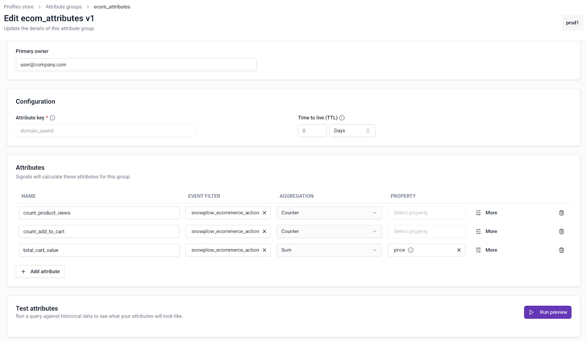
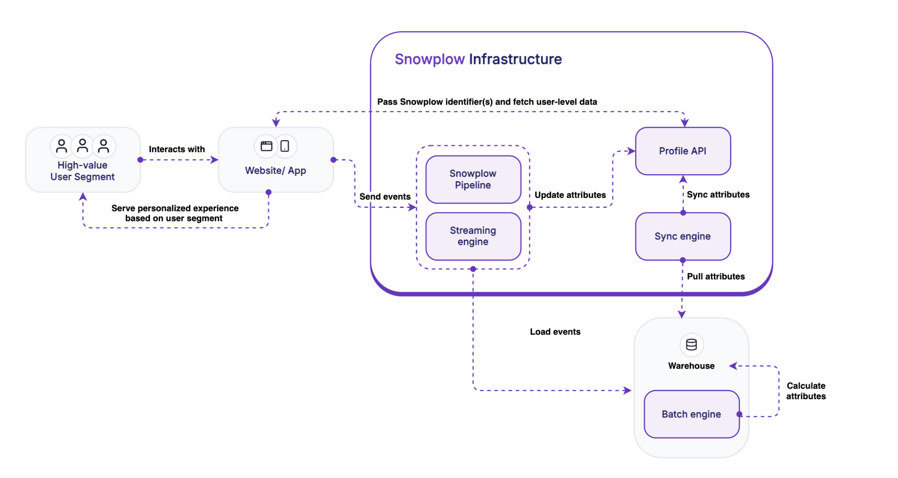

Snowplow Signals is now generally available. Signals is a real-time customer intelligence system that computes and serves user context. With Signals, you can power in-session personalization, recommendations engines, adaptive UIs, and agentic experiences like AI copilots and chatbots — without spending months or years building and maintaining the underlying infrastructure yourself.

The new release includes:

### Multi-cloud and multi-warehouse support

* **Cloud platforms**: AWS and GCP deployments with identical developer experience
* **Data warehouses**: Native integration with Snowflake and BigQuery for batch processing (Databricks support coming soon)

### No-code UI in Snowplow Console

Product managers and engineers can manage Signals directly in the Snowplow UI without writing code. This includes:

* Self-service deployment flows
* User attribute management interface
* Configuration and monitoring tools

The Python SDK is available for teams that prefer code-based workflows.

### Production-grade performance

The Profiles API delivers 45ms p50 response times, enabling in-session personalization use cases like:

* Dynamic pricing and offers
* Contextual product recommendations
* AI agent responses with real-time user context

### Live debugging with Snowplow Inspector

Debug and validate your personalization logic in real time using the Snowplow Inspector integration.

### Components

Signals includes several core components:

* **Streaming engine**: Calculates real-time user attributes from live event streams (for example, current page views or cart status)
* **Batch engine**: Computes historical user attributes from warehouse data using ML models (for example, lifecycle stage or propensity scores)
* **Profiles store:** Stores and serves user profiles at low latency to your applications
* **Interventions**: Triggers real-time actions in your application based on user behavior

### Getting started

If you'd like to trial Signals, contact your Customer Success Manager or reach out to [support@snowplow.io](mailto:support@snowplow.io).

For detailed implementation guidance, see the [Signals documentation](/docs/signals/).
