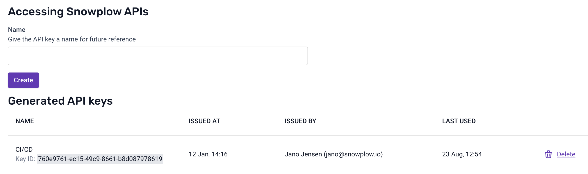
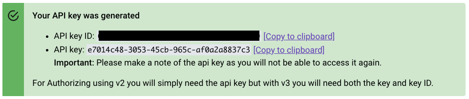

Manage your account configuration and users using the Snowplow Console. You can also use the underlying API directly. This page describes how to acquire an API key.

## Credentials API

The API that drives Console's functionality is [publicly documented](https://console.snowplowanalytics.com/api/msc/v1/docs/index.html?url=/api/msc/v1/docs/docs.yaml) and available for customers to invoke via code. All calls to it need to be properly authenticated using JSON Web Tokens (JWT) that can be acquired via the Credentials API.

The following view is available in [Console](https://console.snowplowanalytics.com/), under **Settings** in the navigation bar, then **Manage organization**, then **API keys for managing Snowplow**. Users can view this page only if they have the "view" permission on API keys.



API keys generation view

You can create multiple API keys, and it's also possible to delete any key. When a new API key is generated, the following view will appear:



Newly created API key view

Both the API key ID and API key are required. The API key functions like a combination of a username and password, and should be treated with the same level of security. Once you have an API key and key ID, exchanging it for a JWT is straightforward. For example, using curl, the process would look like this:

```bash
curl \
  --header 'X-API-Key-ID: <API_KEY_ID>' \
  --header 'X-API-Key: <API_KEY>' \
  https://console.snowplowanalytics.com/api/msc/v1/organizations/<ORGANIZATION_ID>/credentials/v3/token
```

You can find your Organization ID [on the _Manage organization_ page](https://console.snowplowanalytics.com/settings) in Console.

The curl command above will return a JWT as follows:

```json
{ "accessToken": "<JWT>" }
```

You can then use this access token to supply authorization headers for subsequent API requests:

```bash
curl --header 'Authorization: Bearer <JWT>'
```


### Previous versions

A previous version of the token exchange endpoint is still available, only requiring the API key: 

```bash
curl \
  --header 'X-API-Key: <API_KEY>' \
  https://console.snowplowanalytics.com/api/msc/v1/organizations/<ORGANIZATION_ID>/credentials/v2/token
```

While this method will continue to work, the endpoint is now deprecated and will be removed in the future. Use the v3 endpoint detailed above instead.
