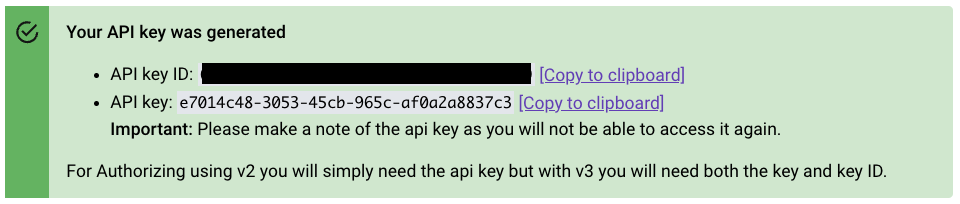

Manage your account configuration and users using the Snowplow BDP Console. You can also use the underlying API directly. This page describes how to acquire an API key.

## Credentials API

The API that drives BDP Console's functionality is [publicly documented](https://console.snowplowanalytics.com/api/msc/v1/docs/index.html?url=/api/msc/v1/docs/docs.yaml) and available for our customers to invoke via code. All calls to it need to be properly authenticated using JSON Web Tokens (JWT) that can be acquired via the Credentials API.

The process for creating a key has been improved over time. We recommend using the v3 process.


### Version 3

The following view is available to all customers under [BDP Console settings](https://console.snowplowanalytics.com/credentials):


API keys generation view

You can create multiple API keys, and it's also possible to delete any key. When a new API key is generated, the following view will appear:



Newly created API key view

In v3, both the API key ID and API key are required. The api key functions like a combination of a username and password, and should be treated with the same level of security. Once you have an API key and key ID, exchanging it for a JWT is straightforward. For example, using curl, the process would look like this:

```bash
curl \
  --header 'X-API-Key-ID: <API_KEY_ID>' \
  --header 'X-API-Key: <API_KEY>' \
  https://console.snowplowanalytics.com/api/msc/v1/organizations/<ORGANIZATION_ID>/credentials/v3/token
```

You can find your Organization ID [on the _Manage organization_ page](https://console.snowplowanalytics.com/settings) in Console.

The curl command above will return a JWT as follows:

```json
{"accessToken":"<JWT>"}
```

You can then use this access token to supply authorization headers for subsequent API requests:

```bash
curl --header 'Authorization: Bearer <JWT>'
```


### Version 2


API keys generation view

It is possible to have multiple different keys, and deletion of a key is also possible. When a new API key is created, the following view shows up:


Showing a newly created API key

This is a secret, equivalent to a username and a password combined, and should be handled as such at all times. As soon as you have an API key, it is straightforward to exchange it for a JWT. If you would do that using curl, it would look as follows:

```bash
curl \
  --header 'X-API-Key: <API_KEY>' \
  https://console.snowplowanalytics.com/api/msc/v1/organizations/<ORGANIZATION_ID>/credentials/v2/token
```

You can find your Organization ID [on the _Manage organization_ page](https://console.snowplowanalytics.com/settings) in Console.

The curl command above will return a JWT as follows:

```json
{"accessToken":"<JWT>"}
```

You may then use this access token value to supply authorization headers for subsequent API requests:

```bash
curl --header 'Authorization: Bearer <JWT>'
```

Authenticating with v2 only required the API key secret. While this method and the respective credentials will continue to work, we strongly advise you to use v3 detailed above.


### Version 1

Previously, BDP Console was using the Password authentication flow to support machine-to-machine (m2m) applications. Under that scenario a BDP customer had to create a bot user in their account, retrieve a client ID and a client secret, and use all three to acquire a JWT. Customers who have enabled these credentials in the past will see the following panel in their Console account settings:


Legacy Snowplow BDP credentials management

This method and the respective credentials still work for those who have been using them, however we strongly advise that customers upgrade to the current iteration where the only secret to be used by m2m applications is an API key which can be exchanged for a JWT.
