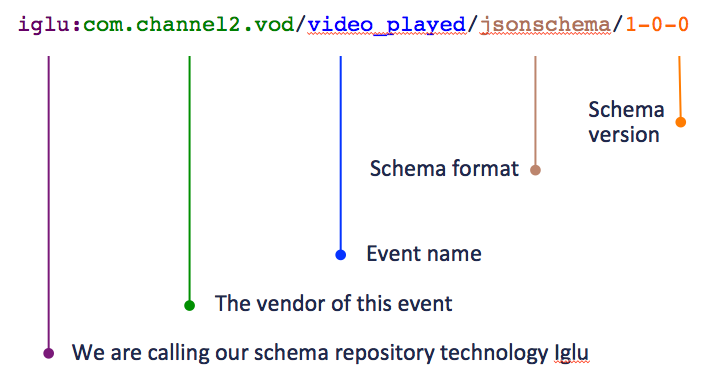

_This page is adapted from the Snowplow Analytics blog post, [Introducing self-describing JSONs](http://snowplowanalytics.com/blog/2014/05/15/introducing-self-describing-jsons/)._

In this section, we will be describing the approach we chose to link together a JSON with its JSON Schema in order to make it self-describing. Instead of embedding the JSON Schema directly into the JSON itself which would be very wasteful in terms of space, we chose only to store a reference to its JSON Schema.

For example, let's say we have a JSON representing a click on an ad like so:

```json
{
    "bannerId": "4acd518feb82"
}
```

which is supposed to conform to this [self-describing JSON Schema](/docs/api-reference/iglu/common-architecture/self-describing-json-schemas/index.md):

```json
{
    "$schema": "http://json-schema.org/schema#",
    "self": {
        "vendor": "com.snowplowanalytics",
        "name": "ad_click",
        "format": "jsonschema",
        "version": "1-0-0"
    },
    "type": "object",
    "properties": {
        "bannerId": {
            "type": "string"
        }
    },
    "required": ["bannerId"],
    "additionalProperties": false
}
```

Our self-describing JSON will look like this:

```json
{
    "schema": "iglu:com.snowplowanalytics/ad_click/jsonschema/1-0-0",
    "data": {
        "bannerId": "4acd518feb82"
    }
}
```

Notice the two main differences compared to our original JSON:

1. There is a new `schema` field located at the root of the JSON which contains (in a space-efficient format) all the information required to uniquely identify the associated JSON Schema. The schema's URI follows the following pattern:



1. The data contained in the original JSON has been encapsulated in a `data` field to prevent any accidental collisions should the JSON already have a `schema` field

This way, our JSON becomes de facto self-describing, embedding a link to its JSON Schema.

Back to [Common architecture](/docs/api-reference/iglu/common-architecture/index.md).
