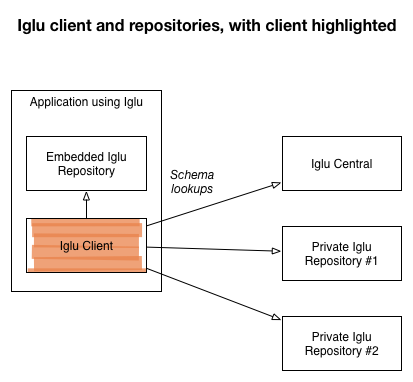

Iglu clients are used for interacting with Iglu server repos and for resolving schemas in embedded and remote Iglu schema repositories.

## Technical architecture

In this diagram we show an Iglu client resolving a schema from Iglu Central, one embedded repository and a further two remote HTTP repositories:

For more information on the rules governing resolving schemas from multiple repositories, see [Schema resolution](/docs/api-reference/iglu/common-architecture/schema-resolution/index.md).

## Available Iglu clients

There are currently three Iglu client libraries implemented:

| **Repo server** | **Description** | **Status** |
| --- | --- | --- |
| [Scala client](https://github.com/snowplow/iglu-scala-client) | An Iglu client and resolver for Scala | Production-ready |
| [Objc client](https://github.com/snowplow/iglu-objc-client) | An Iglu client and resolver for OSX | Unsupported |
| [Ruby client](https://github.com/snowplow/iglu-ruby-client) | An Iglu client and resolver for Ruby and JRuby | Unsupported |
