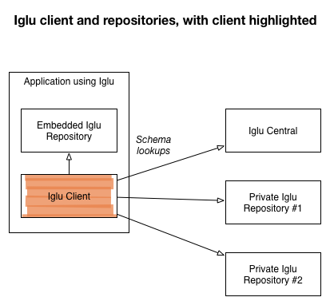

## Overview

**Iglu** is a machine-readable schema registry for [JSON](http://json-schema.org/) and Thrift schema. A schema registry is like npm, Maven, or Git but holds data schemas instead of software or code.

Iglu consists of three key technical aspects:

1. A [common architecture](/docs/api-reference/iglu/common-architecture/index.md) that informs all aspects of Iglu
2. [Iglu registries](/docs/api-reference/iglu/iglu-repositories/index.md) that can host a set of [self-describing JSON schemas](/docs/api-reference/iglu/common-architecture/self-describing-json-schemas/index.md)
3. [Iglu clients](/docs/api-reference/iglu/iglu-clients/index.md) that can resolve schemas from one or more Iglu registries

## Iglu explained

**Iglu** is built on a set of technical design decisions that allow Iglu clients and registries to interoperate. The key design components are:

- [Self-describing JSON schema](/docs/api-reference/iglu/common-architecture/self-describing-json-schemas/index.md): extensions to JSON schema that semantically identify and version a given JSON schema
- [Self-describing JSON](/docs/api-reference/iglu/common-architecture/self-describing-jsons/index.md): a standardized JSON format which co-locates a reference to the instance's JSON schema alongside the instance's data
- [SchemaVer](/docs/api-reference/iglu/common-architecture/schemaver/index.md): how we semantically version schemas
- [Schema resolution](/docs/api-reference/iglu/common-architecture/schema-resolution/index.md): our public algorithm for how we determine in which order we check Iglu registries for a given schema

**Iglu clients** are used for interacting with Iglu server repos and for resolving schemas in embedded and remote Iglu schema registries.

In the below diagram we show an Iglu client resolving a schema from Iglu Central, one embedded registry and a further two remote HTTP registries:

An **Iglu registry** acts as a store of data schemas. Hosting JSON schemas in an Iglu registry allows you to use those schemas in Iglu-capable systems such as Snowplow.

So far we support two types of Iglu registry:

- **Remote registries** - essentially websites containing schemas which an Iglu client can query over HTTP
- **Embedded registries** - which are embedded in a piece of software (typically alongside an Iglu client)

In the below diagram we show an Iglu client resolving a schema from Iglu Central, one embedded registry and a further two remote HTTP registries:

**Iglu Central** ([http://iglucentral.com](http://iglucentral.com/)) is a public registry of Snowplow JSON schemas.

Under the covers, Iglu Central is built and run as a **static Iglu registry**, hosted on Amazon S3.

> A **static repo** is simply an Iglu registry server structured as a static website.

The **deployment process** for Iglu Central is documented in [Iglu Central setup](/docs/api-reference/iglu/iglu-central-setup/index.md) in case you want to set up a public mirror or private instance of Iglu Central.
