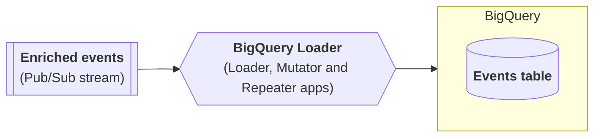
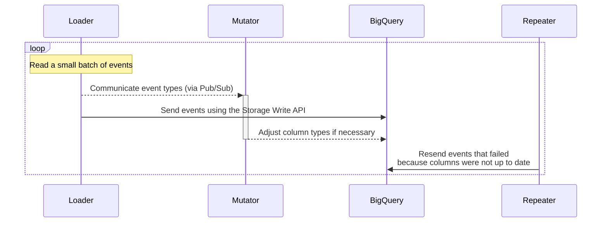

At the high level, BigQuery loader reads enriched Snowplow events in real time and loads them in BigQuery using the [legacy streaming API](https://cloud.google.com/bigquery/docs/streaming-data-into-bigquery). 

BigQuery loader consists of three applications: Loader, Mutator and Repeater. The following diagram illustrates the interaction between them and BigQuery:

