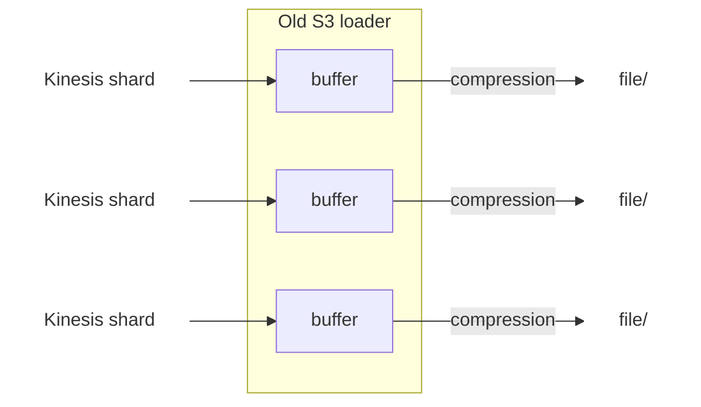
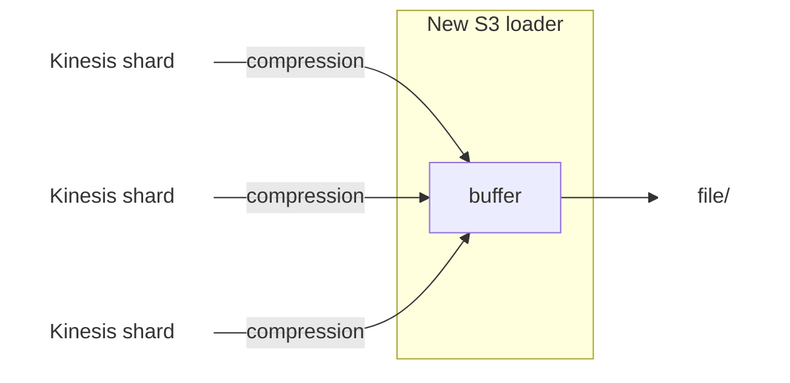

```mdx-code-block
import {versions} from '@site/src/componentVersions';
import CodeBlock from '@theme/CodeBlock';
```

S3 loader was using AWS SDK v1 which goes EOL at the end of 2025.
Bumping to AWS SDK v2 required a full rewrite of the app.

## Buffering

S3 loader buffers the events into memory before writing them to S3. There are 2 key differences between the previous loader and the new one:

- In the previous loader we had one buffer per Kinesis shard, each buffer getting written to one file. In the new loader, records from all the Kinesis shards go to the same buffer and file. The consequence is that the new loader writes fewer but bigger files.

- In the previous loader, records were compressed after the buffer was full, before getting written to disk. In the new loader, records get compressed before getting added to the buffer. The consequence is that the new loader writes bigger files (very close to `maxBytes` if this limit is reached before `maxDelay`).





## LZO deprecation

Starting from version `3.0.0`, S3 loader should only be used to load enriched events and bad rows (no more `purpose = "RAW"`).
The reason for this is that storing the events emitted by the collector is redundant and it is not compatible with features that we have on the roadmap.
LZO compression format is not supported any more (it was used in old batch pipelines).
Only the following Docker images with GZIP get published:

- <p><code>{`snowplow/snowplow-s3-loader:${versions.s3Loader}`}</code></p>
- <p><code>{`snowplow/snowplow-s3-loader:${versions.s3Loader}-distroless`}</code> (lightweight alternative)</p>

## Config file

In `3.0.0` S3 Loader went through a major configuration refactoring. A [sample config](https://github.com/snowplow/snowplow-s3-loader/blob/3.0.0/config/config.aws.reference.hocon) is available in GitHub repository.

These config fields have been removed:

- `region`: it is now retrieved from the region provider chain.
- `buffer.recordLimit`: only `maxDelay` and `maxBytes` are now used for the buffering.
- `monitoring.snowplow`: Snowplow tracking (sending events e.g. `app_initialized` or `app_heartbeat`) got removed.
- `output.s3.maxTimeout`

These sections/fields have been renamed:

- `output.s3` -> `output.good`
- `buffer.byteLimit` -> `batching.maxBytes`
- `buffer.timeLimit` -> `batching.maxDelay`
- `input.maxRecords` -> `input.retrievalMode.maxRecords`

For more details, refer to the [configuration reference](/docs/api-reference/loaders-storage-targets/s3-loader/configuration-reference/index.md).

## Change in the filename

There is a change in the name of the files written to S3.
In `2.x` the filename was `yyyy-MM-dd-HHmmss-<first_sequence_number_in_shard>-<last_sequence_number_in_shard>.gz`.
In `3.0.0` the new filename is `yyyy-MM-dd-HHmmss-<uuid>.gz`.
The reason for this change is that S3 loader `2.x` was writing the events one file per shard whereas the new loader is writing the events many shards to the same file.

