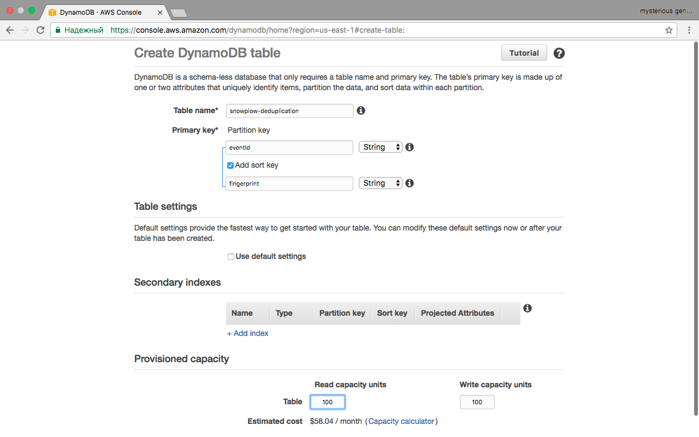
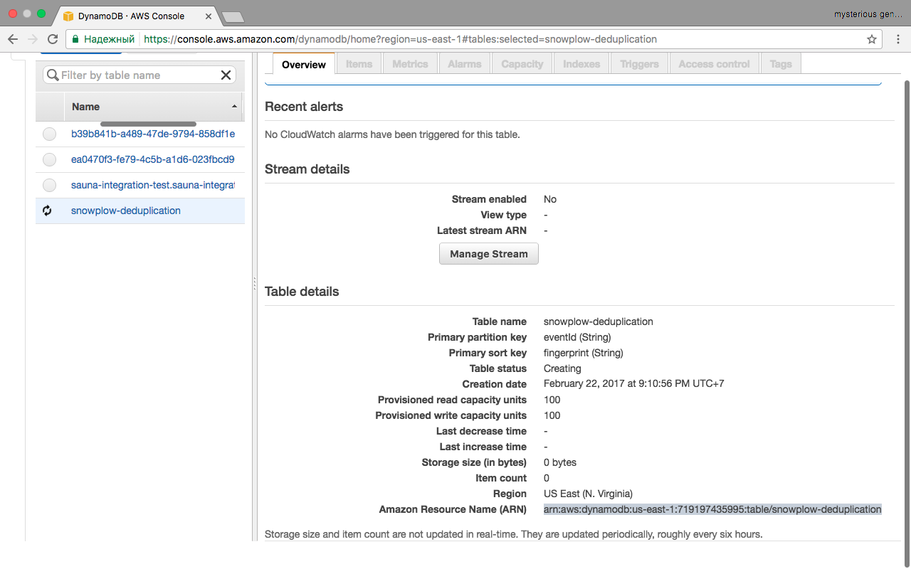
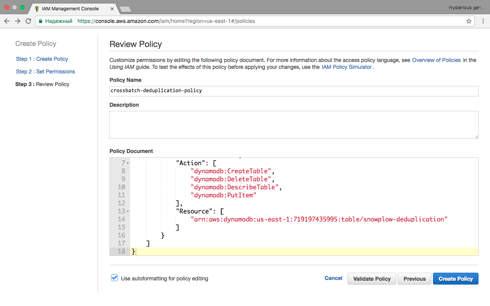

In order to perform [deduplication](/docs/api-reference/loaders-storage-targets/snowplow-rdb-loader/previous-versions/snowplow-rdb-loader/event-deduplication/index.md) in the RDB shredder, a dynamoDB table is needed to store the event manifest.

## 1. Creating Amazon DynamoDB table

If [Relational Database Shredder](/docs/api-reference/loaders-storage-targets/snowplow-rdb-loader/previous-versions/snowplow-rdb-loader/event-deduplication/index.md) doesn't find a specified table - it will try to create it with default provisioned throughput, which might be not sufficient. This step is optional, but recommended.

The table name can be anything, but must be unique.

Partition key must be called `eventId` and have type String. Sort key must be called `fingerprint` and have type String.

Uncheck "Use default settings" checkbox and set "Write capacity units" to 100. Capacity units value is individual and should tweaked depending on your cluster size.



Create Table

After table is created, write down "Amazon Resource Name (ARN)" in "Overview" tab. It should look similar to `arn:aws:dynamodb:us-east-1:719197435995:table/one-more-deduplication-test` This ARN will be used in next step.



Finding the Table ARN

## 2. Setting up IAM Policy

Log into the AWS console, navigate to the IAM section and go to **Policies**:

Select **Create Your Own Policy** and choose descriptive name. Paste following JSON as Policy Document:

```json
{
    "Version": "2012-10-17",
    "Statement": [
        {
            "Sid": "Stmt1486765706000",
            "Effect": "Allow",
            "Action": [
                "dynamodb:CreateTable",
                "dynamodb:DeleteTable",
                "dynamodb:DescribeTable",
                "dynamodb:PutItem"
            ],
            "Resource": [
                "arn:aws:dynamodb:us-east-1:719197435995:table/snowplow-deduplication"
            ]
        }
    ]
}
```

Notice element in `Resourse` array. It must be changed to your ARN from previous step.

`dynamodb:CreateTable` and `dynamodb:DeleteTable` are unnecessary if you already created table.



Attach the IAM policy
