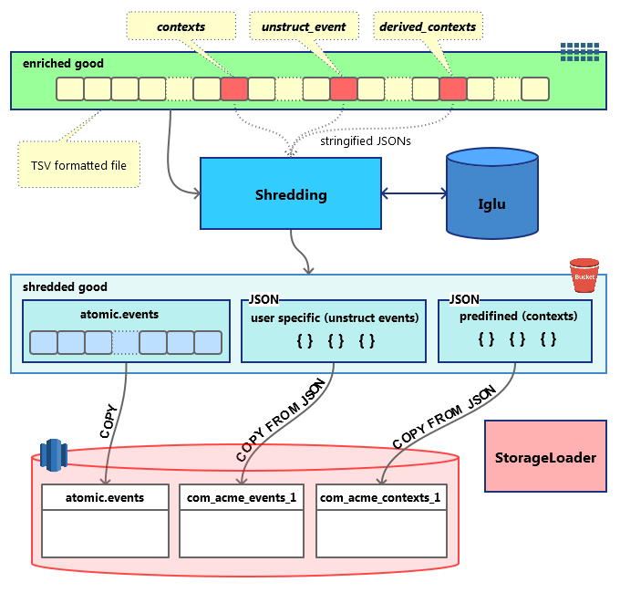

Shredding is the process of splitting a Snowplow enriched event into several smaller files, which can be inserted directly into Redshift tables.

A Snowplow enriched event is a 131-column TSV file, produced by Enrich. Each line contains all information about a specific event, including its id, timestamps, custom and derived contexts and much more.

After shredding, the following entities are split out from the original event:

1. **Atomic events**. a TSV line very similar to `EnrichedEvent` but not containing JSON fields (`contexts`, `derived_contexts` and `unstruct_event`). The results will be stored in a path similar to `shredded/good/run=2016-11-26-21-48-42/atomic-events/part-00000` and will be available to load via [RDB Loader](/docs/api-reference/loaders-storage-targets/snowplow-rdb-loader/previous-versions/snowplow-rdb-loader/index.md) or directly via Redshift [COPY](http://docs.aws.amazon.com/redshift/latest/dg/copy-parameters-data-source-s3.html).
2. **Contexts**. This part consists of the two extracted above JSON fields: `contexts` and `derived_contexts`, which are validated (during the enrichment step) self-describing JSONs. But, unlike the usual self-describing JSONs consisting of a `schema` and a `data` object, these ones consist of a `schema` object (like in JSON Schema), the usual `data` object and a `hierarchy` object. This `hierarchy` contains data to later join your contexts’ SQL tables with the `atomic.events` table. The results will be stored in a path which looks like `shredded/good/run=2016-11-26-21-48-42/shredded-types/vendor=com.acme/name=mycontext/format=jsonschema/version=1-0-1/part-00000`, where the part files like `part-00000` are valid NDJSONs and it will be possible to load them via [RDB Loader](/docs/api-reference/loaders-storage-targets/snowplow-rdb-loader/previous-versions/snowplow-rdb-loader/index.md) or directly via Redshift [COPY](http://docs.aws.amazon.com/redshift/latest/dg/copy-parameters-data-source-s3.html).
3. **Self-describing (unstructured) events**. Very much similar to the contexts described above those are the same JSONs with the `schema`, `data` and `hierarchy` fields. The only difference is that there is a one-to-one relation with `atomic.events`, whereas contexts have many-to-one relations.

Those files end up in S3 and are used to load the data into Redshift tables dedicated to each of the above files under the RDB Loader orchestration.

The whole process could be depicted with the following dataflow diagram.

