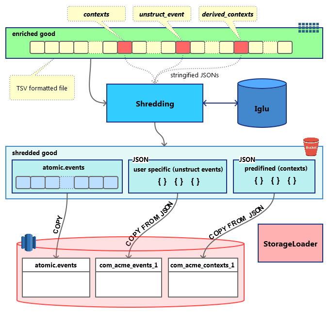

_For a high-level overview of the RDB Loader architecture, of which the transformer is a part, see [RDB Loader](/docs/api-reference/loaders-storage-targets/snowplow-rdb-loader/index.md)._

The `transformer` application can have two types of output:

- 'shredded' data
- wide row format.

Both the Spark transformer and the stream transformer can output both types. Which type to pick, depends on the intended storage target.

For loading into **Redshift**, use [shredded data](#shredded-data).

For loading into **Snowflake**, use [wide row format](#wide-row-format).

For loading into **Databricks**, use [wide row format](#wide-row-format).

## Shredded data

Shredding is the process of splitting a Snowplow enriched event into several smaller chunks, which can be inserted directly into **Redshift** tables.

A Snowplow enriched event is a 131-column tsv line. Each line contains all fields that constitute a specific event, including its id, timestamps, custom and derived contexts, etc.

After shredding, the following entities are split out from the original event:

1. **Atomic event.** A tsv line very similar to the enriched event but not containing JSON fields (`contexts`, `derived_contexts` and `unstruct_event`). The results are stored under a path similar to `shredded/good/run=2016-11-26-21-48-42/atomic-events/part-00000` and are available to load with RDB Loader or directly with Redshift `COPY`.
2. **Contexts.** Two JSON fields -- `contexts` and `derived_contexts` -- are extracted from the enriched event. Their original values are validated self-describing JSONs, consisting of a `schema` and a `data` property. After shredding, a third property is added, called `hierarchy`. This `hierarchy` contains fields you can use to later join your context SQL tables with the `atomic.events` table. One atomic event can be associated with multiple context entities. The results are stored under a path like `shredded/good/run=2016-11-26-21-48-42/shredded-types/vendor=com.acme/name=my_context/format=jsonschema/version=1-0-1/part-00000`, where the `part-*` files are valid ndJSON files which can be loaded with RDB Loader or directly with Redshift `COPY`.
3. **Self-describing (unstructured) events.** Same as the contexts described above but there is a strict one-to-one relation with atomic events. The results are stored under a path with the same structure as for contexts and are ready to be loaded with RDB Loader or directly with Redshift `COPY`.

These files are stored on S3 partitioned by type. When the data is loaded into Redshift, each type goes to a dedicated table.

The following diagram illustrates the process:

**NOTE:** Shredded data can currently only be loaded into **Redshift**.

## Wide row format

Unlike shredding, wide row format preserves data as a single line per event, with one column for each different type of contexts and self-describing events.

For contexts (aka entities), the type of the column is `ARRAY` and the name looks like `contexts_com_acme_my_custom_entity_schema_1`. Note the plural that matches the `ARRAY` type: in theory each `contexts_*` column may contain multiple entities.

For self-describing events, the type of the column is `OBJECT` and the name looks like `unstruct_event_com_acme_my_custom_event_schema_1`. Each line in the table contains only 1 event.

The values in these columns have recursive structure with arbitrary depth, which depends on the schema that describes them.

The results are stored under a path like `output=good/part-00000` and can be loaded with RDB Loader.

There are two options as output file format with wide row transformation: JSON and Parquet

JSON file format can be used for loading into **Snowflake** and Parquet file format can be used for loading into **Databricks**
