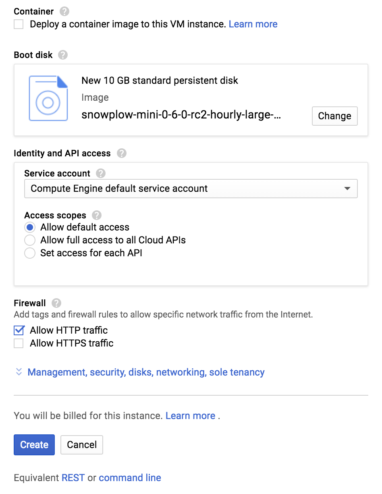

## Overview

Snowplow Mini is, in essence, the Snowplow real time stack inside of a single image. It is an easily-deployable, single instance version of Snowplow that serves three use cases:

1. Giving a Snowplow consumer (e.g. an analyst / data team / marketing team) a way to quickly understand what Snowplow "does" i.e. what you put it at one end and take out of the other
2. Giving developers new to Snowplow an easy way to start with Snowplow and understand how the different pieces fit together
3. Giving people running Snowplow a quick way to debug tracker updates (because they can)

The software stack installed (0.14.2):

- Snowplow Stream Collector NSQ 2.7.0
- Snowplow Stream Enrich NSQ 3.2.5
- Snowplow Elasticsearch Loader 1.0.7
- Snowplow Iglu Server 0.8.4
- Elasticsearch-OSS 6.8.23
- Kibana-OSS 6.8.20
- Postgresql 14.2
- NSQ v1.2.1

Note: All services are configured to start automatically so everything should happily survive restarts/shutdowns.

To understand the flow of data please refer to the following diagram:


## Importing public tarballs to a GCP project

Our offering for GCP is 3 compressed tarballs for 3 different sized Snowplow Mini, produced through `gcloud`'s [`export`](https://cloud.google.com/sdk/gcloud/reference/compute/images/export) command. Simply put, they are Virtual Disk images exported in GCP format, a `disk.raw` file that has been tarred and gzipped.

To use them within GCP console, you need to import a tarball of your choice into your GCP project. You can use `gcloud` CLI utility to do that.

Browse [GCP docs](https://cloud.google.com/sdk/docs/quickstarts) to get started with `gcloud`.

Assuming you have `gcloud` setup and configured for your GCP project, use `gcloud`'s [`create`](https://cloud.google.com/sdk/gcloud/reference/compute/images/create) command to import a tarball of your choice into your GCP project.

A sample usage would be as following.

```bash
gcloud compute images create \
imported-sp-mini \
--source-uri \
https://storage.googleapis.com/snowplow-mini/snowplow-mini-0-14-2-large-1660910771.tar.gz
```

Note that `imported-sp-mini` is a name of your choice for destination image and above URI is for large image, change it with your preferred version of Snowplow Mini.

Version 0.14.2 (Recommended)

| L / 2 vCPUs | XL / 4 vCPUs | XXL / 8 vCPUs |
| --- | --- | --- |
| [large](https://storage.googleapis.com/snowplow-mini/snowplow-mini-0-14-2-large-1660910771.tar.gz) | [xlarge](https://storage.googleapis.com/snowplow-mini/snowplow-mini-0-14-2-xlarge-1660913170.tar.gz) | [xxlarge](https://storage.googleapis.com/snowplow-mini/snowplow-mini-0-14-2-xxlarge-1660913099.tar.gz) |

You can find more about `gcloud compute images create` command [here](https://cloud.google.com/sdk/gcloud/reference/compute/images/create) for additional parameters.

After importing our tarball of your choice into your project, you should see it under `Images` on `Compute Engine`.

To decide on which size of Snowplow Mini to choose, read on.

### large & xlarge & xxlarge

Until today, Snowplow Mini was being used inside AWS `t2.medium`, `n1-standard-1` in GCP, instances and it served well for demonstration purposes. However, we observed that Snowplow Mini started exceeding its initial motivation and machine resources started to become an obstacle, causing issues with Elasticsearch etc. This is why, Mini is available at 3 different sizes.

- `large` : Same image published so far. Elasticsearch has `4g` heap size and Snowplow apps has `0.5g` heap size. Recommended machine RAM is `8g`.
- `xlarge` : Double the large image. Elasticsearch has `8g` heap size and Snowplow apps has `1.5g` heap size. Recommended machine RAM is `16g`.
- `xxlarge` : Double the xlarge image. Elasticsearch has `16g` heap size and Snowplow apps has `3g` heap size. Recommended machine RAM is `32g`.

## Create instance

Go to `Compute Engine` on GCP console, select `Images` from menu on the left. You should see your imported image on the list. Select it then you should see `CREATE INSTANCE` button at the top of the page. Click on it.




Click `Create`.

These images show setup for `large` image. To setup `xlarge` or `xxlarge`, you should increase memory per above explanation of different sizes.

```mdx-code-block
import Telemetry from "@site/docs/reusable/telemetry/_index.md"

<Telemetry name="Mini" since="0.13.0">

  If you wish to disable telemetry, you can do so via the [API](../control-plane-api/#configuring-telemetry).

</Telemetry>
```
