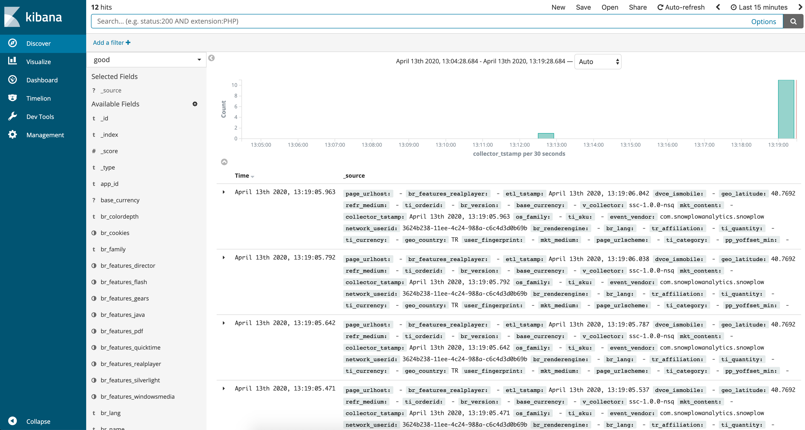
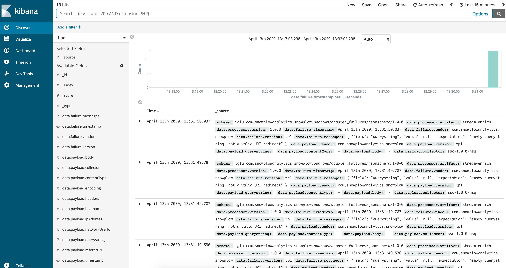
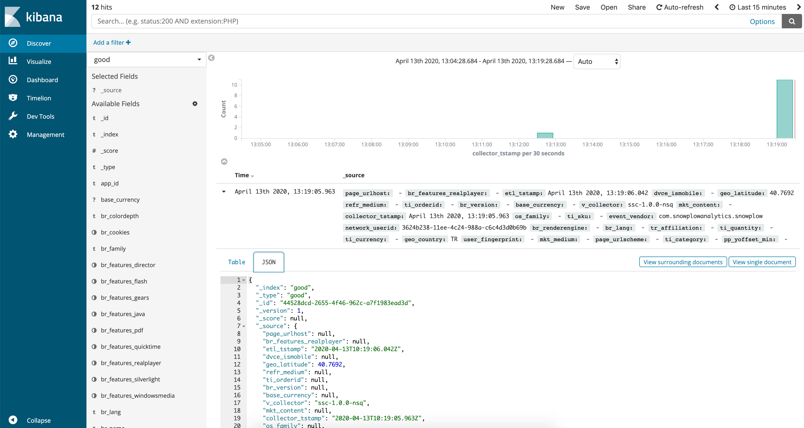

## Overview

Snowplow Mini is, in essence, the Snowplow real time stack inside of a single image. It is an easily-deployable, single instance version of Snowplow that serves three use cases:

1. Giving a Snowplow consumer (e.g. an analyst / data team / marketing team) a way to quickly understand what Snowplow "does" i.e. what you put it at one end and take out of the other
2. Giving developers new to Snowplow an easy way to start with Snowplow and understand how the different pieces fit together
3. Giving people running Snowplow a quick way to debug tracker updates

Jump to [First Time Usage](#first-time-usage) if it is your first time with a Mini.

## Upgrading

Mini 0.8.0 updated some of the internal components resulting in some breaking changes as following:

- _Iglu Server is updated from 0.3.0 to 0.6.1_ :
    - Swagger UI is deprecated which means `repo-server.baseURL` configuration field in Iglu Server configuration is deprecated too.
    - We've overhauled Iglu Server in 0.6.0 release and introduced breaking API changes. Please check [API Changes section](https://snowplow.io/blog/iglu-server-0-6-0-released/#api-changes) of the blog post to learn about them.
    - In addition to 0.6.0, Iglu Server 0.6.1 deprecated query parameter support for `POST iglu-server/api/auth/keygen` endpoint. vendor_prefix must be provided
    - **Note** that browsing to the same endpoint ( /iglu-server ) in an internet browser will yield an error message stating that endpoint doesn't exist, we'll address this in upcoming releases but one can safely ignore that for now and server health can be checked at `GET iglu-server/api/meta/health` endpoint.
- _Stream Enrich is updated from 0.21.0 to 1.0.0_ :
    - Please check [Upgrade Guide](https://github.com/snowplow/snowplow/wiki/Upgrade-Guide#enrich) to see updated enrichment configuration.

## First time usage

This section is dedicated to the steps that need performing when accessing the Snowplow Mini instance for the first time.

### Connecting to the instance for the first time

You can access the Snowplow Mini instance at the `http://[public_dns]/home` address. While accessing Snowplow Mini services, HTTP authentication is required. As a result, you will be prompted for credentials which are `USERNAME_PLACEHOLDER` and `PASSWORD_PLACEHOLDER` by default.

You **should** change these default credentials to something to your liking by going to the Control Plane tab (the last one) and fill the "Change username and password for basic http authentication" form towards the bottom.

**Note that only alphanumeric passwords are supported.**

You will then be prompted for those new credentials.

### Changing the super API key for the local Iglu schema registry

As as second step, you should change the super API key for the Iglu schema registry that is bundled with Snowplow Mini. This API key can be changed via the Control Plane tab.

Given that this API key must be a UUID v4, you will need to generate one by running `uuidgen` at the command line, or by using an online UUID generator like [this one](https://www.uuidgenerator.net/). Make a note of this UUID, you'll need it to upload your own event and context schemas to Snowplow Mini in the next subsection.

### Generating a pair of read/write API keys for the local Iglu schema registry

Mini 0.8.0 comes bundled with Iglu Server 0.6.1 which introduced a couple of changes regarding this section.

- Swagger UI of Iglu Server is deprecated, however Iglu Server still serves at `/iglu-server` endpoint.
- `POST /api/auth/keygen` no longer supports query parameter to provide vendor prefix. Use POST raw data request instead.

To add schemas to the Iglu repository bundled with Snowplow Mini, you have to create a dedicated pair of API keys. We have 2 options:

- Use igluctl's `[server keygen](/docs/api-reference/iglu/igluctl-2/index.md#server-keygen)` subcommand
- Use any HTTP client e.g. cURL

Let's have examples for both options.

- Download the igluctl 0.10.1 from Github:

`$ wget https://github.com/snowplow-incubator/igluctl/releases/download/0.10.1/igluctl_0.10.1.zip  
$ chmod +x igluctl`

Following is a sample execution where `com.acme` is the vendor prefix for which we'll upload our schemas, `mini-address` is the URL of our mini and `53b4c441-84f7-467e-af4c-074ced53eb20` is the super API key created in step 2.2

`$ ./igluctl server keygen --vendor-prefix com.acme mini-address/iglu-server 53b4c441-84f7-467e-af4c-074ced53eb20`

- Let's also see how one can use `cURL` to interact with the Iglu Server

`$ curl --location --request POST 'mini-address/iglu-server/api/auth/keygen' --header 'apikey: 1b5d0459-3492-451c-aab1-7f74cbe12112' --header 'Content-Type: application/json' --data-raw '{"vendorPrefix":"com.acme"}'`

should return a read key and a write key.

```json
{
  "read":"bfa90866-ab14-4b92-b6ef-d421fd688b54",
  "write":"6175aa41-d3a7-4e4f-9fb4-3a170f3c6c16"
}
```

### Copying your Iglu repository to Snowplow Mini (optional)

To test and send non-standard Snowplow events such as your own custom-contexts and unstructured events you can load them into the Iglu repository local to the Snowplow Mini instance.

1. Get a local copy of your Iglu repository which contains your schemas. This should be modelled after [this folder](https://github.com/snowplow/iglu-central/tree/master/schemas)
2. Download the latest Igluctl from Github:

```bash
$ wget https://github.com/snowplow-incubator/igluctl/releases/download/0.10.1/igluctl_0.10.1.zip
$ chmod +x igluctl
```

1. Run the executable with the following input:

- The address of the Iglu repository: `http://[public_dns]/iglu-server`
- The Super API Key you created in step 2.2
- The path to your schemas For example to load the `iglu-central` repository into Iglu Server:

```bash
/path/to/igluctl static push iglu-central/schemas http://[public_dns]/iglu-server 980ae3ab-3aba-4ffe-a3c2-3b2e24e2ffce --public
```

Note: this example assumes the `iglu-central` repository has been cloned in the same directory as where executable is run.

1. After uploading the schemas, you will need to clear the cache with the restart button under the Control Plane tab in the Snowplow Mini dashboard.

### Setting up HTTPS (optional)

If you want to use HTTPS to connect to Snowplow Mini, you need to submit a domain name via the Control Plane. Make sure that the domain name you submit is redirected to the IP of the server Snowplow Mini is running from.

## Sending events to Snowplow Mini

Now that the first time usage steps have been dealt with, you can send some events!

### Example events

An easy way to quickly send a few test events is to use our example web page.

1. Open up the Snowplow Mini UI at: `http://[public_dns]/home`
2. Login with username and password which you choose in step 2.1
3. Select the `Example Events` tab
4. Press the event triggering buttons on the page!

### Events from tracker

You can instrument any other Snowplow tracker by specifying the collector URL as the public DNS of the Snowplow Mini instance.

## Accessing the Elasticsearch API

Snowplow Mini makes the Elasticsearch HTTP API available at `http://[public_dns]/elasticsearch`, you can check it's working by:

- Checking the Elasticsearch API is available:
    - `curl --user username:password http://[public_dns]/elasticsearch`
    - You should see a `200 OK` response
- Checking the number of good events we sent in step 3:
    - `curl --user username:password http://[public_dns]/elasticsearch/good/good/_count`
    - You should see the appropriate count of sent events

## Viewing the data in Kibana

Data sent to Snowplow Mini will be processed and loaded into Elasticsearch in real time. In turn, it will be made available in Kibana. To view the data in Kibana, navigate in your browser to `mini-public-address/kibana`.

### Index patterns

Snowplow Mini comes with two index patterns:

- `good` : For good events, indexed on `collector_tstamp`
- `bad` : For bad events, indexed in `data.failure.timestamp`

### Discover your data

Browse to `mini-public-address/kibana` , once Kibana is loaded, you should be able to view most recently sent good events via the discover interface:

You can then inspect any individual event data in the UI by unfolding a payload:



If you want to inspect bad events, click on `good`, placed towards top left of the screen and select `bad` from drop-down list.



Unfold any payload to inspect a bad event in detail.



## Resetting Elasticsearch indices

As of 0.13.0, it is possible to reset Elasticsearch indices, along with the corresponding index patterns in Kibana, through Control Plane API.

```bash
curl -L \
-X POST '<mini-address>/control-plane/reset-service' \
-u '<username>:<password>' \
-H 'Content-Type: application/x-www-form-urlencoded' \
--data-urlencode 'service_name=elasticsearch'
```

Note that resetting deletes not only indices and patterns but also all events stored so far.

## Restart services individually

As of 0.13.0, it is possible to restart services one by one.

```bash
curl -L \
-X PUT '<mini-address>/control-plane/restart-service' \
-u '<username>:<password>' \
-H 'Content-Type: application/x-www-form-urlencoded' \
--data-urlencode 'service_name=<service_name>'
```

where `service_name` can be one of the following: `collector`, `enrich`, `esLoaderGood`, `esLoaderBad`, `iglu`, `kibana`, `elasticsearch`.

## Configuring telemetry

See our [telemetry principles](/docs/get-started/snowplow-community-edition/telemetry/index.md) for more information on telemetry.

HTTP GET to get current configuration

```bash
curl -L -X GET '<mini-address>/control-plane/telemetry' -u '<username>:<password>'
```

HTTP PUT to set it (use true or false as value of key `disable` to turn it on or off)

```bash
curl -L -X PUT '<mini-address>/control-plane/telemetry' -u '<username>:<password>' -H 'Content-Type: application/x-www-form-urlencoded' --data-urlencode 'disable=false'
```

## Uploading custom enrichments

You can add new custom enrichments via the Control Plane tab. The only thing you have to do is submit the enrichment file which you created according to this [wiki page](/docs/pipeline/enrichments/available-enrichments/index.md). If the enrichment relies on additional schemas these should be uploaded to the Iglu repository.

## Adding a custom schema

Since Mini 0.8.0 deprecated Swagger UI of Iglu Server, we have 2 options:

- Use igluctl [static push](/docs/api-reference/iglu/igluctl-2/index.md#static-push) to put our custom schema into the Iglu Server
- Use any HTTP client e.g. cURL

Let's have examples for both options.

- Download the igluctl 0.7.0 from Github:

```bash
$ wget https://github.com/snowplow-incubator/igluctl/releases/download/0.7.2/igluctl
$ chmod +x igluctl
```

Following is a sample execution where `path-to-schema(s)` is the path to custom schema(s) , `mini-address` is the URL of our mini and `53b4c441-84f7-467e-af4c-074ced53eb20` is the super API key created in step 2.2

```bash
$ ./igluctl static push path-to-schema(s) mini-address/iglu-server 53b4c441-84f7-467e-af4c-074ced53eb20
```

- Let's also see how one can use `cURL` to interact with the Iglu Server

```bash
$ curl mini-address/iglu-server/api/schemas -X POST -H "apikey: YOUR_APIKEY" -d '{"json": YOUR_JSON}'
```

will produce a response like this one, if no errors are encountered:

```json
{
  "message": "Schema created",
  "updated": false,
  "location": "iglu:com.acme/ad_click/jsonschema/1-0-0",
  "status":201
}
```

## Adding an external Iglu repository

If you already have an external Iglu repository available, instead of copying it inside the Iglu repository bundled with the Snowplow Mini instance as shown in 2.4, you can add it directly with the Control Plane's `Add an external Iglu repository` form. Note that if you're using a static repository hosted on S3, you can omit providing an API key.

## Runtime metrics

Mini 0.12.0 introduced /metrics endpoint powered by [cAdvisor](https://github.com/google/cadvisor) . You can also find the link to metrics on the home page under Quicklinks header.

It's been possible to observe runtime metrics of a Mini instance by looking at AWS/GCP monitoring dashboards however internal services' individual metrics weren't exposed, making it more difficult to diagnose issues.

Exposing runtime metrics such as CPU, RAM and Network usage of the internal services in real time will make Mini more transparent, hopefully making it easier to understand what's going on under the hood.

## Logs

As of Mini 0.12.0, application logs of the Mini sub-services are exported to Cloudwatch on AWS and Cloud Logging on GCP.

On AWS, each individual service emits its' logs under a specific log stream within `snowplow-mini` log group.

On GCP, we need to make use of filters to see the logs of a specific component. The recommended approach is as following:

- On GCP console, go to Logging > Logs Viewer
- Under Query Builder, select resource
- Under `VM instance`, select the instance Mini is running at
- Click on `Add`

Click on `Run Query` and we should see logs of all services combined.

To see the logs of a specific component, add the following filter to the query:

jsonPayload.container.name="/service-name"

where service-name can be one of the following: `elasticsearch`, `kibana`, `elasticsearch-loader-good`, `elasticsearch-loader-bad`, `nsqlookupd`, `nsqd`, `nsqadmin`, `scala-stream-collector-nsq`, `stream-enrich-nsq`

An example query looks as following:

resource.type="gce_instance"

resource.labels.instance_id="3778299199368430127"

jsonPayload.container.name="/elasticsearch"
