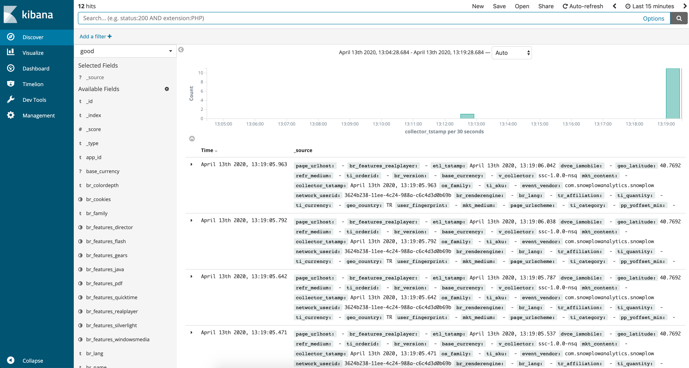
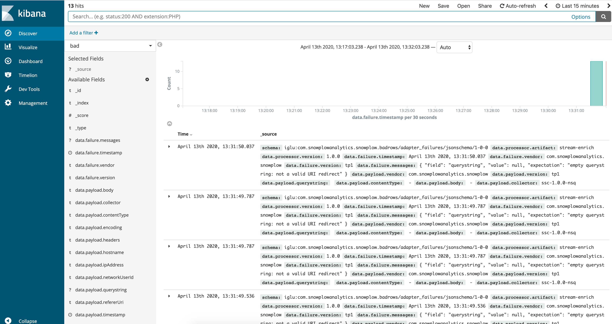
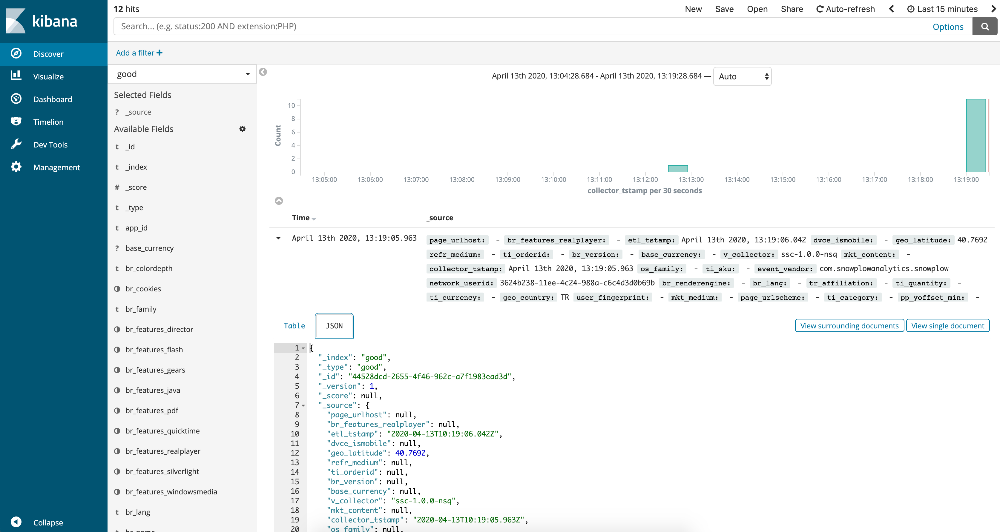

## Overview

Snowplow Mini is, in essence, the Snowplow real time stack inside of a single image. It is an easily-deployable, single instance version of Snowplow that serves three use cases:

1. Giving a Snowplow consumer (e.g. an analyst / data team / marketing team) a way to quickly understand what Snowplow "does" i.e. what you put it at one end and take out of the other
2. Giving developers new to Snowplow an easy way to start with Snowplow and understand how the different pieces fit together
3. Giving people running Snowplow a quick way to debug tracker updates

Jump to [First Time Usage](#first-time-usage) if it is your first time with a Mini.

## Upgrading

Until version 0.15.0, Snowplow data was loaded to Elasticsearch 6.x in the Mini. However, a [licensing change](https://www.elastic.co/blog/licensing-change) in Elasticsearch prevented us from upgrading it to more recent versions. To make sure we stay up to date with important security fixes, we've decided to replace Elasticsearch with [Opensearch](https://opensearch.org/). Also, Kibana is replaced with [Opensearch Dashboards](https://opensearch.org/docs/latest/dashboards/index/).

[Opensearch](https://opensearch.org/) is a fork of open source Elasticsearch 7.10. Therefore this change shouldn't affect Mini users much. To minimize the impact further, we've tried to make as minimal a change as possible. In Mini, you can still access Opensearch with the `/elasticsearch` endpoint and Opensearch Dashboards with the `/kibana` endpoint.

The only breaking change this migration would bring is the removal of mapping types. It means that you don't have to provide a mapping type in your search queries anymore when accessing your data in good or bad indices. For example, good events count can be found using the following endpoint in previous versions: `/elasticsearch/good/good/_count`. Starting with 0.15.0, it can be found using this endpoint: `/elasticsearch/good/_count`.

## First time usage

This section is dedicated to the steps that need performing when accessing the Snowplow Mini instance for the first time.

### Connecting to the instance for the first time

You can access the Snowplow Mini instance at the `http://[public_dns]/home` address. While accessing Snowplow Mini services, HTTP authentication is required. As a result, you will be prompted for credentials which are `USERNAME_PLACEHOLDER` and `PASSWORD_PLACEHOLDER` by default.

You **should** change these default credentials to something to your liking by going to the Control Plane tab (the last one) and fill the "Change username and password for basic http authentication" form towards the bottom.

**Note that only alphanumeric passwords are supported.**

You will then be prompted for those new credentials.

### Changing the super API key for the local Iglu schema registry

As as second step, you should change the super API key for the Iglu schema registry that is bundled with Snowplow Mini. This API key can be changed via the Control Plane tab.

Given that this API key must be a UUID v4, you will need to generate one by running `uuidgen` at the command line, or by using an online UUID generator like [this one](https://www.uuidgenerator.net/). Make a note of this UUID, you'll need it to upload your own event and context schemas to Snowplow Mini in the next subsection.

### Generating a pair of read/write API keys for the local Iglu schema registry

:::note

Mini 0.8.0 comes bundled with Iglu Server 0.6.1 which introduced a couple of changes regarding this section.

- Swagger UI of Iglu Server is deprecated, however Iglu Server still serves at `/iglu-server` endpoint.
- `POST /api/auth/keygen` no longer supports query parameter to provide vendor prefix. Use POST raw data request instead.

:::

To add schemas to the Iglu repository bundled with Snowplow Mini, you have to create a dedicated pair of API keys. There are 2 options:

- Use igluctl’s [server keygen](/docs/api-reference/iglu/igluctl-2/index.md#server-keygen) subcommand
- Use any HTTP client e.g. cURL

#### Option 1

First, [download igluctl](/docs/api-reference/iglu/igluctl-2/index.md#downloading-and-running-igluctl).

Following is a sample execution where `com.acme` is the vendor prefix for which we'll upload our schemas, `mini-address` is the URL of our mini and `53b4c441-84f7-467e-af4c-074ced53eb20` is an example super API key you would have created in the previous steps.

```bash
/path/to/igluctl server keygen --vendor-prefix com.acme mini-address/iglu-server 53b4c441-84f7-467e-af4c-074ced53eb20
```

#### Option 2

You can also use `cURL` to interact with Iglu Server:

```
curl --location --request POST 'mini-address/iglu-server/api/auth/keygen' \
  --header 'apikey: 1b5d0459-3492-451c-aab1-7f74cbe12112' \
  --header 'Content-Type: application/json' \
  --data-raw '{"vendorPrefix":"com.acme"}'
```

should return a read key and a write key.

```json
{
  "read":"bfa90866-ab14-4b92-b6ef-d421fd688b54",
  "write":"6175aa41-d3a7-4e4f-9fb4-3a170f3c6c16"
}
```

### Copying your Iglu repository to Snowplow Mini (optional)

To test and send non-standard Snowplow events such as your own custom-contexts and unstructured events you can load them into the Iglu repository local to the Snowplow Mini instance.

1. Get a local copy of your Iglu repository which contains your schemas. This should be modelled after [this folder](https://github.com/snowplow/iglu-central/tree/master/schemas)
2. [Download igluctl](/docs/api-reference/iglu/igluctl-2/index.md#downloading-and-running-igluctl).

1. Run the executable with the following input:

- The address of the Iglu repository: `http://[public_dns]/iglu-server`
- The Super API Key you created previously
- The path to your schemas For example to load the `iglu-central` repository into Iglu Server:

```bash
/path/to/igluctl static push iglu-central/schemas http://[public_dns]/iglu-server 980ae3ab-3aba-4ffe-a3c2-3b2e24e2ffce --public
```

Note: this example assumes the `iglu-central` repository has been cloned in the same directory as where executable is run.

1. After uploading the schemas, you will need to clear the cache with the restart button under the Control Plane tab in the Snowplow Mini dashboard.

### Setting up HTTPS (optional)

If you want to use HTTPS to connect to Snowplow Mini, you need to submit a domain name via the Control Plane. Make sure that the domain name you submit is redirected to the IP of the server Snowplow Mini is running from.

## Sending events to Snowplow Mini

Now that the first time usage steps have been dealt with, you can send some events!

### Example events

An easy way to quickly send a few test events is to use our example web page.

1. Open up the Snowplow Mini UI at: `http://[public_dns]/home`
2. Login with username and password which you choose in step 2.1
3. Select the `Example Events` tab
4. Press the event triggering buttons on the page!

### Events from tracker

You can instrument any other Snowplow tracker by specifying the collector URL as the public DNS of the Snowplow Mini instance.

## Accessing the Opensearch API

Snowplow Mini makes the Opensearch (or previously Elasticsearch) HTTP API available at `http://[public_dns]/elasticsearch`, you can check it's working by:

- Checking the Opensearch API is available:
    - `curl --user username:password http://[public_dns]/elasticsearch`
    - You should see a `200 OK` response
- Checking the number of good events we sent in step 3:
    - `curl --user username:password http://[public_dns]/elasticsearch/good/_count`
    - You should see the appropriate count of sent events

## Viewing the data in Opensearch Dashboards

Data sent to Snowplow Mini will be processed and loaded into Opensearch in real time. In turn, it will be made available in Opensearch Dashboards. To view the data in Opensearch Dashboards, navigate in your browser to `mini-public-address/kibana`.

### Index patterns

Snowplow Mini comes with two index patterns:

- `good` : For good events, indexed on `collector_tstamp`
- `bad` : For bad events, indexed in `data.failure.timestamp`

### Discover your data

Browse to `mini-public-address/kibana` , once Opensearch Dashboards is loaded, you should be able to view most recently sent good events via the discover interface:

You can then inspect any individual event data in the UI by unfolding a payload:



If you want to inspect bad events, click on `good`, placed towards top left of the screen and select `bad` from drop-down list.



Unfold any payload to inspect a bad event in detail.



## Resetting Opensearch indices

As of 0.13.0, it is possible to reset Opensearch (or previously Elasticsearch) indices, along with the corresponding index patterns in Opensearch Dashboards, through Control Plane API.

```bash
curl -L \
-X POST '<mini-address>/control-plane/reset-service' \
-u '<username>:<password>' \
-H 'Content-Type: application/x-www-form-urlencoded' \
--data-urlencode 'service_name=elasticsearch'
```

Note that resetting deletes not only indices and patterns but also all events stored so far.

## Restart services individually

As of 0.13.0, it is possible to restart services one by one.

```bash
curl -L \
-X PUT '<mini-address>/control-plane/restart-service' \
-u '<username>:<password>' \
-H 'Content-Type: application/x-www-form-urlencoded' \
--data-urlencode 'service_name=<service_name>'
```

where `service_name` can be one of the following: `collector`, `enrich`, `esLoaderGood`, `esLoaderBad`, `iglu`, `kibana`, `elasticsearch`.

## Configuring telemetry

See our [telemetry principles](/docs/get-started/self-hosted/telemetry/index.md) for more information on telemetry.

HTTP GET to get current configuration

```bash
curl -L -X GET '<mini-address>/control-plane/telemetry' -u '<username>:<password>'
```

HTTP PUT to set it (use true or false as value of key `disable` to turn it on or off)

```bash
curl -L -X PUT '<mini-address>/control-plane/telemetry' -u '<username>:<password>' -H 'Content-Type: application/x-www-form-urlencoded' --data-urlencode 'disable=false'
```

## Uploading custom enrichments

You can add new custom enrichments via the Control Plane tab. The only thing you have to do is submit the enrichment configuration file which you created according to the documentation in [Available Enrichments](/docs/pipeline/enrichments/available-enrichments/index.md). If the enrichment relies on additional schemas these should be uploaded to the Iglu repository.

## Adding a custom schema

Since Mini 0.8.0 deprecated Swagger UI of Iglu Server, we have 2 options:

- Use igluctl’s [static push](/docs/api-reference/iglu/igluctl-2/index.md#static-push) subcommand to put our custom schema into the Iglu Server
- Use any HTTP client e.g. cURL

#### Option 1

First, [download igluctl](/docs/api-reference/iglu/igluctl-2/index.md#downloading-and-running-igluctl).

Following is a sample execution where `path-to-schema(s)` is the path to custom schema(s) , `mini-address` is the URL of our mini and `53b4c441-84f7-467e-af4c-074ced53eb20` is an example super API key you would have created in the previous steps.

```bash
/path/to/igluctl static push path-to-schema(s) mini-address/iglu-server 53b4c441-84f7-467e-af4c-074ced53eb20
```

#### Option 2

You can also use `cURL` to interact with Iglu Server:

```bash
curl mini-address/iglu-server/api/schemas -X POST \
  -H "apikey: YOUR_APIKEY" -d '{"json": YOUR_JSON}'
```

The command will produce a response like this one, if no errors are encountered:

```json
{
  "message": "Schema created",
  "updated": false,
  "location": "iglu:com.acme/ad_click/jsonschema/1-0-0",
  "status":201
}
```

## Adding an external Iglu repository

If you already have an external Iglu repository available, instead of copying it inside the Iglu repository bundled with the Snowplow Mini instance as shown in 2.4, you can add it directly with the Control Plane's `Add an external Iglu repository` form. Note that if you're using a static repository hosted on S3, you can omit providing an API key.

## Runtime metrics

Mini 0.12.0 introduced /metrics endpoint powered by [cAdvisor](https://github.com/google/cadvisor) . You can also find the link to metrics on the home page under Quicklinks header.

It's been possible to observe runtime metrics of a Mini instance by looking at AWS/GCP monitoring dashboards however internal services' individual metrics weren't exposed, making it more difficult to diagnose issues.

Exposing runtime metrics such as CPU, RAM and Network usage of the internal services in real time will make Mini more transparent, hopefully making it easier to understand what's going on under the hood.

## Logs

As of Mini 0.12.0, application logs of the Mini sub-services are exported to Cloudwatch on AWS and Cloud Logging on GCP.

On AWS, each individual service emits its' logs under a specific log stream within `snowplow-mini` log group.

On GCP, we need to make use of filters to see the logs of a specific component. The recommended approach is as following:

- On GCP console, go to Logging > Logs Viewer
- Under Query Builder, select resource
- Under `VM instance`, select the instance Mini is running at
- Click on `Add`

Click on `Run Query` and we should see logs of all services combined.

To see the logs of a specific component, add the following filter to the query:

jsonPayload.container.name="/service-name"

where service-name can be one of the following: `elasticsearch`, `kibana`, `elasticsearch-loader-good`, `elasticsearch-loader-bad`, `nsqlookupd`, `nsqd`, `nsqadmin`, `scala-stream-collector-nsq`, `stream-enrich-nsq`

An example query looks as following:

resource.type="gce_instance"

resource.labels.instance_id="3778299199368430127"

jsonPayload.container.name="/elasticsearch"
