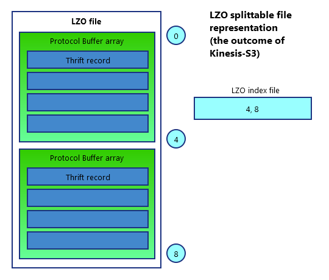

The collector receives raw Snowplow events sent over HTTP by [trackers](/docs/sources/trackers/index.md) or [webhooks](/docs/sources/webhooks/index.md). It serializes them to a [Thrift](http://thrift.apache.org/) record format, and then writes them to a sink. Currently supported sinks are:

1. [Amazon Kinesis](http://aws.amazon.com/kinesis/)
2. [Google PubSub](https://cloud.google.com/pubsub/)
3. [Apache Kafka](http://kafka.apache.org/)
4. [NSQ](http://nsq.io/)
5. [Amazon SQS](https://aws.amazon.com/sqs/)
6. `stdout` for a custom stream collection process

The collector supports cross-domain Snowplow deployments, setting a `user_id` (used to identify unique visitors) server side to reliably identify the same user across domains.

## How it works

### User identification

The collector allows the use of a third-party cookie, making user tracking across domains possible.

In a nutshell: the collector receives events from a tracker, sets/updates a third-party user tracking cookie, and returns the pixel to the client. The ID in this third-party user tracking cookie is stored in the `network_userid` field in Snowplow events.

In pseudocode terms:

```text
if (request contains an "sp" cookie) {
    Record that cookie as the user identifier
    Set that cookie with a now+1 year cookie expiry
    Add the headers and payload to the output array
} else {
    Set the "sp" cookie with a now+1 year cookie expiry
    Add the headers and payload to the output array
}
```

### Collector stream formats

The collector produces **streams** of Snowplow events (records). This collector used to be called collector, to distinguish it from alternatives that have since been deprecated; this name is still used for the [GitHub repository](https://github.com/snowplow/stream-collector).

The data (payload) is serialized by utilizing [Apache Thrift framefork](http://thrift.apache.org/).

Binary serialization allows for:

- simpler data structure
- smaller size
- faster transfer
- easier (programmatical) parsing

The Snowplow Thrift raw event format conforms to [this Thrift schema](https://github.com/snowplow/iglu-central/blob/master/schemas/com.snowplowanalytics.snowplow/CollectorPayload/thrift/1-0-0). For easier perception, the structure of the collector payload is depicted below.

```text
struct CollectorPayload {
	31337: string schema

	// Required fields which are intrinsic properties of HTTP
	100: string ipAddress

	// Required fields which are Snowplow-specific
	200: i64 timestamp
	210: string encoding
	220: string collector

	// Optional fields which are intrinsic properties of HTTP
	300: optional string userAgent
	310: optional string refererUri
	320: optional string path
	330: optional string querystring
	340: optional string body
	350: optional list&lt;string&gt; headers
	360: optional string contentType

	// Optional fields which are Snowplow-specific
	400: optional string hostname
	410: optional string networkUserId
}
```

## Beyond the collector

The raw event stream generated by the collector is typically processed by two downstream consumers:

- **Enrich** reads thrift-serialized payloads from the raw stream and writes the _enriched_ Snowplow event to another stream.
- **Snowplow S3 Loader** (AWS only) reads thrift-serialized payloads from the raw stream, _encodes_ and wraps them into [Thrift](http://thrift.apache.org/) by means of [ElephantBird library](https://github.com/twitter/elephant-bird), _compresses_ the data using [splittable LZO](http://blog.cloudera.com/blog/2009/11/hadoop-at-twitter-part-1-splittable-lzo-compression/) or GZIP , and writes them to _S3_

The output of Snowplow S3 Loader is a projection of raw event data (serialized Thrift records, not enriched) in the form of a compressed LZO file.

Each `.lzo` file has a corresponding `.lzo.index` file containing the byte offsets for the LZO blocks, so that the blocks can be processed in parallel using Spark.

Generally, the LZO file generated by Snowplow S3 Loader could be depicted as an "onion-like" layered object as shown below.



## Technical architecture

The collector is written in scala and built on top of [http4s](https://http4s.org).

[GitHub repository](https://github.com/snowplow/stream-collector)
