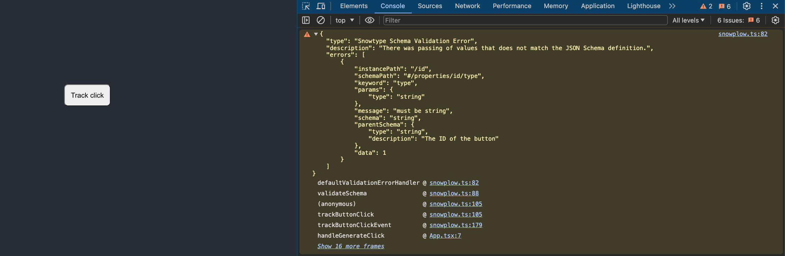

:::info
This feature is available since version 0.2.8 of Snowtype for the [Browser Tracker](/docs/collecting-data/collecting-from-own-applications/javascript-trackers/web-tracker/quick-start-guide/?platform=browser) in both JavaScript and TypeScript.
:::

## Schema validation right on your browser
Using Snowtype you can get notified, at runtime, about schema validation errors and fix them before slipping to production.

To opt-in to client-side validation you should include the `--validations` flag when you are generating your code.

```sh
npx snowtype generate --validations
```

For validations to work, you will also need to install `ajv@8`, `ajv-formats@2` and `ajv-draft-04@1`.

```sh
# Example using npm
npm install ajv@8 ajv-formats@2 ajv-draft-04@1
```

This command will generate your code as expected but behind the scenes run all the validations required when an event is being sent from the generated code.

## An example validation

Below there is an example of how validations will show up in your environment.

Suppose we are tracking against a custom schema for button clicks:

```json
{
    type: 'object',
    description: 'Data structure for custom button clicks ',
    properties: {
        label: {
            type: 'string',
            description: 'The text on the button, or a user-provided override'
        },
        id: { 
            type: 'string', 
            description: 'The identifier of the button'
        },
    },
    /* Other attributes... */
}
```

When the respective method, from Snowtype, that handles tracking of this event is fired validation will happen at runtime for all schema attributes. Following we can see an example of how the schema validation will show up in the browser console when the event responsible for tracking against the custom button click schema fires. 



As we can observe, the value passed as the `id` attribute is violating the schema rules. The erroneous value can be found under `errors[n].data` which in this case is the number `1`.

Currently the validation information will include attributes that can help point out the issue happening at the schema level, plus the stack trace revealing the caller of the function.

### Coming soon
This is the initial version of this feature but due to the importance of integrating data quality checks as close to the code producing them as possible, there are a few upcoming features you should expect to be released pretty soon.
- Custom `onValidationError` handler. You can pass a custom function to be executed when a validation is detected. For example:
    - Send the error to your error monitoring tool e.g. Sentry, Rollbar.
    - Control if the event will be sent or dropped.
    - Integrate nicely with JavaScript unit testing libraries.
- Validation for entity and property rules for [Data Products](/docs/understanding-tracking-design/defining-the-data-to-collect-with-data-poducts/).

## Caveats

### Bundle size consideration
Since the validation capability depends on a set of additional libraries which can increase the application bundle size, it is advised that this feature is used in development and test environments. Moving forwards there is consideration for creating a validation capability with minimal overhead both at runtime and bundle size.

### Divergence with pipeline validation
Due to the differences between environments, there could be a few cases where validation result might diverge between the client and the pipeline. These differences can be found in cases where regular expressions are included in the schema. For JSON Schema, these kinds of formats are mostly included in the [pattern](https://json-schema.org/understanding-json-schema/reference/string#regexp) attribute.

For that reason, when Snowtype detects a `pattern` key in string type attributes will warn accordingly during generation.