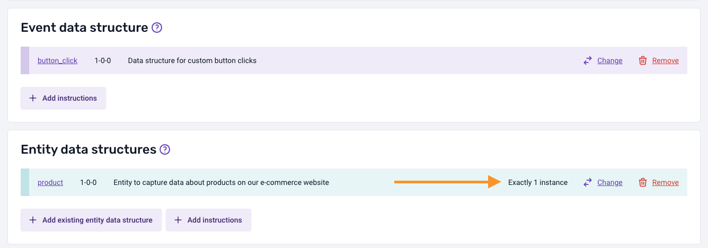
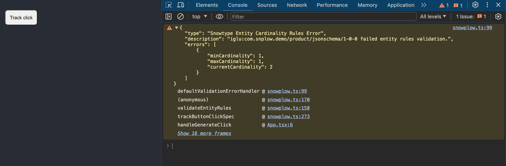
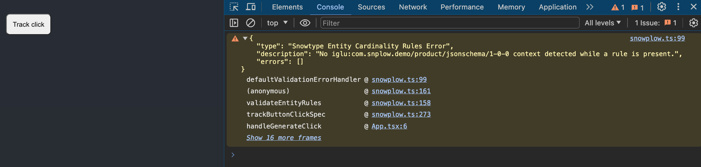

:::info
This feature is available since version 0.2.8 of Snowtype for the [Browser Tracker](/docs/collecting-data/collecting-from-own-applications/javascript-trackers/web-tracker/quick-start-guide/?platform=browser) in both JavaScript and TypeScript.
:::

## Schema validation right on your browser
Using Snowtype you can get notified, at runtime, about schema validation errors and fix them before slipping to production.

To opt-in to client-side validation you should include the `--validations` flag when you are generating your code.

```sh
npx @snowplow/snowtype generate --validations
```

For validations to work, you will also need to install `ajv@8`, `ajv-formats@2` and `ajv-draft-04@1`.

```sh
# Example using npm
npm install ajv@8 ajv-formats@2 ajv-draft-04@1
```

This command will generate your code as expected but behind the scenes run all the validations required when an event is being sent from the generated code.

## Schema validation example

Below there is an example of how validations will show up in your environment.

Suppose we are tracking against a custom schema for button clicks:

```json
{
    type: 'object',
    description: 'Data structure for custom button clicks ',
    properties: {
        label: {
            type: 'string',
            description: 'The text on the button, or a user-provided override'
        },
        id: { 
            type: 'string', 
            description: 'The identifier of the button'
        },
    },
    /* Other attributes... */
}
```

When the respective method, from Snowtype, that handles tracking of this event is fired validation will happen at runtime for all schema attributes. Following we can see an example of how the schema validation will show up in the browser console when the event responsible for tracking against the custom button click schema fires. 


As we can observe, the value passed as the `id` attribute is violating the schema rules. The erroneous value can be found under `errors[n].data` which in this case is the number `1`.

Currently the validation information will include attributes that can help point out the issue happening at the schema level, plus the stack trace revealing the caller of the function.

## Entity cardinality rules validation example

:::info
This feature is available since version 0.3.1 of Snowtype for the [Browser Tracker](/docs/collecting-data/collecting-from-own-applications/javascript-trackers/web-tracker/quick-start-guide/?platform=browser) in TypeScript.
:::

Cardinality rules allow you to specify the expected number of an entity taking part in an Event Specification. You would use this capability to ensure the correct number of entities are getting sent alongside your event. E.g. 

- `Exactly 1` 
- `At least 1`
- `Between 1 and 2`

By using Snowtype client-side validations you will get notified right in your browser that there is a violation of cardinality rules for an Event Specification. This can prove to be really important during development and/or testing.

Below there is an example of how entity cardinality rules validations will show up in your environment. In this example there is a `product` entity that is expected to have cardinality of `Exactly 1`.



The code generated for the Event Specification can be used as such without violating the cardinality rules:
```ts
trackButtonClickSpec({
    label: "Product click",
    context: [createProduct({ name: "Product", price: 1, quantity: 1 })],
});
```

In the case that a rule is violated, for example in the case of adding more than one product contexts to the event, you will get notified with a validation warning on your browser as such:

```ts
trackButtonClickSpec({
    label: "Product click",
    context: [
        createProduct({ name: "Product", price: 1, quantity: 1 }),
        // This violates the cardinality rule of Exactly 1
        createProduct({ name: "Product 2", price: 1, quantity: 1 })
    ],
});
```



The warning will include information about the `minCardinality` and `maxCardinality` expected alongside the `currentCardinality` which is the number of currently included contexts in the event. All these together with stack trace information you can use to trace back the violating function.

A similar warning will occur when there is a cardinality rule set for an entity, and this entity does not exist as context in the event:



## Custom Violation Handler

By default, when a JSON Schema or Data Product rule is violated, Snowtype will print a warning using `console.log`, displaying this information in the browser's developer tool panel. While this is useful for debugging events in the browser, it can be adjusted for different environments to better suit your needs. For example:

- When unit testing with a library such as Jest, you might prefer each violation to throw a new `Error` so that relevant tests automatically fail.
- In staging or production environments, you might want to report the violation to a third-party error monitoring solution such as Sentry.

To accommodate custom violation handling use cases, Snowtype provides an option to set the `violationsHandler`. Using the `snowtype.setOptions` API, you can configure the `violationsHandler` to be called whenever a violation is detected.

```ts
import { snowtype } from "{{outpath}}/snowplow";

function myViolationsHandler(error){
    // Custom violation handling logic
}

snowtype.setOptions({ violationsHandler: mockViolationsHandler });
```

The `error` attribute is typed as follows:

```ts
type ErrorType = {
  /* Specific error code number e.g. 100, 200, 201 ... */
  code: number;
  /* Error message */
  message: string;
  /* Description of the violation */
  description: string;
  /* Violations occurred */
  errors: (ErrorObject | Record<string, unknown>)[];
};
```

:::info
When Snowtype detects the `NODE_ENV` environment variable being set to `test`, as is done by many testing libraries, it will automatically default to throwing an `Error` when a violation is detected. 
:::

### Coming soon
This is the initial version of this feature but due to the importance of integrating data quality checks as close to the code producing them as possible, there are a few upcoming features you should expect to be released pretty soon.
- Property rules validation for [Data Products](/docs/understanding-tracking-design/defining-the-data-to-collect-with-data-poducts/).

## Caveats

### Bundle size consideration
Since the validation capability depends on a set of additional libraries which can increase the application bundle size, it is advised that this feature is used in development and test environments. Moving forwards there is consideration for creating a validation capability with minimal overhead both at runtime and bundle size.

### Divergence with pipeline validation
Due to the differences between environments, there could be a few cases where validation result might diverge between the client and the pipeline. These differences can be found in cases where regular expressions are included in the schema. For JSON Schema, these kinds of formats are mostly included in the [pattern](https://json-schema.org/understanding-json-schema/reference/string#regexp) attribute.

For that reason, when Snowtype detects a `pattern` key in string type attributes will warn accordingly during generation.