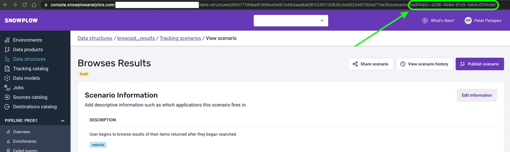
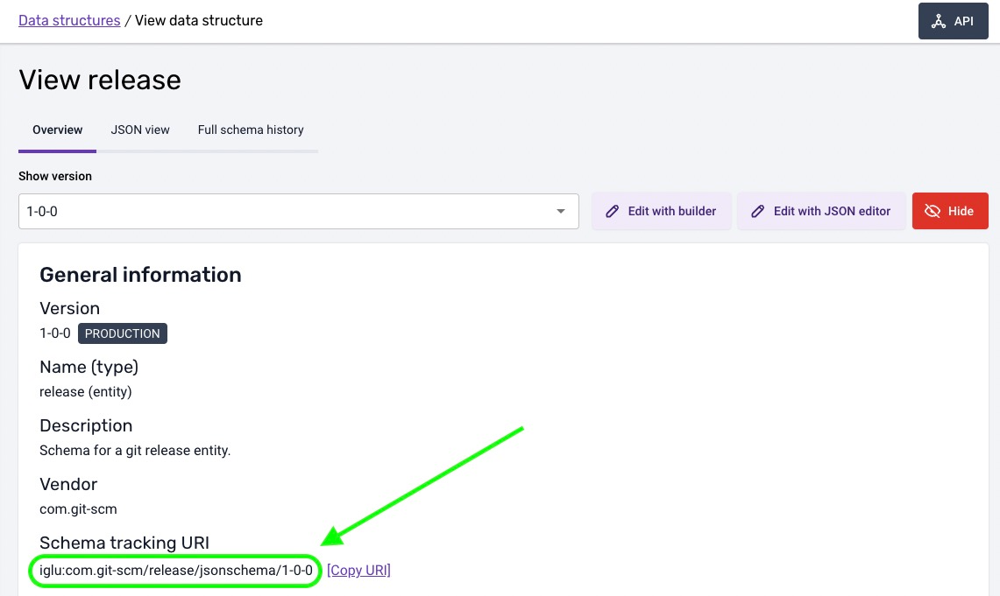
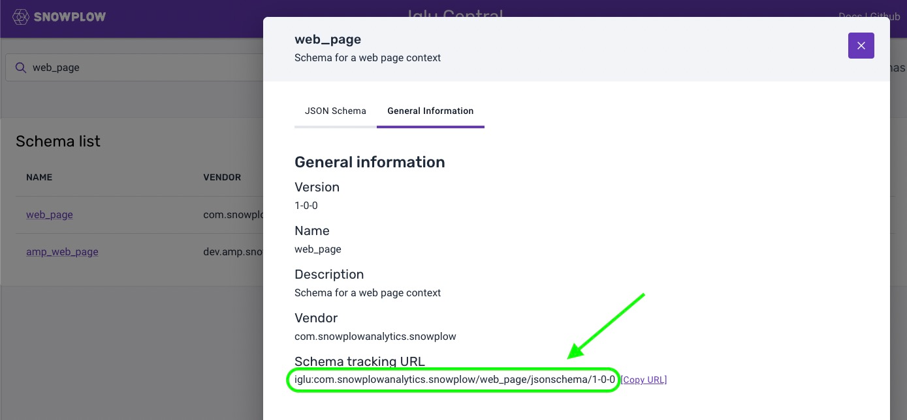
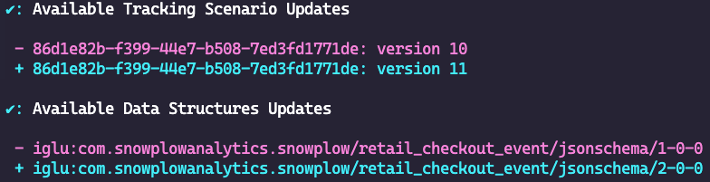

```mdx-code-block
import Tabs from '@theme/Tabs';
import TabItem from '@theme/TabItem';
```

## Working with the Snowtype CLI

The Snowtype CLI is a tool which aims to speed up tracking implementations, provide type safety and inline documentation for developers and ultimately reduce the number of erroneous events. By integrating this tool in the development workflow we introduce a way to connect the additions and updates done in a Snowplow implementation with the corresponding tracking code of the project.

## Initializing Snowtype for your project

For the Snowtype CLI to work properly, it requires a [configuration file](../snowtype-config/index.md) to be initialized and present on your project's root folder. This file will be automatically generated using the `snowtype init` command, after adding the required input.

```bash
# Start prompting for configuration inputs
npx snowtype init 
```

The input required for the initialization to work, it the following:
- The organization ID from the BDP console.
- The [tracker](./index.md#available-trackerslanguages) you wish to generate code for.
-  _If applicable,_ the language for that tracker.
- The output path you wish the CLI to generate the code to.

These will all be prompted to you by default, but if needed you can call the `snowtype init` command with any or all the attributes passed as [optional flags](../commands/index.md#snowtype-init) so prompting is not required.

## Authenticating with the Console

A Console API key is required for the Snowtype CLI to authenticate with your account. You can find your own or create one in the Console [API key management](https://console.snowplowanalytics.com/credentials).

From there, the ways for the CLI to recognize the key are either through the global `-k, --apiKey` option or the `SNOWPLOW_CONSOLE_API_KEY` environment variable. The Snowtype CLI does automatically read from a `.env` file at the root of your project as well.

<Tabs groupId="api-key">
  <TabItem value="env file" label=".env file" default>

  ```bash
  SNOWPLOW_CONSOLE_API_KEY=MY-API-KEY
  ```
  
  </TabItem>
  <TabItem value="shell" label="Shell variable" default>

  ```bash
  # The required command will depend on your shell   
  export SNOWPLOW_CONSOLE_API_KEY=MY-API-KEY
  ```
  
  </TabItem>
  <TabItem value="cli" label="CLI parameter" default>

  ```bash
  npx snowtype generate --apiKey MY-API-KEY
  ```
  
  </TabItem>
</Tabs>

**Recommended:** We recommend that you use the `SNOWPLOW_CONSOLE_API_KEY` environment variable.

## Generate tracking code

The CLI will generate tracking code using a valid Snowtype configuration file with the `snowtype generate command`. The code that will be generated, depending on the language, will have all the required types used in schemas and Tracking Scenarios together with methods/classes that allows for tracking these.


```bash
# Code will be generated to the outpath configuration
npx snowtype generate 
```

The code generated by the CLI is not minified and contains inline documentation for methods, classes and types. If needed you can modify it in any way it suits your project.

### Contents
The contents of a generated file from the Snowtype CLI will be:
- Types/Interfaces/Classes for each schema that relates to the Data Structures, Iglu Central Schemas and Tracking Scenarios selected.
- For each schema:
    - A method/class to instantiate the structure as a Self Describing JSON. _This is particularly useful to add entities as extra context on events._
    - A method that sends a Self Describing Event with the schema as the main event entity.
- For each Tracking Scenario, a method/class to track the specific scenario.

:::caution
The Snowtype CLI does not automatically install the required Snowplow tracking libraries. For now it generates code that use the tracking libraries which are expected to be installed on the project.
:::

### Available Trackers/Languages

Following is the set of available trackers and languages the Snowtype CLI currently can work with. This list is also the source of truth for valid keys in the `tracker` and `language` attributes of the Snowtype configuration file.

| **Tracker** | **Language/s** |
| --- | --- |
| `@snowplow/browser-tracker` | javascript, typescript |
| `@snowplow/node-tracker` | javascript, typescript |
| `@snowplow/javascript-tracker` | javascript |
| `snowplow-golang-tracker` | go |
| `snowplow-ios-tracker` | swift |
| `snowplow-android-tracker` | kotlin |

### Tracking Scenarios

To add Tracking Scenario to the code generation, either manually or through the `snowtype patch` command, you would need the ID of the scenario. You can find the Scenario ID in the main page of the scenario as shown below:



Then you should add this ID to your `snowtype.config.json` `trackingScenarioIds` array.

### Data Structures

To add a Data Structure to the code generation, either manually or through the `snowtype patch` command, you would need the Data Structure `Schema tracking URL`. You can find the Data Structure tracking URL on the Data Structure page in the Console, under the **Overview** tab as shown below:



Then you should add this Data Structure tracking URL to your `snowtype.config.json` `dataStructures` array.

### Iglu Central Schemas

To add a Data Structure to the code generation, either manually or through the `snowtype patch` command, you would need the `Schema tracking URL`. You can find the Schema tracking URL on [Iglu Central](http://iglucentral.com/) by searching for the schema and under the **General Information** tab you can find the URL as shown below:



Then you should add this Schema tracking URL to your `snowtype.config.json` `igluCentralSchemas` array.

## Keeping up with latest updates

It is important that the tracking code is up-to-date with latest versions of Data Structures and Tracking Scenarios we are tracking on a project. The Snowtype CLI gives the engineers the ability to check if there are available updates for Data Structures and Tracking Scenarios that are used in the project.

This works with the `snowtype update` command.

```bash
npx snowtype update 
```

The above command will output a _diff_ showing the available version updates, similar to what you can see below:



In that case, you can select to update to latest versions and regenerate the tracking code. To automatically update and regenerate the tracking code reflecting the latest updates, you can use the `--yes` flag.