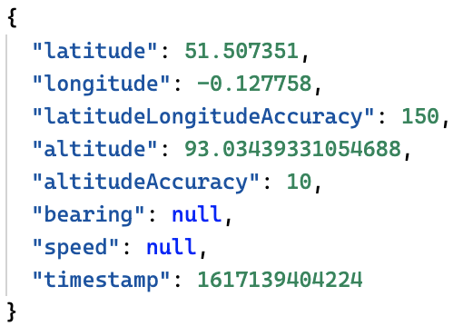

```mdx-code-block
import Tabs from '@theme/Tabs';
import TabItem from '@theme/TabItem';
import ReleaseBadge from '@site/docs/reusable/javascript-tracker-release-badge-v3/_index.md'

<ReleaseBadge/>
```

If this plugin is enabled, the tracker will attempt to create a context from the visitor’s geolocation information. If the visitor has not already given or denied the website permission to use their geolocation information, a prompt will appear. If they give permission, then all events from that moment on will include their geolocation information.

## Installation

<Tabs groupId="platform" queryString>
  <TabItem value="js" label="JavaScript (tag)" default>

| Tracker Distribution | Included |
|----------------------|----------|
| `sp.js`              | ✅        |
| `sp.lite.js`         | ❌        |

**Download:**

<table class="has-fixed-layout"><tbody><tr><td>Download from GitHub Releases (Recommended)</td><td><a href="https://github.com/snowplow/snowplow-javascript-tracker/releases" target="_blank" rel="noreferrer noopener">Github Releases (plugins.umd.zip)</a></td></tr><tr><td>Available on jsDelivr</td><td><a href="https://cdn.jsdelivr.net/npm/@snowplow/browser-plugin-geolocation@latest/dist/index.umd.min.js" target="_blank" rel="noreferrer noopener">jsDeliv</a><a href="https://cdn.jsdelivr.net/npm/@snowplow/browser-plugin-consent@latest/dist/index.umd.min.js" target="_blank" rel="noreferrer noopener">r</a> (latest)</td></tr><tr><td>Available on unpkg</td><td><a href="https://unpkg.com/@snowplow/browser-plugin-geolocation@latest/dist/index.umd.min.js" target="_blank" rel="noreferrer noopener">unpkg</a> (latest)</td></tr></tbody></table>

**Note:** The links to the CDNs above point to the current latest version. You should pin to a specific version when integrating this plugin on your website if you are using a third party CDN in production.

  </TabItem>
  <TabItem value="browser" label="Browser (npm)">

- `npm install @snowplow/browser-plugin-geolocation`
- `yarn add @snowplow/browser-plugin-geolocation`
- `pnpm add @snowplow/browser-plugin-geolocation` 


  </TabItem>
</Tabs>

## Initialization

<Tabs groupId="platform" queryString>
  <TabItem value="js" label="JavaScript (tag)" default>

```javascript
window.snowplow('addPlugin', 
  "https://cdn.jsdelivr.net/npm/@snowplow/browser-plugin-geolocation@latest/dist/index.umd.min.js",
  ["snowplowGeolocation", "GeolocationtPlugin"],
  [false] // Enable at load
);
```

  </TabItem>
  <TabItem value="browser" label="Browser (npm)">

```javascript
import { newTracker, trackPageView } from '@snowplow/browser-tracker';
import { GeolocationPlugin, enableGeolocationContext } from '@snowplow/browser-plugin-geolocation';

newTracker('sp1', '{{collector_url}}', { 
   appId: 'my-app-id', 
   plugins: [ GeolocationPlugin() ],
});

enableGeolocationContext();
```

  </TabItem>
</Tabs>

### Functions

<table class="has-fixed-layout"><tbody><tr><td><code>enableGeolocationContext</code></td><td><a href="/docs/collecting-data/collecting-from-own-applications/javascript-trackers/web-tracker/tracker-setup/initialization-options/#enablegeolocationcontext">Documentation</a></td></tr></tbody></table>

### Context

Adding this plugin will automatically capture the following context:

| Context                                                                                                                                                                                                       | Example                                           |
|---------------------------------------------------------------------------------------------------------------------------------------------------------------------------------------------------------------|---------------------------------------------------|
| [iglu:com.snowplowanalytics.snowplow/geolocation_context/jsonschema/1-1-0](https://github.com/snowplow/iglu-central/blob/master/schemas/com.snowplowanalytics.snowplow/geolocation_context/jsonschema/1-1-0) |  |
