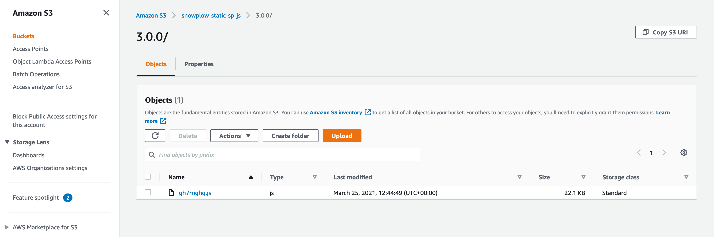

## Pre-requisites

For the purposes of this guide, we are going to assume that you want to serve the standard `sp.js` from CloudFront. To accomplish this, you will need the following:

- An account with [Amazon Web Services](http://aws.amazon.com/)
- S3 and CloudFront enabled within your AWS account

## Download the JavaScript tracker file

Navigate to [https://github.com/snowplow/snowplow-javascript-tracker/releases](https://github.com/snowplow/snowplow-javascript-tracker/releases) and download the latest version of the Snowplow JavaScript Tracker sp.js file

## gzip and rename the file

- rename `sp.js` to a random 8 character string to reduce the chance of AdBlockers preventing the script from loading e.g. `gh7rnghq.js`
- `gzip` the file to reduce the file size and reduce associated cloud storage and egress costs.

From a terminal / command prompt window, navigate to where you have downloaded the file and run:

`gzip -c sp.js > gh7rnghq.js`

**N.B.** on Windows you may need to [download the gzip binaries](http://gnuwin32.sourceforge.net/packages/gzip.htm)

We will continue referring to the file as `sp.js` throughout this guide, however where `sp.js` is mentioned we are referring to your renamed and gzipped file.

## Uploading to Amazon Web Services

### Create a bucket for the JavaScript Tracker

Navigate to [S3 within AWS](https://s3.console.aws.amazon.com/s3/home) and then create a new bucket within your Amazon S3 account to store `sp.js`.

| Option                                           | Value                                       |
|--------------------------------------------------|---------------------------------------------|
| **Bucket Name**                                  | For example, `[company-name]-sp-js`         |
| **AWS Region**                                   | For example, `EU (London) eu-west-2`        |
| **Block Public Access settings for this bucket** | Deselect: ****Block _all_ public access**** |

You can leave all other settings as their defaults.

Click **Create Bucket**.

### Upload the JavaScript

You want to upload the **minified** version of the Snowplow JavaScript, which is called `sp.js`, that you downloaded in an earlier step. If you haven't downloaded it yet, you can obtain the latest version of the JavaScript from [Github releases](https://github.com/snowplow/snowplow-javascript-tracker/releases).

Now you're ready to upload the JavaScript Tracker into your S3 bucket.

1. Navigate to your new bucket by clicking on your Buckets name
2. Click `Create folder` and create a new folder which represents the version of the JavaScript Tracker you are uploading. This will help with any browser caching issues as you update your tracker in the future.  
    If you downloaded Version 3.0.0 then create a folder called `3.0.0`
3. Navigate into your new folder, click **Upload**, click **Add Files** and browse to your file
4. Your file should now be present in the **Files and folders** section
5. Click on **Additoinal upload options** to drop down to extra settings
6. In the **Access control list (ACL)** pane, you must select **Read** within the **Objects** column on **Everyone (public access)** row. You may need to confirm you understand the effects of this change within the UI.
7. Before uploading, we must now we will configure the required metadata for a gzipped file and the cache control for Cloudfront.

#### Configuring metadata

First we will set the `Content-Encoding` header.

1. Scroll down to the **Metadata** section within the **Addtional upload options.**
2. Click **Add Metadata**
3. Add Type: **System defined**, Key: **Content-Encoding**, Value: **gzip**

Now we will add the `Cache-Control` header.

1. Click **Add Metadata**
2. Add Type: **System defined**, Key: **Cache-Control**, Value: **max-age=315360000**
3. Click **Edit metadata**

This sets your items to expire in 10 years, that is 10x365x24x60x60 = 315,360,000.

We recommend that you set the `Cache-Control max-age` property on the file. This property determines _both_ how long Cloudfront caches `sp.js` in its edge locations, and crucially, how long individual browsers cache `sp.js` before repinging Cloudfront for a fresh copy. By setting a long expiration date, you can reduce the number of browser requests for `sp.js`, which can significantly decrease your Cloudfront costs.

The only disadvantage of a long expiration is that you need to find a way to _force_ end users to fetch a fresh copy of `sp.js` when you upgrade to a newer version. However as you have created a versioned folder, this is easily managed by saving your new version to a new folder in your S3 bucket, and updating your Snowplow tags to point to the new version.

Your metadata should now look something like this:

| Type           | Key             | Value                  |
|----------------|-----------------|------------------------|
| System defined | Cache-Control   | max-age=315360000      |
| System defined | Content-Type    | application/javascript |
| System defined | Cotent-Encoding | gzip                   |

Now scroll to the bottom and click **Upload** to upload the JavaScript file into your bucket. When done, you should have something like this:



### Create your CloudFront distribution

Now you are ready to create the CloudFront distribution which will serve your JavaScript. Navigate to [CloudFront within AWS](https://console.aws.amazon.com/cloudfront/home).

1. Click **Create Distribution** and then **Get Started**
2. Use the table below to set all the required options

| Option | Value |
| --- | --- |
| Origin Domain Name | **[Bucket Name].s3.amazonaws.com**  
e.g. snowplow-static-js.s3.amazonaws.com |
| Other options | Leave as default |

Click **Create Distribution** and then you should see AWS beginning to create the distribution.

Note down your CloudFront distribution's **Domain Name** - e.g. `http://d1weib8el6blz6.cloudfront.net`  
You will need this later when you integrate Snowplow into your website.

### Testing your JavaScript file on CloudFront

Before testing, take a 10 minute coffee break (that's how long CloudFront takes to synchronize).

Done? Now just check that you can access your JavaScript file over both HTTP and HTTPS using a browser, `wget` or `curl`:

```text
http://{{SUBDOMAIN}}.cloudfront.net/{{VERSION}}/sp.js
https://{{SUBDOMAIN}}.cloudfront.net/{{VERSION}}/sp.js
```

If you have any problems, then double-check your CloudFront distribution's URL, and check the permissions on your `sp.js` file: it must have Read permissions for Everyone.

That's it - you now have a CloudFront distribution which will serve your Snowplow JavaScript to anybody anywhere in the world, fast. Now all that remains is to update your Snowplow tag to fetch your own version of `sp.js`.
