This template implements the [Snowplow JavaScript tracker v3](/docs/collecting-data/collecting-from-own-applications/javascript-trackers/index.md).

The template supports all the features of the tracker, with a few exceptions due to the limitations of custom templates’ [sandboxed JavaScript](https://developers.google.com/tag-platform/tag-manager/templates/sandboxed-javascript).

## Install the template

To **install the template**, browse to **Templates** in the Google Tag Manager user interface.

Under **Tag Templates**, click **Search Gallery**, and type `Snowplow v3` into the gallery overlay search bar.

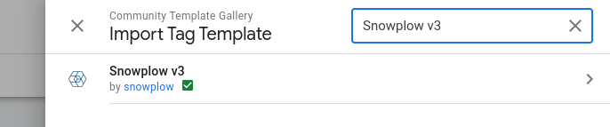

Click the **Snowplow v3** template name, and then click **Add to Workspace** in the next screen. Review the permissions and click **Add** to finalize the import.

After importing the template, you can follow the normal process of creating a **new tag** in Google Tag Manager, and the **Snowplow v3** template will be listed among the **Custom** tag types you can choose from.

## Caveats

To begin with, some of the caveats of using the Custom Template.

- Any methods that require the parsing of HTML elements (e.g. link tracking filter functions, cross domain linking) will not work and are thus disabled.
- Automatic error tracking does not work due to lack of support for the `ErrorEvent` API.
- There is no implementation for the [standard ecommerce](/docs/collecting-data/collecting-from-own-applications/javascript-trackers/web-tracker/tracking-events/index.md#ecommerce-tracking) events. Users are encouraged to implement the [enhanced ecommerce](/docs/collecting-data/collecting-from-own-applications/javascript-trackers/web-tracker/tracking-events/index.md#enhanced-ecommerce-tracking) setup instead.

## Instructions

Here are basic instructions for how to instrument the JavaScript tracker v3.

In general, when the tag fires, it first checks if the Snowplow JavaScript library has been loaded from the self-hosted URL provided in the template settings (more on this below). Then, the tag checks whether a tracker with the given **Tracker Name** has already been initialized. If not, it proceeds to initialize the new tracker.

Finally, the tag bundles a **command** from the settings in the tag, and sends it to the given **Collector Endpoint**.

### Settings Configuration

The Tag template requires a [Snowplow v3 Settings](/docs/collecting-data/collecting-from-own-applications/javascript-trackers/web-tracker/tracker-setup/google-tag-manager-custom-template/v3-settings-variable/index.md) Variable template to be configured which can be referenced within the Tag. This settings template contains the information required for the Tag to appropriately initialize the tracker.

Once a settings variable has been configured, it can be attached to the Tag in the **Tracker Initialisation** section.

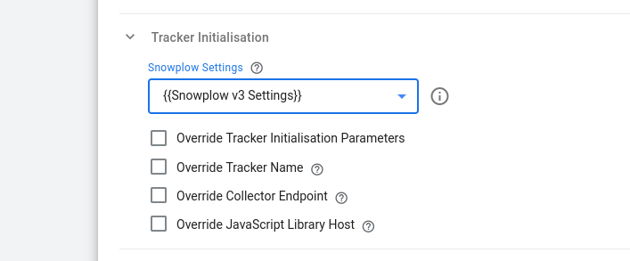

You can also choose to override some of the parameters specifically for this tag if you wish to, such as the Tracker Name or the Collector Endpoint.

#### Self Hosted JavaScript Tracker

If you have the Snowplow library [self-hosted](/docs/collecting-data/collecting-from-own-applications/javascript-trackers/web-tracker/tracker-setup/hosting-the-javascript-tracker/index.md), and have configured it as such in your Settings variable, you need to update the **Injects Scripts** permission to reflect the new location, by editing the **Snowplow Analytics v3 Tag template**. Delete the content of the **Allowed URL Match Patterns** field, and type the full URL to the library there. Again, it must match what you input into the tag itself when creating it.

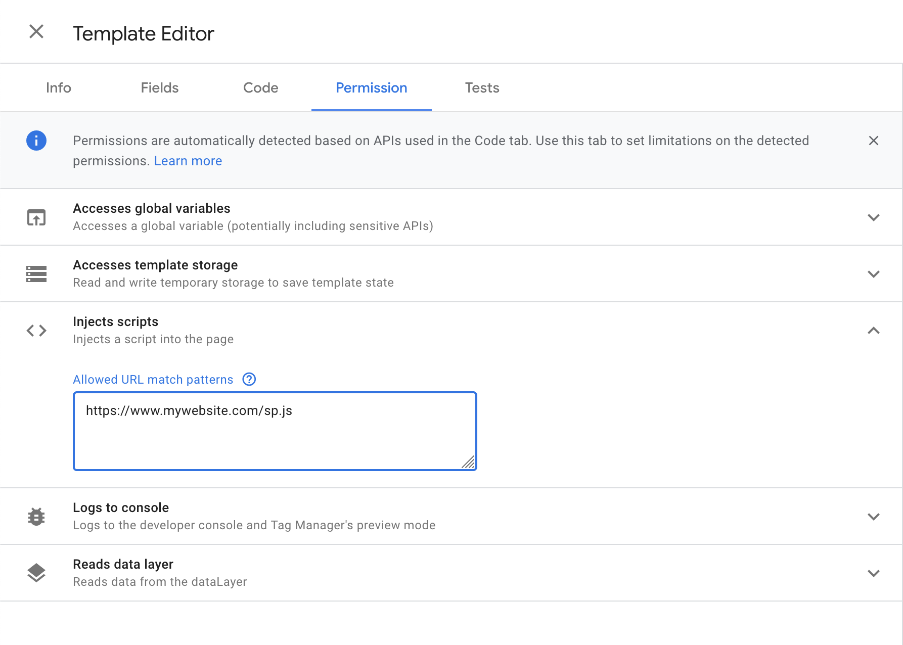

Modifying permissions **breaks the gallery link** and you will no longer be notified about updates to the template.

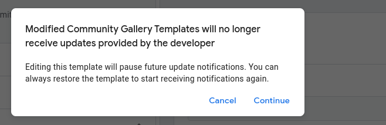

:::note

Since v1.1.0, an alternative to prevent breaking the gallery update link is to use the `Do not load` option from the corresponding drop down menu:

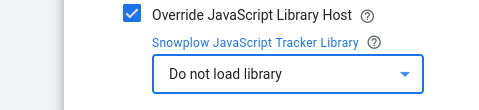

Using this option means that the Snowplow v3 Tag will not inject the Snowplow JavaScript Tracker library on the page and can be used **only** when the Tracker Snippet is loaded with another technique, e.g. directly on the page or through another GTM tag. (This is also supported as a configuration option since v1.2.0 of the [Snowplow v3 Settings](/docs/collecting-data/collecting-from-own-applications/javascript-trackers/web-tracker/tracker-setup/google-tag-manager-custom-template/v3-settings-variable/index.md) Variable.)

:::

### Tag Type

Under **Tag Type**, you can choose what type of command is compiled and sent to the endpoint. The tag types are split here into three groups: commands that utilize a common **parameters** object, commands that have **special conditions**, and **custom commands**.

#### Tags with a parameter object

Tags that can derive their parameters from a Google Tag Manager variable are:

- Ad Tracking
- Cart Tracking
- Error Tracking
- Consent
- Self-describing Event
- Site Search
- Social Interaction
- Structured Event
- Timing

You can set the **Retrieve Parameters From Variable** setting to a Google Tag Manager variable. This parameter _must_ return an object. In the object, the key-value pairs should reflect the named parameters in the [event documentation](/docs/collecting-data/collecting-from-own-applications/javascript-trackers/web-tracker/tracking-events/index.md). For example, to have the variable populate an [Error event](/docs/collecting-data/collecting-from-own-applications/javascript-trackers/web-tracker/tracking-events/index.md#error-tracking), you could use a Custom JavaScript variable like this:

```javascript
function() {
  return {
    message: 'Some Error Happened',
    filename: 'somefile.js',
    lineno: 5,
    colno: 236,
    error: null
  }
}
```

Alternatively, you can set the drop-down to the value `No`, and add the parameters manually instead:

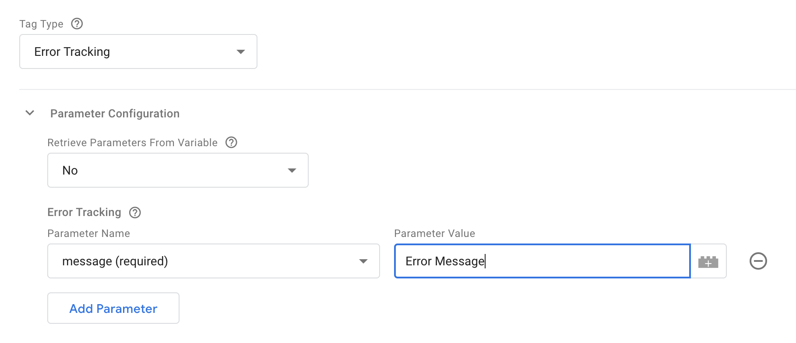

Some tag types will add additional selections to this section. Follow the [official tracker documentation](/docs/collecting-data/collecting-from-own-applications/javascript-trackers/web-tracker/tracking-events/index.md) for more information about what each option does.

#### Special tags

Some tag types have special conditions and have been separated into their own configurations.

##### Enhanced Ecommerce

When you select Enhanced Ecommerce, you are left with two options: **Use Data Layer** or **Choose Variable**. The way it works is very similar to Enhanced Ecommerce in Google Analytics.

If you choose the first, the template will look into the `dataLayer` structure for the **most recently** pushed [Enhanced Ecommerce object](https://www.simoahava.com/analytics/enhanced-ecommerce-guide-for-google-tag-manager/#data-types-actions), and map this object to the request to Snowplow Analytics.

If you selected **Choose Variable**, you need to provide a GTM variable that returns an object in the correct, expected format.

##### Form Tracking

Form tracking has just two options, because **filters** and **transformations** won’t work with the custom template (due to lack of support for processing HTML elements). The options are to set form and/or field **blacklists** and **whitelists**.

Blacklists and whitelists for forms are a list of comma-separated HTML class names. If blacklisted, then any form element with a listed class will not trigger the form event. If whitelisted, then _only_ form elements with a listed classname will be tracked.

For fields, blacklists and whitelists work similarly, except they use the `name` attribute rather than the class.

##### Link Click Tracking

The **Track Link Click** event is similar to regular parameter-based events, as it lets you add parameters and track a link click as a manually encoded hit.

The **Enable Automatic Link Click Tracking** adds listeners to the page, which will track clicks on links permitting they adhere to the blacklisted/whitelisted class names you can optionally provide.

The **Fix Middle-click Tracking** adds a fix for some browsers where middle-clicks were not tracked properly.

If you check **Track HTML Content Of Clicked Link**, then the full text content of the link element will be sent to Snowplow as well.

##### Page View

You can provide a **Custom Page Title** if you wish, and you can add a [custom context](/docs/collecting-data/collecting-from-own-applications/javascript-trackers/web-tracker/tracking-events/index.md#custom-context) to the request, as also described [here](/docs/collecting-data/collecting-from-own-applications/javascript-trackers/web-tracker/tracking-events/index.md#trackpageview).

If you enable **Page Activity Tracking**, the tag will setup a _heartbeat_ tracker, and send page pings to Snowplow at intervals that you can specify.

The **Callback Function** is something you can set to a JavaScript function. If you set the callback, then instead of sending the page ping to Snowplow, the function gets invoked instead.

#### Custom Commands

For any other commands which are supported by the Snowplow JavaScript Tracker v3, you can select the **[Custom Command]** option. Once select, you can enter any function name and the associated parameter for that function. The parameter can either be a simple string, in examples such as `setUserId`:

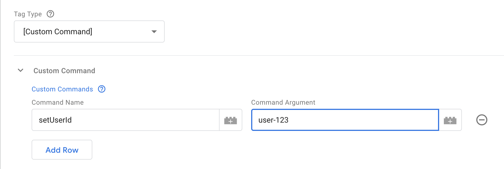

Or it can be set to a Custom JavaScript Variable in the instances where an Object should be passed to the function, such as with `enableAnonymousTracking`:

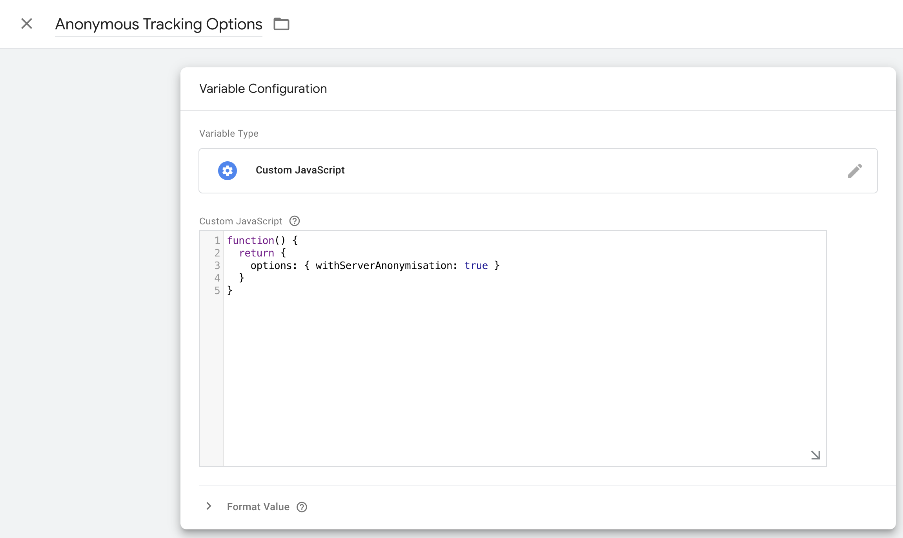

And then use this variable as your Command Argument:

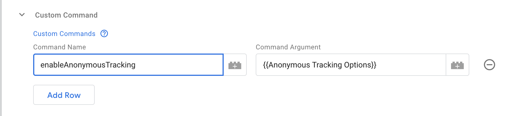

### Additional Tracking Parameters

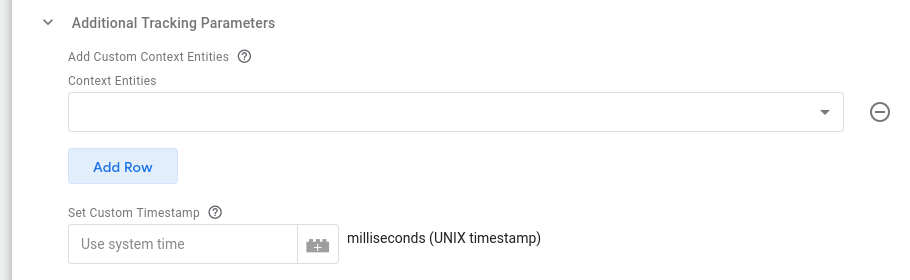

#### Add Custom Context Entities

Using the **Context Entities** table allows you to attach [custom context entities](/docs/collecting-data/collecting-from-own-applications/javascript-trackers/web-tracker/tracking-events/index.md#custom-context) to the Snowplow event. Each row should be set to a variable value that must be an **array of custom context objects** that will all be concatenated to add to the Event.

#### Set Custom Timestamp

You can also choose to [set the True Timestamp](/docs/collecting-data/collecting-from-own-applications/javascript-trackers/web-tracker/tracking-events/index.md#setting-the-true-timestamp) with this field. The format must be UNIX time in milliseconds.

### Using Plugins

[Plugins](/docs/collecting-data/collecting-from-own-applications/javascript-trackers/web-tracker/plugins/index.md) provide an easy way to distribute custom behavior for the tracker.
Each Plugin can be loaded from external URLs or provided inline within GTM, and can optionally take some custom configuration.
A Plugin may add new methods to the tracker that can be called via [Custom Commands](#custom-commands).

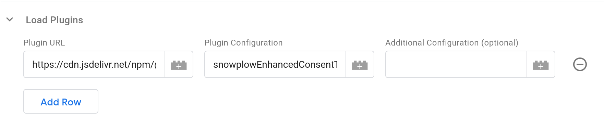

Plugins are configured by using the **Load Plugins** table.
Each row in the table takes three values and loads a single plugin.
Plugins are loaded in order, and processed before the configured **Tag Type** configuration is executed -- so you can load a plugin in the same Tag that uses its functionality via Custom Commands.
The plugins will remain configured in the tracker and be accessible to later Tags.

#### External Plugins

You can load external plugins by entering their URL in the **Plugin URL** field.
The tracker will try to load plugins each time they are requested.
This is usually acceptable as the browser will have cached the first request; if you don't want this behavior we suggest creating an empty **Custom Command** Tag with no commands that loads the plugins; you can make this Tag fire [once per page](https://support.google.com/tagmanager/answer/6279951) and add it as a [Setup Tag](https://support.google.com/tagmanager/answer/6238868) to any other Tags that use its commands.

:::tip

Plugins are loaded by the tracker SDK directly, not via the Tag Template:
You do not need to adjust the Template permissions to allow loading plugins from these URLs.

:::note

Official Snowplow Plugin versions are updated in lock-step with the tracker version, to ensure maximum compatibility.
For best results, try to keep your SDK version and plugin versions in sync.
If you are loading your tracker SDK file and the plugins from a CDN like unpkg or jsDelivr (built into the Template), the version is located in the URLs.
Consider keeping your version in a GTM Variable that you can use to define your SDK version and include in the URLs for plugins to keep them in sync.
If you are self-hosting the files, make sure to update the plugin files at the same time you update the SDK.

The Plugin's documentation will describe the value to use for the **Plugin Configuration** field.
This is usually an array with two string elements, for example `['snowplowWebVitals', 'WebVitalsPlugin']`.
The Tag Template will split the value entered here on `,` to make it an array, so you should enter the string values joined with that character, such as `snowplowWebVitals,WebVitalsPlugin`.

Finally, the optional **Additional Configuration** field allows you to add any configuration the Plugin may require.
Plugins are allowed to take zero or more parameters, but you are only given a single field to enter them in the Tag Template configuration.
You can either type in a string value, or reference a Variable containing another value, which should return an Array of arguments to pass to the Plugin (this will typically be a Custom JavaScript Variable).
If you enter a string, the Tag Template will check if it contains a `,` character, and if so, will split it into an array of strings and pass them as separate arguments to the Plugin, otherwise passing your string as the only argument.

:::warning

The Tag Template will try to call `.indexOf(',')` on the **Additional Configuration** value, so values of types other than Array or String may fail and break the Tag.
String values (before or after splitting) of `true`, `false`, `null`, and numeric values will become their respective typed JSON values.
It is not possible to pass a single `null`, `undefined`, or empty string value as a parameter to a Plugin, instead no arguments will be passed to the plugin.

:::info

If your configuration includes functions, GTM will wrap those functions in [its sandbox](https://developers.google.com/tag-platform/tag-manager/templates/sandboxed-javascript), even when passed to the SDK for execution.
Complex values like DOM elements will be replaced by `null` when passed to or returned from your function.
This may make some plugins not function as intended.

#### Inline Plugins

[Inline Plugins](/docs/collecting-data/collecting-from-own-applications/javascript-trackers/web-tracker/plugins/creating-your-own-plugins/index.md#inline-plugins) are plugins that don't require being fetched from an external file to load.

You can create Inline Plugins in GTM by using Custom JavaScript Variables in the **Plugin URL** field.
The Variable should return an Object with a method that returns another Object meeting the [Plugin Interface](/docs/collecting-data/collecting-from-own-applications/javascript-trackers/web-tracker/plugins/creating-your-own-plugins/index.md#plugin-interface) (any other methods on the outer Object will become tracker methods).

For **Plugin Configuration**, the UI enforces the comma-seperated values syntax required for external Plugins and unconditionally calls `.split(',')` on the string.
The SDK requires that for inline-plugins only a single string may be used.
To work around this limitation, create another Custom JavaScript Variable that returns your constructor method name wrapped in an Object with a fake `split()` method:

```javascript
function() {
  return {
    split: function() {
      return "myInlineConstructorMethodName";
    }
  };
}
```

Configuration for **Additional Configuration** is the same as for [External Plugins](#external-plugins).

## Acknowledgements

Thanks to [Simo Ahava](https://www.simoahava.com/) for building the initial release of this template.
