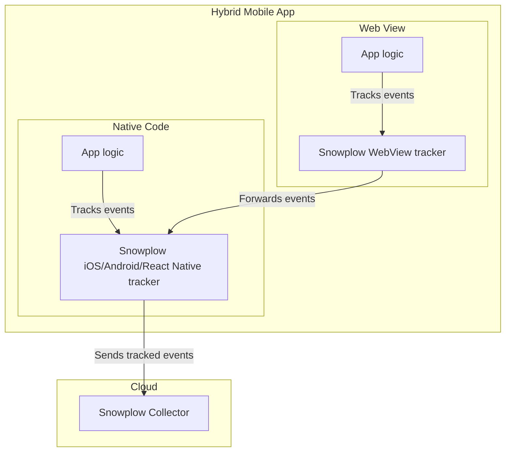

```mdx-code-block
import Badges from '@site/src/components/Badges';
import Tabs from '@theme/Tabs';
import TabItem from '@theme/TabItem';

<Badges badgeType="Early Release"></Badges>
```

The [Snowplow WebView Tracker](https://github.com/snowplow-incubator/snowplow-webview-tracker) allows you to track Snowplow events from Web views in **mobile hybrid apps**.

Hybrid apps are mobile apps that in addition to a native interface, provide part of the UI through an embedded Web view.
Snowplow events are tracked from both the native code (e.g. written in Swift or Kotlin) as well as the Web view (in JavaScript).
Our goal is to have both events tracked from the native code as well as the Web view, share the same session and appear as tracked with the same tracker.

The WebView tracker should be integrated in Web apps used in Web views within native mobile apps.
The tracker provides APIs to track Snowplow events.
It forwards the events to the native app code to be tracked by the Snowplow mobile trackers ([iOS, Android tracker](../mobile-trackers/hybrid-apps/index.md), or [React Native](../react-native-tracker/hybrid-apps/index.md)).
The diagram below shows the interaction of the WebView and mobile trackers in hybrid apps.



## Installation

You may choose to install the tracker as an npm package or by loading it through an HTML script tag.

<Tabs groupId="installation">
  <TabItem value="npm" label="Using npm" default>

To install the WebView tracker in your JavaScript or TypeScript app, add the npm package:

```bash
npm install --save @snowplow/webview-tracker
```

You will then be able to use the functions provided by the WebView tracker as follows:

```typescript
import { trackSelfDescribingEvent } from '@snowplow/webview-tracker';
```

In addition, you will need to install the iOS or Android tracker in your native code and configure and initialize a tracker (see the [mobile tracker docs][mobile-tracker-setup-docs]). Afterwards, you will be able to subscribe to and track the events from the WebView tracker in a Web view by calling `Snowplow.subscribeToWebViewEvents(webView)`.

  </TabItem>
  <TabItem value="tag" label="Using Snowplow tag">

You may download the `sp.js` file from the Releases section Github, self-host it, and load to your page using the following tag:

```html
<script type="text/javascript" async=1>
;(function(p,l,o,w,i,n,g){if(!p[i]){p.GlobalSnowplowNamespace=p.GlobalSnowplowNamespace||[]; p.GlobalSnowplowNamespace.push(i);p[i]=function(){(p[i].q=p[i].q||[]).push(arguments) };p[i].q=p[i].q||[];n=l.createElement(o);g=l.getElementsByTagName(o)[0];n.async=1; n.src=w;g.parentNode.insertBefore(n,g)}}(window,document,"script","{{URL to sp.js}}","snowplow"));
</script>
```

:::note

Make sure to replace the `{{URL to sp.js}}` with the URL to the `sp.js` file in the snippet.

:::

  </TabItem>
</Tabs>

## Using the tracker

To track events, simply call their corresponding functions given the event data:

<Tabs groupId="installation">
  <TabItem value="npm" label="Installed using npm" default>

```javascript
trackSelfDescribingEvent({
    event: {
        schema: 'iglu:com.snowplowanalytics.snowplow/link_click/jsonschema/1-0-1',
        data: {
            targetUrl: 'http://a-target-url.com'
        }
    }
});
```

  </TabItem>
  <TabItem value="tag" label="Installed using Snowplow tag">

```javascript
window.snowplow('trackSelfDescribingEvent', {
    event: {
        schema: 'iglu:com.snowplowanalytics.snowplow/link_click/jsonschema/1-0-1',
        data: {
            targetUrl: 'http://a-target-url.com'
        }
    }
});
```

  </TabItem>
</Tabs>

## Accelerator guide

For a step-by-step guide on how to instrument hybrid apps and model the mobile data, please visit the [Mobile & Hybrid App Analytics accelerator](https://docs.snowplow.io/snowplow-hybrid-apps-accelerator).
