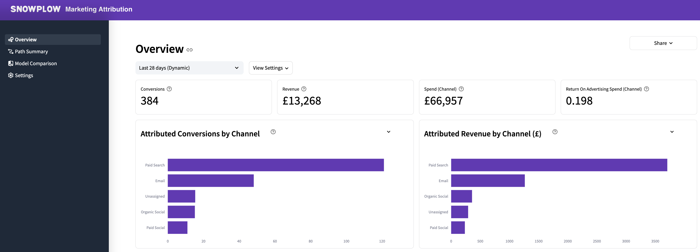
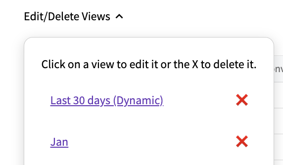

:::caution

This data app is currently in Public Preview and features may change without notice. 

:::

In today's increasingly complex digital world, users often take multi-channel journeys before converting. Assigning credit across multiple touchpoints is vital to getting an accurate picture of the efficacy of your marketing channels, yet requires merging disparate datasets and running complex calculations.

Our **Marketing Attribution** app (together with the [Snowplow Attribution dbt package](/docs/modeling-your-data/modeling-your-data-with-dbt/dbt-models/dbt-attribution-data-model/index.md)) lowers the barrier to entry for your marketing team through the following features:

- Incremental SQL model in your warehouse for cost-effective computation
- Choice of first-touch, last-touch, linear and positional methods, with additional filters and transforms available
- Reports for conversions, revenue, spend and Return On Advertising Spend (ROAS) per channel and campaign
- Option to specify your own touchpoint and advertising spend tables
- Intermediate tables that you can build your own attribution models on top of

## Requirements

- [Campaign Attribution enrichment](/docs/enriching-your-data/available-enrichments/campaign-attribution-enrichment/index.md) enabled
- [Referrer Parser enrichment](/docs/enriching-your-data/available-enrichments/referrer-parser-enrichment/index.md) enabled
- Running the [Snowplow Unified Digital dbt Package](/docs/modeling-your-data/modeling-your-data-with-dbt/dbt-models/dbt-unified-data-model/index.md) with `conversion event(s)` defined and the optional conversion module enabled
- Running the [Snowplow Attribution dbt Package](/docs/modeling-your-data/modeling-your-data-with-dbt/dbt-models/dbt-attribution-data-model/index.md)
- Access to the derived tables granted to the role used when setting up the data app

## Preparing Views for the Dashboards

Note that all these settings are global for all users, meaning if you change them they will be changed for everyone. The first user of the app will have to define at least one `View` which is the dataset needed to generate the charts. Defining a View can be done on the `Settings` page.

### 1. Basic Configurations

#### 1.1 Decide on the Update Method 

Use the toggle `Last N days View (Dynamic)` to choose whether your would like to define a dynamic view that auto-updates or a static view:

**Defining a Last N Days (Dynamic) View**

The so-called `Dynamic` views are to be used for generating datasets that have a rolling conversion window of last nth day and will be refreshed automatically (e.g. Last 30 days). The app will save the last-refreshed date with the View configurations and any subsequent day a user logs back in the app, a query will run in the background to look for any newly processed conversion event in the conversion source and if there is, the dynamic datasets are refreshed by running all the queries that are needed to generate data for the charts to populate. 

If you choose this option, set the `auto-update days`: the number of days since the last conversion event defined here will define the conversion window. The latest conversion window in use can be checked on the `Settings` page where a table with information on all the created views is displayed including conversion window that is currently in use.

**Defining a Custom Date Range (static) View**

Non-dynamic views will have to be given a name and will typically be used to generate a fixed dataset (e.g. Jan, Q1, 2023) to avoid having to recalculate the analysis for subsequent users.

Define a fixed conversion window by selecting the appropriate date range with the date picker tool (which gets activated by clicking on the default date range). 

#### 1.2 Set a currency symbol (defaults to $)

### 2. Connect your Data Sources:

1. Select your schema that contains the derived unified and attribution tables: this will trigger an update which checks for any tables with the names closest to what the app expects.
2. After waiting for the update to take place you can revise if the auto-detected source tables are in line with your expectations, you can change them to any other existing tables you have in case they are not correct.

    There is an optional `snowplow_attribution_paths_to_non_conversion` table select box, which for most users are not relevant and therefore the first option: `Do not use paths_to_non_conversion table` should be selected. 

    Please note that this table is not recalculated by the app, therefore it should only be used for a fixed view with the intention of consuming the same period as is in the latest data model, consuming the  `snowplow_attribution_paths_to_non_conversion` table for use in the `Path Summary` page.

3. Overwrite the attribution_manifest table. Most likely the schema name will have to be modified. Please keep the `schema_name.table_name` notation here. Make sure you press enter once modified.
4. (Optional but recommended) Specify the Spend Source: this will most likely be a view you created on top of your table that holds your marketing spend data. The view should make sure you align the expected field names. It should have `campaign`, `channel`, `spend` and `spend_tstamp` for the analysis to work. Doing this will make sure you have Return On Advertising Spend (ROAS) calculation in your overview. Make sure you press enter once modified.

    Once happy with all the imputs press `Create View` button. The app will first run a validation against the data sources making sure it has all the fields it needs and display them if something is not correct, otherwise it will save the view and the dashboards are ready to be explored. The first time a dashboard page is visited, the relevant query will run once and the data will be cached to speed up subsequent dashboard explorations for other users.

## Using the Dashboard

Once at least one View is configured by the Data Analyst or Engineer, users that are only interested in the Dashboard can just use the dashboards created by the app to review the results of the analysis.

### Dashboard Filters

There are various filters at the top of each dashboard page that make the data exploration interactive. Because the queries are cached, users can make any of these interactive changes without affecting the warehouse to avoid expensive queries or laggy information retrieval.

1. select which `View` to use from a dropdown
2. make changes within `View Settings`

Once you click on `View Settings` at the top of each page you can:
- select which Attribution Type to use (`Fist Touch`, `Last Touch`, `Linear` or `Position Based`)
- choose between using `Campaign` or `Channel` to be considered for paths

Optional filters:
- for relevant pages there are additional filters suche as the `Remove paths with only 1 touchpoint` or `Number of Items` which reduces items within specific charts.

## Editing / Deleting Views
On the `Settings` page there is an easy way to edit or delete existing views:

- **deletion**: click X next to the view
- **editing**: click on the name of the view, the app will take you to the view configuration page where you can make amendments. Once ready, click save again, which will overwrite the existing view configurations 

