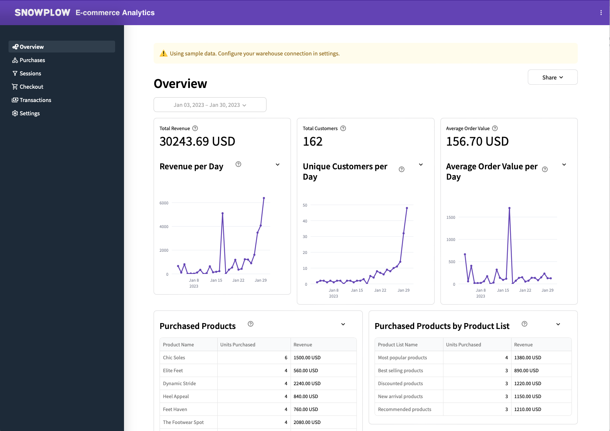

:::caution

This data app is currently in Public Preview and features may change without notice. 

:::

## Introduction

<!-- Ecommerce reports based on GA4's Monetization metrics, covering revenue, purchases, checkout journey and promotions -->

This application offers an in-depth breakdown of Ecommerce activities across your websites and mobile apps, presenting an enhanced rendition of Google Analytics v4 reports.
Access real-time data directly within your data warehouse in a governed manner.
Navigate through a series of interactive dashboards designed to surface monetization data, purchasing behaviors, checkout experiences, and transaction patterns.
Customize your analytics workflow with filters for campaigns, channels, and products.

Leveraging Snowplow's latest Ecommerce event tracking and our proprietary E-commerce dbt package, the app transforms raw event data into structured tables covering carts, checkouts, products, transactions, and user interactions, providing valuable insights for informed decision-making.

### Requirements

- Running the [Snowplow E-commerce dbt Package](/docs/modeling-your-data/modeling-your-data-with-dbt/dbt-models/dbt-ecommerce-data-model/index.md)
- Access to the derived tables granted to the role used when setting up the data app

## Usage

The following steps will guide you through using the app.

### Step 1: Explore the dashboards using sample data (optional)

Before you configure the app to use your data, you are free to explore all the dashboards of the app using the sample data included in the app.

You can browse the following pages:

1. **Overview** shows the key metrics including the revenue, number of customers and the average order value. It also shows the revenue for top performing products and product lists.
2. **Purchases** dives deeper into the purchased products and compares product views, add to carts, units purchased, and more.
3. **Sessions** shows a funnel of how users navigated from product views all the way to transactions by their number of sessions, conversion rate and abandonments.
4. **Checkout** goes deeper into the individual checkout steps within the funnel and shows conversion rate, and abandonment for each step.
5. **Transactions** gives key metrics for the transactions including types of payments.

### Step 2: Configure using the E-commerce dbt package tables

The **Settings** page lets you choose the schema and tables in your data warehouse to use in the app.
These refer to the output of the E-commerce dbt package.

First, choose the warehouse schema where your dbt E-commerce package produced the derived tables (e.g., `dbt_ecom_derived`).
The app will suggest the most likely tables below.
Verify that these match the desired tables and click "Save Settings".
The app will then check that the tables have the required columns.
If successful, you can navigate to the dashboard pages in the sidebar and explore your data.

### Step 3: Choose the date range and filters

At the top of each page, there is an option to choose the date range (including a secondary date range to compare the data against) and filters.
These options let you narrow down the data shown in the dashboard to what you are interested in.

When you click on the "Filters" button, you will see a modal with an option to add conditions on fields in the data.
For example, you can add conditions on the products or product lists that you are interested in.

