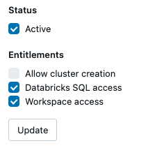

```mdx-code-block
import Tabs from '@theme/Tabs';
import TabItem from '@theme/TabItem';
```

Data applications are self-service analytics tools, deployed in your cloud, that help customers extract value from their data quickly by providing templated use-cases for data collection, modeling, and activation. They aim to reduce the technical barrier, making data analysis more accessible beyond just SQL users.


## Available Data Apps
<!-- This will become a table when we have more -->
```mdx-code-block
import DocCardList from '@theme/DocCardList';

<DocCardList /> 
```

## Accessing the Applications

You can find the Data Applications in the `Applications` tab in the left sidebar of your Snowplow Console. If the status is not `Live`, you can click on the tile and request access. A Snowplow Customer Success Manager will then get in contact with you to discuss the Snowplow Digital Analytics package.

Once the application is installed, clicking on the tile will launch the application in a separate browser tab. By default, anyone in your Console organization will be able to access data applications.

If you wish to invite others to use data applications but not have access to the rest of Console, you can [create a new user](/docs/using-the-snowplow-console/managing-users/adding-removing/index.md) and add a user with the `Data applications user` role. That user will then only see the Data Applications tab within Console. This permissions can be managed in the [usual way](/docs/using-the-snowplow-console/managing-users/managing-permissions/index.md).


## General Usage
### Is the app running?
When the app is doing some calculations, querying the database, or otherwise still loading, you'll see the following gif in the top right of the app. You may particularly notice this on applications with multiple tabs per page, as the tabs will load in order so the last tab may seem empty until this processing is completed.

<div style={{"background-color": '#F2F4F7'}}>

</div>

### Setup
Where the app has some requirements it will also have a `Settings` page that will validate what is available to the app, and provide information for steps to take for any unfulfilled requirements.

### Chart Sources
Many of our apps support the exporting of the SQL used to generate the charts. In some cases, there may be a specific button in the app to do this, but for most cases simply look for the  icon and click it to download the SQL used to make that chart!

:::info

Note that some data is processed further after the query to get in the format required for plotting, which may include actions such as filtering, pivoting, etc.

:::

### Help
Our apps provide useful help text throughout the apps, keep an eye out for the help icon (<Icon icon="fa-regular fa-circle-question"/>) to provide more context or help in using some functionality.

### Log Out
If you wish to Log out of the application, you can do this on the `Account` page of any application. Note this also logs you out of Console.


## One off-setup
To setup the app and have it connect to your warehouse we require a user/role to run the app via, the below steps provide more information on this.

Once you have purchased the Snowplow Digital Analytics package, or other package containing Data Apps, Snowplow’s Infrastructure Support team will contact you to review the setup details, and then deploy the data applications into your cloud environment. 

### Warehouse permissions

All data applications will require warehouse user credentials with read access to the tables powering the data applications. There are two options: 

1. Reuse the Data Modeling User - in this case we will use the existing Data Modeling user you created during your on-boarding. Note that this user may need additional table access granted to it to use your own tables in any of the apps e.g. the [funnel builder](/docs/data-apps/funnel-builder/index.md). 
2. [Recommended] Create a new Data Applications user  - you can also create a new warehouse user with more fine-grained permissions. To create this, you can run the following script and then pass us the details via the secure messaging in console.

:::tip

While possible to re-use the same user for each data app, it may be beneficial to have a user per app for easier management of access and for logging purposes. In this case, please alter the scripts below to name each user/role as required.

:::


<Tabs groupId="warehouse" queryString>
<TabItem value="bigquery" label="BigQuery" default>


Create and share a GCP Service Account with us that has the following roles attached to it:

```hcl
data_app_roles = [
  "roles/bigquery.dataViewer",
  "roles/bigquery.filteredDataViewer",
  "roles/bigquery.jobUser",
  "roles/bigquery.metadataViewer",
  "roles/bigquery.readSessionUser"
]
```

Once created share the following details back with us:

1. Project ID
2. BigQuery Dataset ID (indicator of where the app should default into, but is configurable in most apps once launched)
3. BigQuery Dataset Region (indicator of where the app should default into, but is configurable in most apps once launched)
4. BigQuery Service Account JSON (**please send this in a secure format**)

</TabItem>
<TabItem value="snowflake" label="Snowflake">


```sql
CREATE ROLE IF NOT EXISTS DATA_APPS_ROLE;

CREATE WAREHOUSE IF NOT EXISTS DATA_APPS_WH WITH
  WAREHOUSE_SIZE = 'XSMALL' // NOTE: depends on your data volume
  WAREHOUSE_TYPE = 'STANDARD'
  AUTO_SUSPEND = 60
  AUTO_RESUME = TRUE;
GRANT USAGE, OPERATE ON WAREHOUSE DATA_APPS_WH TO ROLE DATA_APPS_ROLE;

// NOTE: ensure you grant read-only access to any other database / schema
//       you would like the applications to access.
GRANT USAGE ON DATABASE <database_with_snowplow_data> TO ROLE DATA_APPS_ROLE;
GRANT USAGE ON FUTURE SCHEMAS IN database <database_with_snowplow_data> TO ROLE DATA_APPS_ROLE;
GRANT MONITOR ON FUTURE SCHEMAS IN database <database_with_snowplow_data> TO ROLE DATA_APPS_ROLE;
GRANT SELECT ON FUTURE TABLES IN database <database_with_snowplow_data> TO ROLE DATA_APPS_ROLE;
GRANT SELECT ON FUTURE VIEWS IN database <database_with_snowplow_data> TO ROLE DATA_APPS_ROLE;
GRANT USAGE ON ALL SCHEMAS IN database <database_with_snowplow_data> TO ROLE DATA_APPS_ROLE;
GRANT MONITOR ON ALL SCHEMAS IN database <database_with_snowplow_data> TO ROLE DATA_APPS_ROLE;
GRANT SELECT ON ALL TABLES IN database <database_with_snowplow_data> TO ROLE DATA_APPS_ROLE;
GRANT SELECT ON ALL VIEWS IN database <database_with_snowplow_data> TO ROLE DATA_APPS_ROLE;

CREATE USER IF NOT EXISTS DATA_APPS_USER
  PASSWORD='<user_password>'
  MUST_CHANGE_PASSWORD = FALSE
  DEFAULT_ROLE = DATA_APPS_ROLE
  EMAIL = '<user_email>';
GRANT ROLE DATA_APPS_ROLE TO USER DATA_APPS_USER;
```

Once created share the following details back with us:

1. Snowflake Region
2. Snowflake Account (we need the account identifier which you can find following this guide: https://docs.snowflake.com/en/user-guide/admin-account-identifier#finding-the-organization-and-account-name-for-an-account)
3. Snowflake Username
4. Snowflake Password (**please send this in a secure format)**
5. Snowflake Database
6. Snowflake Schema (indicator of where the app should default into, but is configurable in most apps once launched)
7. Snowflake Warehouse
8. Snowflake Role

</TabItem>
<TabItem value="databricks" label="Databricks">

Create a new [Service Principal](https://docs.databricks.com/en/administration-guide/users-groups/service-principals.html#add-service-principals-to-your-account-using-the-account-console) in your workspace, make sure to give it Databricks SQL access and Workspace access in the configuration. Alternatively create a [new user](https://docs.databricks.com/en/administration-guide/users-groups/users.html#add-users-to-your-account-using-the-account-console) and ensure they have those accesses.



```sql

// Uses the databricks inheritance model: https://docs.databricks.com/en/data-governance/unity-catalog/manage-privileges/privileges.html#inheritance-model
// NOTE: ensure you grant read-only access to any other catalog / schema
//       you would like the applications to access.
GRANT USE_CATALOG ON CATALOG <catalog_with_snowplow_data> TO <your_principal_or_user>;
GRANT USE_SCHEMA ON CATALOG <catalog_with_snowplow_data> TO <your_principal_or_user>;
GRANT SELECT ON CATALOG <catalog_with_snowplow_data> TO <your_principal_or_user>;
```

Once created share the following details back with us:

1. [Warehouse server hostname](https://docs.databricks.com/en/integrations/compute-details.html)
2. [The HTTP path to your SQL Warehouse](https://docs.databricks.com/en/integrations/compute-details.html)
3. Connection catalog (likely `hive_metastore`)
4. The default connection schema (indicator of where the app should default into, but is configurable in most apps once launched)
5. [One of](https://docs.databricks.com/en/administration-guide/users-groups/service-principals.html#manage-tokens-for-a-service-principal) (**please send this in a secure format**):
    1. An OAUTH secret and client ID pair (Coming Soon)
    2. A Personal access token

</TabItem>
<TabItem value="redshift" label="Redshift">


```sql
CREATE USER data_apps_user WITH PASSWORD '<data_apps_user_password>';
// NOTE: ensure you grant read-only access to any other schemas
//       you would like the applications to access.
GRANT SELECT ON ALL TABLES IN SCHEMA <snowplow_schema> TO data_apps_user;
GRANT USAGE ON SCHEMA <snowplow_schema> TO data_apps_user;
// Ensure future grants by automatically granting access to created tables
ALTER DEFAULT PRIVILEGES FOR USER <user_creating_tables> IN SCHEMA <snowplow_schema> GRANT SELECT ON TABLES TO data_apps_user;
```

Once created share the following details back with us:

1. Redshift Username
2. Redshift Password (**please send this in a secure format**)
3. Redshift Database
4. Redshift Schema (indicator of where the app should default into, but is configurable in most apps once launched)
5. Redshift Host
6. Redshift Port (e.g. 5439)

If your Redshift is protected behind an SSH Tunnel please also share:

1. Bastion Host
2. Bastion Port (e.g. 22)
3. Bastion Username
4. SSH Private Key (**please send this in a secure format**)

</TabItem>

</Tabs>

:::tip

This grants read access to all tables within a schema for increased flexibility in applications but you can of course limit to just specific tables or views as required.

:::


Once you have passed us the user credentials, there may be some additional setup steps or requirements for each data app.
