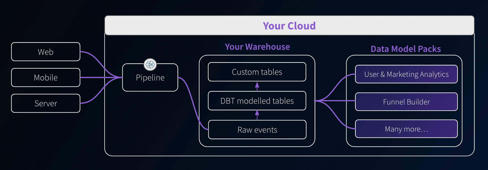
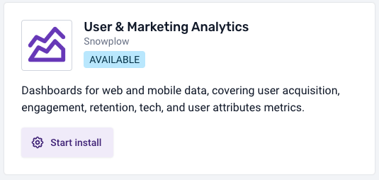
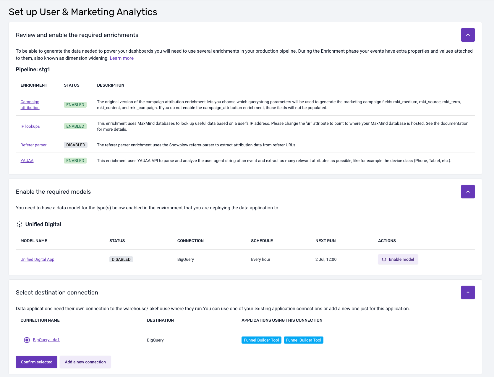
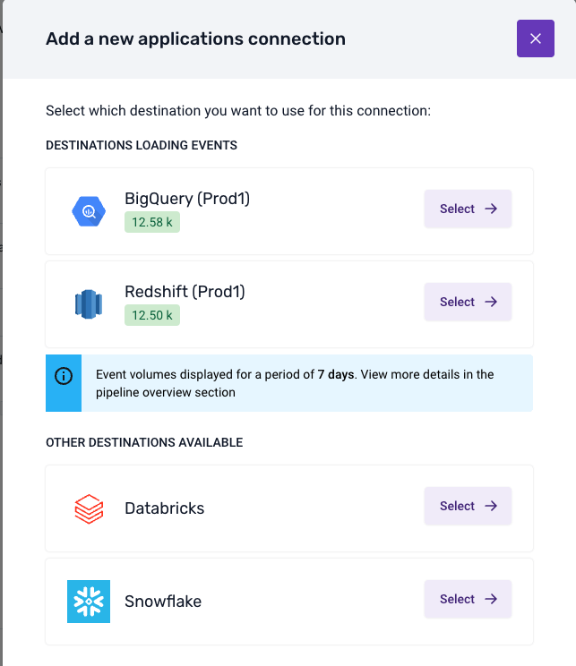

```mdx-code-block
import Tabs from '@theme/Tabs';
import TabItem from '@theme/TabItem';
```

Data applications are self-service analytics tools, deployed in your cloud, that help customers extract value from their data quickly by providing templated use-cases for data collection, modeling, and activation. They aim to reduce the technical barrier, making data analysis more accessible beyond just SQL users.



## Available Data Apps
<!-- This will become a table when we have more -->
```mdx-code-block
import DocCardList from '@theme/DocCardList';

<DocCardList />
```

## Accessing the Applications

You can find the Data Applications in the `Applications` tab in the left sidebar of your Snowplow Console. An application can be in one of three states:
* _By request_ — If you have not yet purchased a package that includes the application, you can click on “Learn more” and register your interest. A Snowplow Customer Success Manager will then get in contact with you to discuss getting access to the application.
* _Available_ — The application is ready to be set up. See the [installation instructions](#installing-applications) below.
* _Live_ — The application is ready to use.

Once the application is installed, clicking on the tile will launch the application in a separate browser tab. By default, anyone in your Console organization will be able to access data applications.

If you wish to invite others to use data applications but not have access to the rest of Console, you can [create a new user](/docs/account-management/managing-users/adding-removing/index.md) and add a user with the `Data applications user` role. That user will then only see the Data Applications tab within Console. This permissions can be managed in the [usual way](/docs/account-management/managing-users/managing-permissions/index.md).

## Installing applications

Once you have purchased an application, you are able to install it. Click the tile to begin installing the application and follow the steps.



During installation, you will need to [provide a connection](#application-connections) to the warehouse you would like the application to use. It will also highlight any pipeline and data model dependencies that are required.



### Dependencies on data models

Generally, applications will depend on data models. If there are dependencies, then the installation flow will highlight which models are required and what models you currently have [running via BDP](/docs/modeling-your-data/running-data-models-via-snowplow-bdp/standard-models/index.md). It will also highlight any properties that you need to enable or configure for these data models.

:::note
If you are running the necessary data models yourself outside of BDP, then you will need to manually check that your setup satisfies the requirements for each application. These requirements are listed within the documentation pages for each application.
:::

## Application connections

To install a data application, you will need to create a connection to where your data model output or atomic table resides. You can do this as part of the installation process. Creating a connection involves securely setting up credentials for the data app to use to fetch the data.

:::tip
You might have already set up a warehouse connection for loading and/or modeling the data. Data applications, however, require a different connection, as you will often want them to run under a different user/role and with different permissions.
:::



Once you have selected a destination, provided the credentials and run the suggested SQL script, BDP will test the connection. Upon a successful test, the application will be available to use.

## General Usage
### Is the app running?
When the app is doing some calculations, querying the database, or otherwise still loading, you'll see the following gif in the top right of the app. You may particularly notice this on applications with multiple tabs per page, as the tabs will load in order so the last tab may seem empty until this processing is completed.

<div style={{"background-color": '#F2F4F7'}}>

</div>

### Setup
Where the app has some requirements it will also have a `Settings` page that will validate what is available to the app, and provide information for steps to take for any unfulfilled requirements.

### Chart Sources
Many of our apps support the exporting of the SQL used to generate the charts. In some cases, there may be a specific button in the app to do this, but for most cases simply look for the  icon and click it to download the SQL used to make that chart!

:::info

Note that some data is processed further after the query to get in the format required for plotting, which may include actions such as filtering, pivoting, etc.

:::

### Help
Our apps provide useful help text throughout the apps, keep an eye out for the help icon (<Icon icon="fa-regular fa-circle-question"/>) to provide more context or help in using some functionality.

### Log Out
If you wish to Log out of the application, you can do this from the sidebar. Note this also logs you out of Console.
