## Creating and editing a new Data Product using Console

To create a new data product, navigate to the "Data products" section from the navigation bar and click the "Create data product" button.

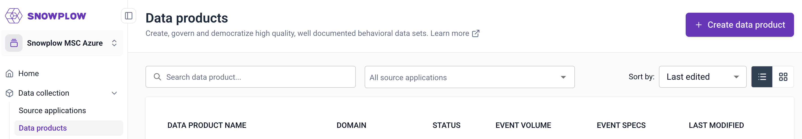

A modal will appear on the page, giving you the possibility to quickly create a data product by using one of the existing templates or create one from scratch.

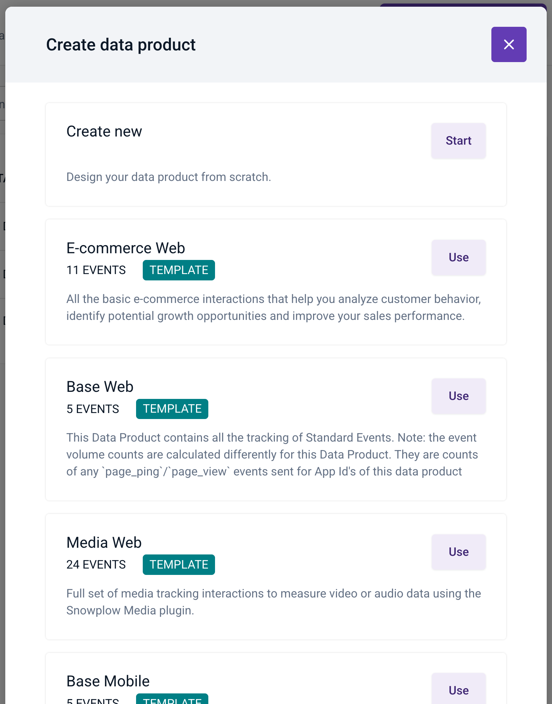

After selecting "Create from scratch" a form will appear on the page. Enter your data product information and click "Create and continue" to navigate to the event specification page.

:::note
_The name of your data product must be unique to ensure proper identification and avoid conflicts._
:::note

This page allows you to create multiple event specifications. You can click on any row to enter the details on this screen, or you can complete the information later.

When clicking on an event specification row, a page will allow you to enter additional information into separate modals:

- **Event information**; describes information such as which applications the event fires in
- **Event data structure**; determines how your data is structured and define the types of properties of the event
- **Entity data structures**; describes which entities to attach to the event when it is triggered
- **Event triggers**; specify the places and circumstances under which the event is triggered
- **Properties**; specify instructions about how each schema property should be set for this event specification

The breadcrumb navigation allows you to quickly navigate to the data product overview as well as to the list of data products. Alternatively, you can access the list of available data products by clicking `Data products` prominently displayed in the navigation bar on the left.

In the image below, you can see an example of a data product. It not only provides an overview of all the event specifications but also allows you to access three important pieces of functionality.

- **Share**; allow other members of your organization to access the data product
- **Subscribe**; receive notifications of any changes in the data product
- **Implement tracking**; automatically generate the code for your data product to be included in your application (to learn more visit [Code Generation - automatically generate code for Snowplow tracking SDKs](/docs/data-product-studio/snowtype/index.md))

*Notes: sharing and subscribing is only available for users registered in Snowplow Console.*

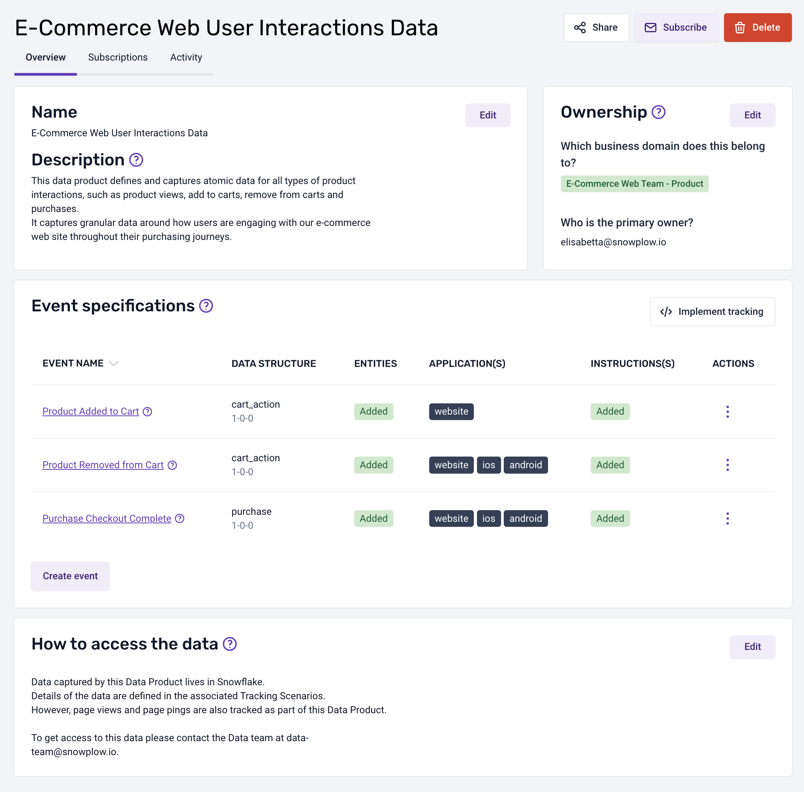

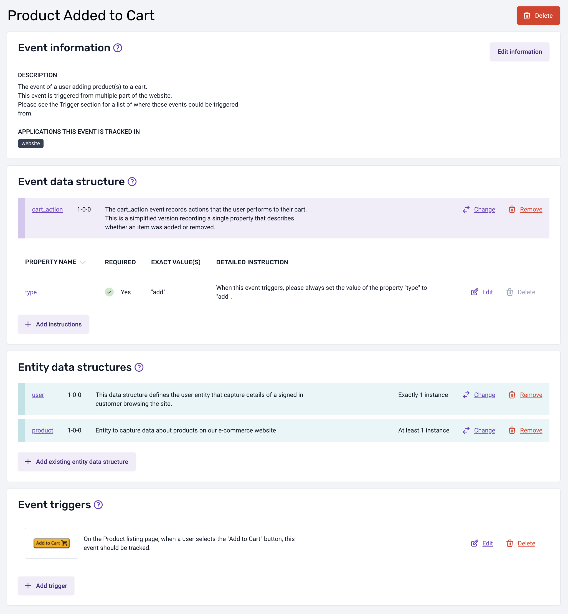

If you need to edit a data product at any time, simply select it from the data products listing accessible from the main menu.

#### Updating existing Data Products following the release of Source Applications

Data Products created prior to the release of [Source Applications](/docs/data-product-studio/source-applications/index.md) in September 2024 will need to be updated to assign Source Applications in which the events will be tracked on. The selected Source Applications will add the relevant application IDs to each of the event specifications in the data product.

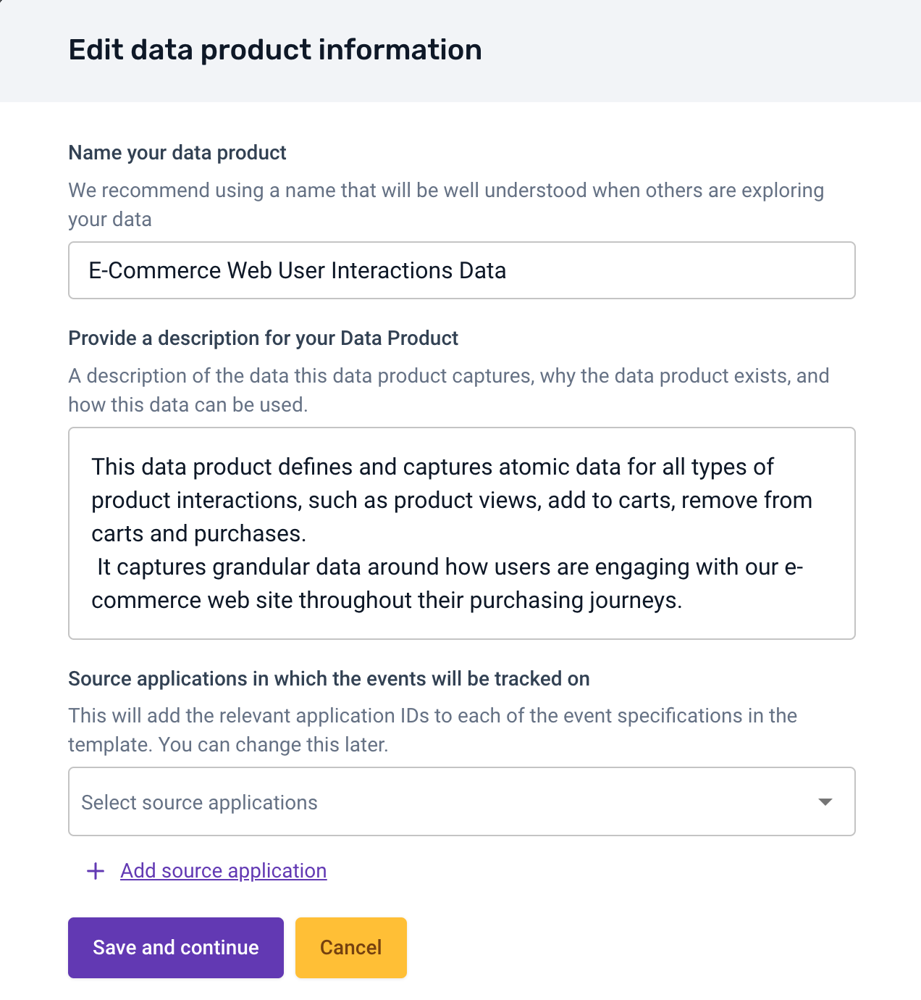

Event specifications which contain previously added application IDs will need to be updated to use the identifiers inherited from the Source Applications selected at Data Product level. This process can be done manually but you can reach out to our Support team to help you with that by either logging a request through our Snowplow [Console](https://console.snowplowanalytics.com/) or by directly emailing [support@snowplow.io](mailto:support@snowplow.io).

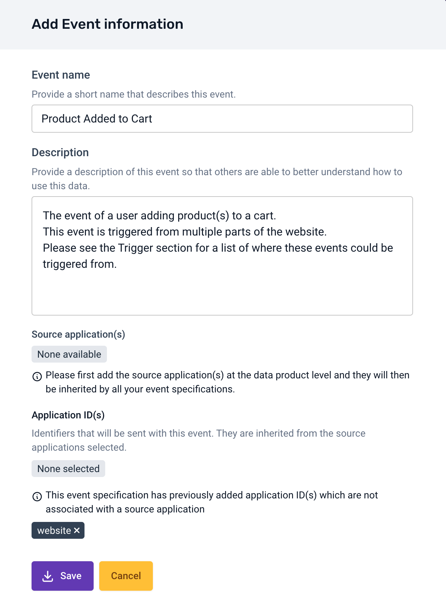

## Upgrading Event Specification Instructions

When working with Event Specifications of a Data Product, it’s essential to account for the evolution of underlying [Data Structures](/docs/data-product-studio/data-structures/index.md). Data Structures define reusable JSON schemas, which can be referenced by different Event Specifications (events and entities). Each Event Specification may contain instructions, which rely on a specific version of a Data Structure, adding another layer to specialize or constraint Event Specifications in a more granular way.

### Versioning of Data Structures

As data and events evolve, Data Structures may be updated to new versions, which can be either compatible or incompatible with previous ones. These changes may cause potential conflicts with the instructions in Event Specifications (both events and entities) that reference an older version of the Data Structure.

### Semi-Automatic Upgrade of Event Specifications via the UI

To streamline the process of upgrading an Event Specification to the latest version of a Data Structure, we’ve implemented a mechanism that allows you to update Event Specification instructions through the UI. Here’s how it works:

When a new version of a Data Structure becomes available, the system will indicate that the event or entities referenced by the data structure has a new version available, showing an **'Upgrade'** button in the UI.

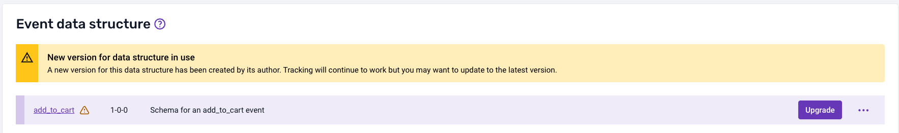

Clicking the button navigates to a new page, informing the user of the new version they are upgrading to, along with a **'View Changes'**.

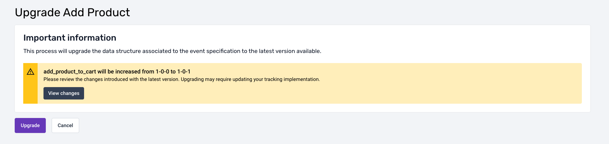

When clicked it will show the differences between the current version of the Data Structure and the one the user intends to upgrade to.

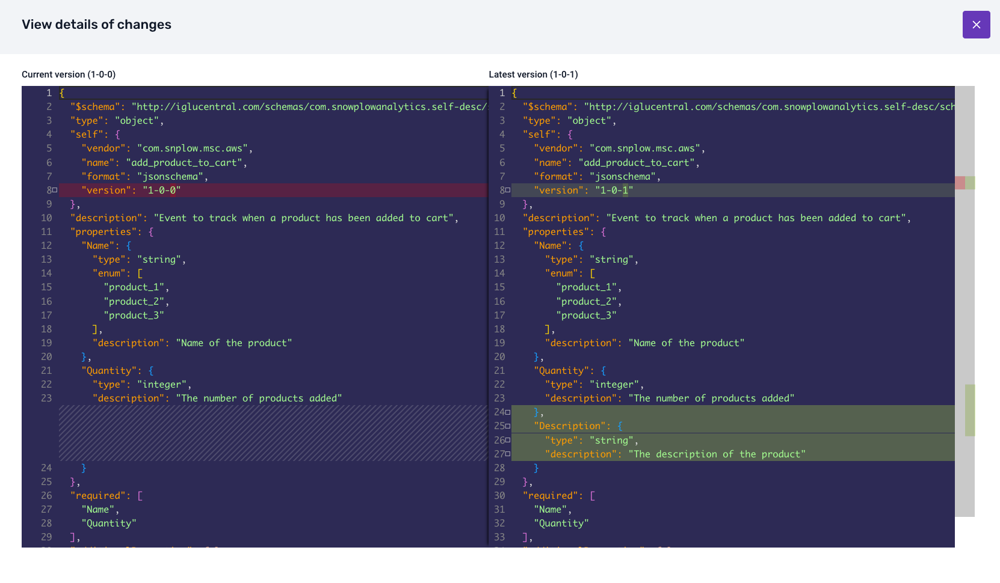

At the bottom, a button will allow users to confirm the upgrade. One of two things can happen when the upgrade is confirmed:

#### 1. Successful automatic upgrade

- If the Event Specification instructions are compatible with the new Data Structure version, the system will automatically upgrade the Event Specification to the latest version of the Data Structure.
- All instructions will be updated seamlessly without any further user intervention.

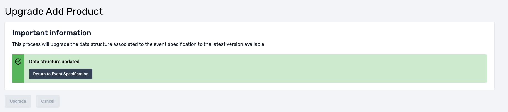

#### 2. Conflict detection and resolution

If the new version of the Data Structure introduces incompatibilities with the existing Event Specification instructions, the system will flag the conflicting properties.

- The UI will prompt the user to resolve these conflicts before the Event Specification can be upgraded.
- The conflict resolution UI provides options to the user tp modify or delete each instruction depending on the type of incompatibility:
  - **Remove conflicting instructions**: If a specific property is no longer present in the new Data Structure.
  - **Modify conflicting instructions**: If a property in the new Data Structure has been changed in an incompatible way (e.g., type change, added/removed enum values, added pattern, etc.).

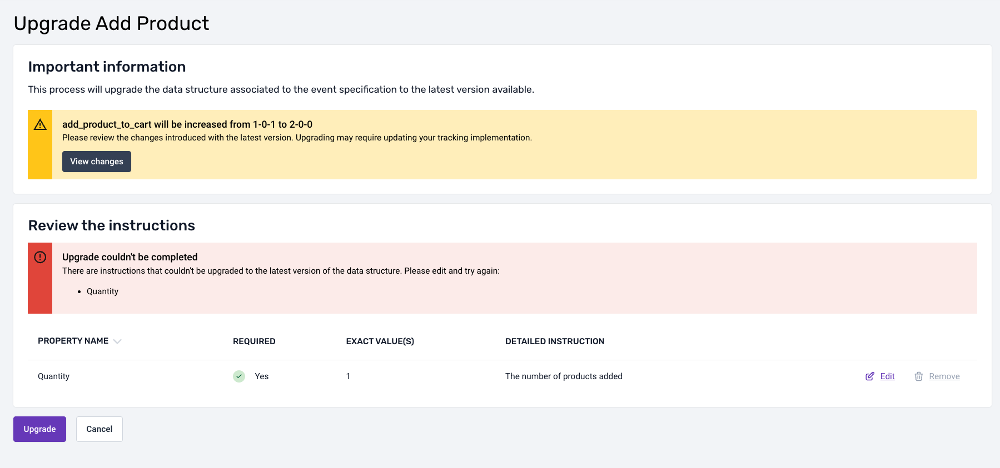

This mechanism ensures that teams can benefit from updated Data Structures while maintaining the integrity and accuracy of their Event Specifications. Users are empowered to make informed decisions during the upgrade process, with clear visual cues and options to handle conflicts effectively.
