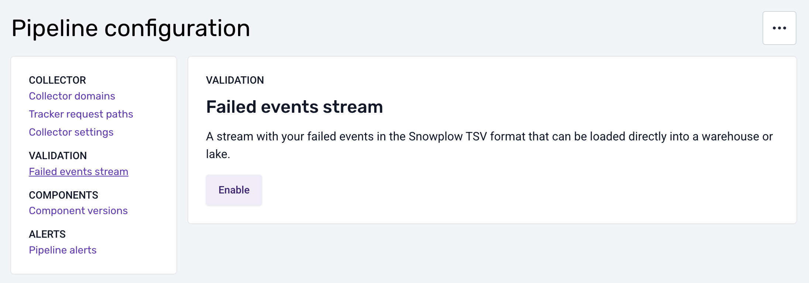
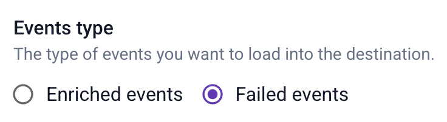

:::note Compatibility

This feature is available since Enrich 5.0.0 and works with Snowflake Loader, BigQuery Loader since version 2, and Lake Loader.

:::

For the common failures (validation and enrichment), you can configure continuous loading of any offending events into _a separate table_ in your warehouse or lake. This way, you can easily inspect them and decide how they might be patched up (e.g. with SQL) and merged with the rest of your data.

:::note

This feature is not retroactive, i.e. only failed events that occur _after it’s enabled_ will be loaded into your desired destination.

:::

## Format

The format of the failed events loaded into your warehouse or lake is [the same as for your atomic events](/docs/fundamentals/canonical-event/index.md). All the standard fields are present (unless themselves invalid — see below). This allows you to query and aggregate this data easily, e.g. if you want to see the number of failures per `app_id`.

There are two differences compared to regular events.

**Invalid data is removed from the event.** This principle applies to all columns:
* Any invalid standard column (e.g. `geo_country`) will be set to `null` instead of the offending value.
* Likewise, any column containing the JSON for a self-describing event (`unstruct_...`) will be set to `null` if that JSON fails validation.
* Finally, for entity columns (`contexts_`), if one entity is invalid, it will be removed from the array of entities. If all entities are invalid, the whole column will be set to `null`.

For more information about the different columns in Snowplow data, see [how Snowplow data is stored in the warehouse](/docs/api-reference/loaders-storage-targets/schemas-in-warehouse/index.md).

**There is an extra column with failure details.** The column is named `contexts_com_snowplowanalytics_snowplow_failure_1`. In most cases, it will also contain the invalid data in some form. See the [next section](#example-failed-event) for an example.

## Example failed event

Here is an example of what the `contexts_com_snowplowanalytics_snowplow_failure_1` column might contain. Note that a single failed event might have more than one error. In this case, there is a required field missing, and also an unrecognized field present.

```js
[
  {
    // timestamp of the failure
    "timestamp": "2025-01-15T14:12:50.498148Z",

    // failure type and failure schema version
    "failureType": "ValidationError",
    "_schema_version": "1-0-0",

    // the component where the failure happened
    "componentName": "snowplow-enrich-kafka",
    "componentVersion": "5.1.2",

    // the schema of the offending event
    "schema": "iglu:com.snowplowanalytics.snowplow/link_click/jsonschema/1-0-1",

    // any properties which were invalid
    "data": {
      "invalidProperty": "This schema doesn't have this property"
    },

    // there can be multiple errors per event
    "errors": [
      {
        "keyword": "required",
        "message": "$.targetUrl: is missing but it is required",
        "path": "$",
        "source": "unstruct",
        "targets": [
          "targetUrl"
        ]
      },
      {
        "keyword": "additionalProperties",
        "message": "$.invalidProperty: is not defined in the schema and the schema does not allow additional properties",
        "path": "$",
        "source": "unstruct",
        "targets": [
          "invalidProperty"
        ]
      }
    ]
  }
]
```

## Configure

To use this feature, you will first need to enable the stream that contains failed events in the [Snowplow TSV format](/docs/fundamentals/canonical-event/understanding-the-enriched-tsv-format/index.md) suitable for loading into your warehouse or lake.

The instructions below are for Snowplow customers. For Community Edition, you will need to configure this manually via Terraform. <--TODO check this re. self-hosted -->

:::note Infrastructure costs

An additional stream (Kinesis, Pub/Sub or Event Hubs on AWS, GCP and Azure respectively) will be reflected in your cloud infrastructure costs (unless you are using BDP Cloud). That said, failed events are usually a tiny fraction of all events, so this stream will be minimally sized.

:::

Open the _“Pipeline configuration”_ section for the desired pipeline and select _“Failed events stream”_.



Click _“Enable”_ and wait for the changes to take effect.

Now you are ready to add a loader. Click _“Add failed events loader”_, which will take you to the destinations catalog.

You can use the following loaders with the failed events stream:

* Snowflake Streaming Loader
* BigQuery Loader (since version 2)
* Lake Loader

Pick your desired destination and follow the steps in the UI, selecting _“failed events”_ as the  type of events.



Note that as with any other loader, you will first need to create a connection to your warehouse or lake, and then the loader itself.

:::warning PII in failed events

Some of the problems that cause failed events could lead them to contain personally identifiable information (PII). For example, a validation error could stem from PII placed in the wrong field, and that field might not be pseudonymized, leaving PII exposed in the error message. Or the [PII enrichment](/docs/pipeline/enrichments/available-enrichments/pii-pseudonymization-enrichment/index.md) itself might have failed.

For this reason, we strongly recommend loading failed events into a separate schema (in case of a warehouse) or storage location (in case of a data lake) compared to your atomic events. This allows you to restrict access to failed events.

Keep this in mind when creating the connection.

:::
