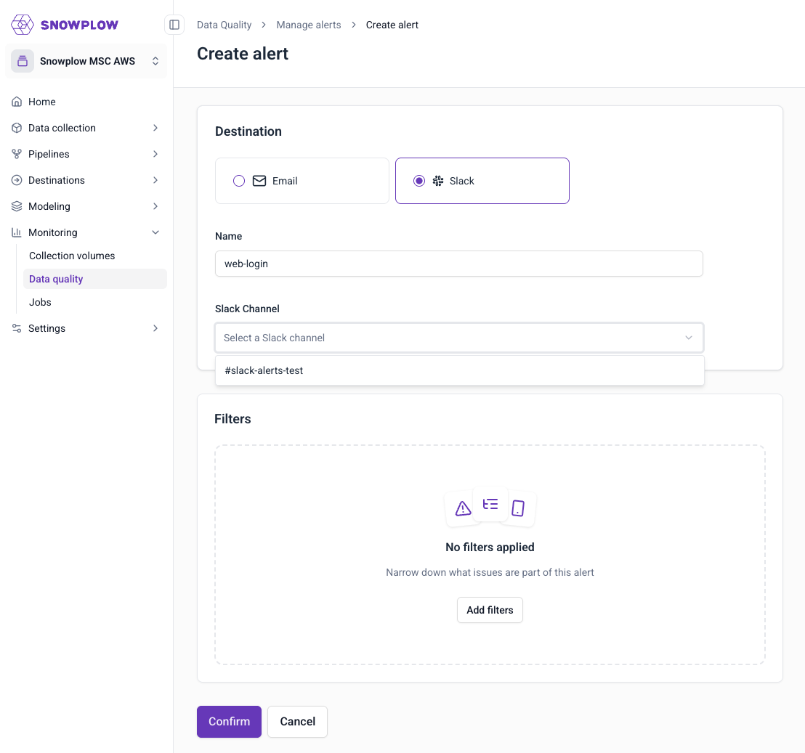
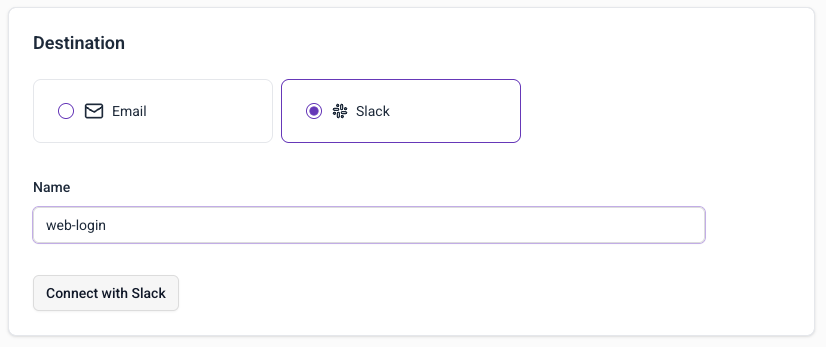
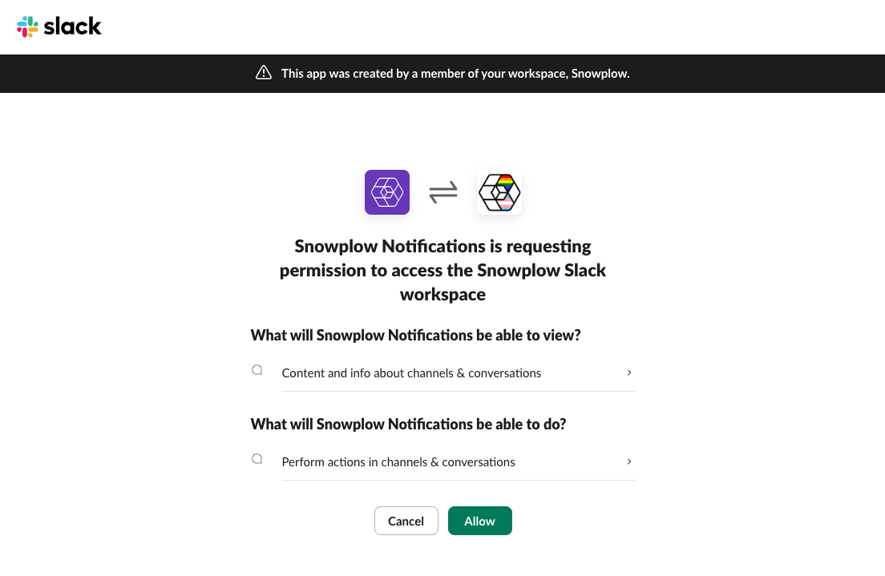
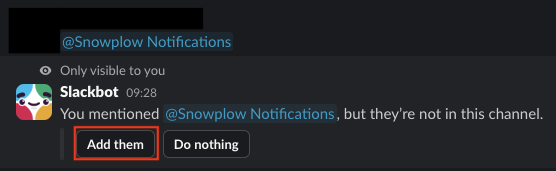
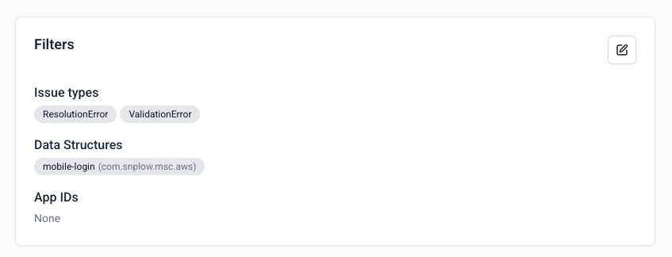

Set up data quality alerts to receive notifications when failed events occur in your data pipeline.

You'll need access to the [data quality dashboard](link to relevant DQD page here).

To create an alert, go to the BDP Console:
1. Navigate to **Data Quality** in the left sidebar
2. Click **Manage alerts** in the top-right corner
3. Click **Create alert**

## Configure destination

Choose how you want to receive notifications:

#### Email notifications

1. Select **Email** as destination
2. Enter alert name (e.g., "mobile-app")
3. Add recipient email addresses
4. Click **Add filters** to configure triggers

#### Slack notifications

1. Select **Slack** as destination
2. Enter alert name (e.g., "web-app")
3. Select Slack channel from dropdown
4. Click **Add filters** to configure triggers

When no active Slack integration is found, a `Connect with Slack` button will appear instead of the list of channels.

A Slack consent screen will appear.

To select channels in the UI, first add the app to those channels. In Slack:

1. Open the channel where you want notifications
2. Type `@Snowplow Notifications` and send
3. Click "Add them" when prompted

Once a Slack alert is configured you will see a confirmation notification in the selected Slack channel.

## Set up filters

Configure when alerts should trigger:

1. **Issue types**: Select ValidationError, ResolutionError, or both
2. **Data structures**: Choose specific data structures (all versions will apply)
3. **App IDs**: Filter by application identifiers

## Complete setup

1. Review your configuration
2. Click **Confirm** to create the alert
3. Your alert will appear in the alerts list

## Alert frequency

Alerts are checked every 10 minutes. You'll receive notifications when new failed events match your filter criteria.

## Next steps

- [Manage existing alerts](/docs/data-product-studio/data-quality/failed-events/monitoring-failed-events/alerts/data-quality-alerts/managing-alerts/index.md)
- [Explore failed events](/docs/data-product-studio/data-quality/failed-events/exploring-failed-events/index.md)
