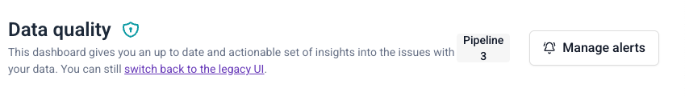

Data quality alerts automatically notify you when [failed events](/docs/fundamentals/failed-events/index.md) occur in your data pipeline. Set up alerts to receive notifications via email or Slack when validation errors, resolution errors, or other data quality issues arise.

The alerting system monitors your failed events and sends notifications based on the filters you configure. Alerts are checked every 10 minutes and sent to your specified destinations when matching failed events are detected.

## Alert destinations

- **Email**: send notifications to one or more email addresses
- **Slack**: send notifications to specific Slack channels

## What you can filter on

Configure alerts to trigger only for specific types of failed events:

- **Issue types**: select `ValidationError`, `ResolutionError`, or both
- **Data structures**: filter by specific schemas or event types
- **App IDs**: filter by application identifiers

## Getting started

1. Navigate to the data quality dashboard
2. View your failed events overview
3. Click **[Manage](/docs/data-product-studio/data-quality/failed-events/monitoring-failed-events/alerts/data-quality-alerts/managing-alerts/index.md)** alerts to set up notifications
4. **[Create](/docs/data-product-studio/data-quality/failed-events/monitoring-failed-events/alerts/data-quality-alerts/creating-alerts/index.md)** and configure your first alert

