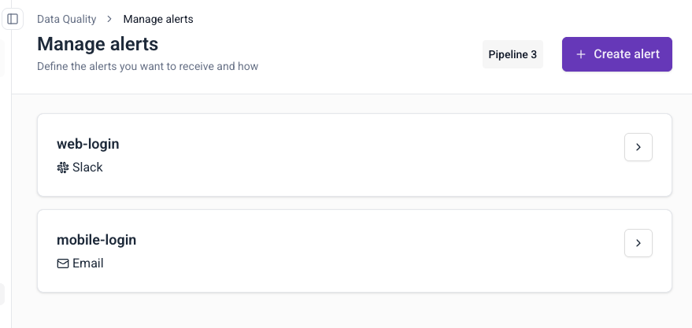

Edit, delete, or review existing failed events alerts.

## View alerts

1. Navigate to **Data Quality** in the left sidebar
2. Click **Manage alerts** in the top-right corner
3. View all configured alerts with their destinations

## Edit an alert

1. Click the arrow next to the alert name
2. Modify destination, filters, or recipients
3. Click **Save** to update

## Delete an alert

1. Click the arrow next to the alert name
2. Click on the three dots button
3. Click **Delete**
4. Confirm deletion

### Multiple notifications

Alerts trigger when new failed events match your filters. If you receive multiple notifications, check if:
- Failed events are occurring frequently
- Filter criteria are too broad
- Multiple alerts have overlapping configurations

## Next steps

- [Create additional alerts](/docs/data-product-studio/data-quality/failed-events/monitoring-failed-events/alerts/data-quality-alerts/creating-alerts/index.md)
- [Explore failed events](/docs/data-product-studio/data-quality/failed-events/exploring-failed-events/index.md)
