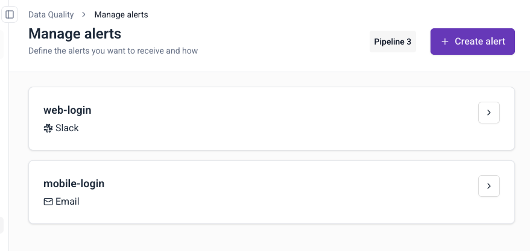

This page explains how to edit, delete, or review existing failed event alerts.

## View alerts

1. Navigate to **Data Quality** in the left sidebar
2. Click **Manage alerts** in the top-right corner
3. View all configured alerts with their destinations

## Edit an alert

1. Click the arrow next to the alert name
2. Modify destination, filters, triggers, or recipients:
   - **Destination**: Change email addresses or Slack channels
   - **Filters**: Update issue types, data structures, or App IDs
   - **Triggers**: Switch between "When above value" and "On any issue", adjust threshold values and delivery frequency
3. Click **Save** to update

## Delete an alert

1. Click the arrow next to the alert name
2. Click on the three dots button
3. Click **Delete**
4. Confirm deletion

## Alert behavior

### Trigger frequency

- **Threshold-based triggers**: Alerts are evaluated against the specified threshold and time window. Notifications are sent according to the delivery frequency (daily, weekly, or monthly) when conditions are met.
- **"On any issue" triggers**: Alerts fire immediately when any failed events are detected, subject to the configured delivery frequency.

### Multiple notifications

Alerts trigger when new failed events match your filters. You may receive multiple notifications for the same failed events in the following scenarios:
- **Rolling window detection**: alerts use rolling time windows to detect failed events. The same failed event type will continue triggering notifications as each consecutive window passes and detects the events again.
- **Overlapping alert configurations**: Multiple alerts may capture the same failed events when their filter criteria overlap. This results in duplicate notifications, especially when alerts are configured to send to the same destination (same Slack channel or email address).
- **Delivery frequency**: Alerts respect the configured delivery frequency to prevent notification spam, sending at most once per the specified period when trigger conditions are met.
