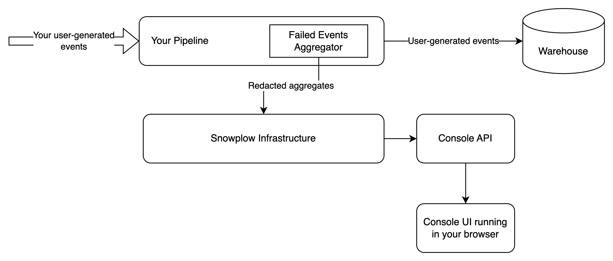
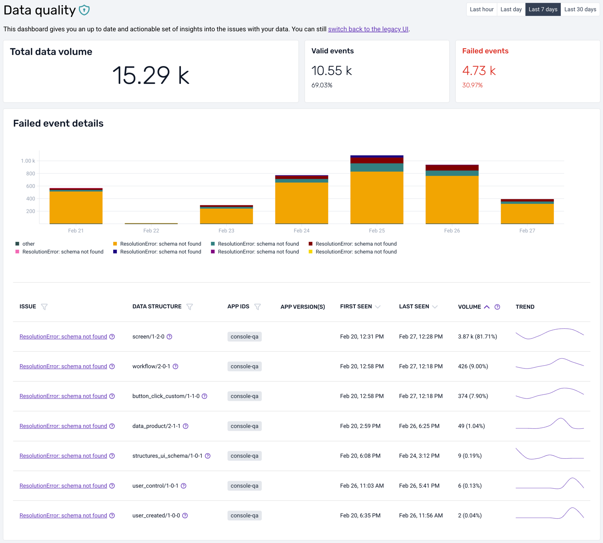

Snowplow pipelines separate events that are problematic in order to keep data quality high in downstream systems. For more information on understanding failed events see [here](/docs/fundamentals/failed-events/index.md).

For Snowplow customers that would like to benefit from seeing aggregates of failed events by type, there are relevant optional features in the Snowplow BDP Console. Snowplow offers two different ways to monitor failed events: The default view with little available information to debug errors, and the new Data Quality Dashboard which surfaces failed events directly from the customer's warehouse in a secure manner, making debugging a lot easier. The two ways are representing a trade-off between ease of exploration and avoidance of PII exposure, which we will discuss in detail below.

# Default view

## Architecture

The default view is a relatively simple interface that shows the number of failed events over time alongside a coarse-grained description of the problem at hand. In certain cases, the error message can be somewhat cryptic in terms of diagnosing the root cause of the error. The reason is that this information flows through Snowplow infrastructure, therefore we have reducted it substantially before it leaves the customer's pipeline to ensure that PII does not traverse Snowplow systems. The aggregates are served by the Console's backend:

In this setup, the customer exposes no additional interface to the public internet, and all failed events information is served by the Console's APIs.

## User Experience

Example view of the failed events screen in the Snowplow BDP Console.

This interface is intended to give our customers a quick representation of the volume of event failures so that action can be taken. The UI focuses on schema violation and enrichment errors at present.

We've filtered on these two types of errors to reduce noise like bot traffic that causes adapter failures for instance. All failed events can be found in your S3 or GCS storage targets partitioned by type and then date/time.

At the top there is a data quality score that compares the volume of failed events to the volume that were successfully loaded into a data warehouse.

The bar chart shows how the total number of failed events varies over time, colour-coding validation and enrichment errors. The time window is 7 days be default but can be extended to 14 or 30 days.

In the table failed events are aggregated by the unique type of failure (validation, enrichment) and the offending schema.

By selecting a particular error you are able to get more detail:

Example failed event detail view.

The detailed view shows the error message as well as other useful metadata (when available) like app_id as an example to help diagnose the source and root cause of the error, as well as a bar chart indicating how the volume of failures varies over time for this particular failed event.

# Data Quality Dashboard

## Architecture

The discussion of architecture is important as it highlights the trade-offs between the two ways of monitoring failed events. As mentioned above, the Data Quality Dashboard is a feature that allows customers to see failed events directly from their warehouse. To achieve that, the customer's browser connects directly to an API running within customer infrastructure, such that no failed event information flows through Snowplow. The aforementioned API is a simple proxy that connects to the customer's warehouse and serves the failed events to the customer's browser. The connection is fully secure, using an encrypted channel (HTTPS) and authenticating/authorizing customers via the same mechanism used by the Console.

In order for a customer to be able to deploy and use the Data Quality Dashboard, they need to sink failed events to the warehouse via a [Failed Events Loader](/docs/data-product-studio/data-quality/failed-events/exploring-failed-events/warehouse-lake/#setup). At the moment the Data Quality Dashboard only supports Snowflake; support for Databricks and BigQuery is coming soon.

In this setup, the customer exposes an additional interface (Data Quality API) to the public internet, and all failed events information is served via that interface.

## User Experience

The user experience of the Data Quality Dashboard is similar to the default view, but offers substantially more information to support resolution of tracking issues. The overview page looks as follows:

As in the default view, it is possible to change the time horizon from the 7-day default, to the last hour, last day, or last 30 days. You get a corresponding overview of event volumes, both the successful and the failed ones, for the whole time period but also split per day/hour/minute in the bar chart right below. 

Complementing the graphical overview, there is a table that lists all errors (at this moment only validation and resolution errors are supported). You can quickly see, for each type of failed event, a short description of the root cause, the offending data structure, first & last seen timestamps, and the total volume.

Clicking on a particular error type will take you to a detailed view:

The detailed view shows (in addition to what is presented in the overview table) an elaborate description of the root cause and the application version ([web](/docs/sources/trackers/snowplow-tracker-protocol/ootb-data/app-information/#application-context-entity-on-web-apps), [mobile](/docs/sources/trackers/mobile-trackers/tracking-events/platform-and-application-context/)). In addition, it makes it possible to explore the failed event data in your warehouse, by providing a sample of those failed events in their entirety. Some columns are too wide to fit in the table, so if you click on them you will see the pretty-printed, syntax-highlighted content in its entirety:

Finally, you can click on the "View SQL query" button to see the SQL query that was used to fetch the failed events from your warehouse:

