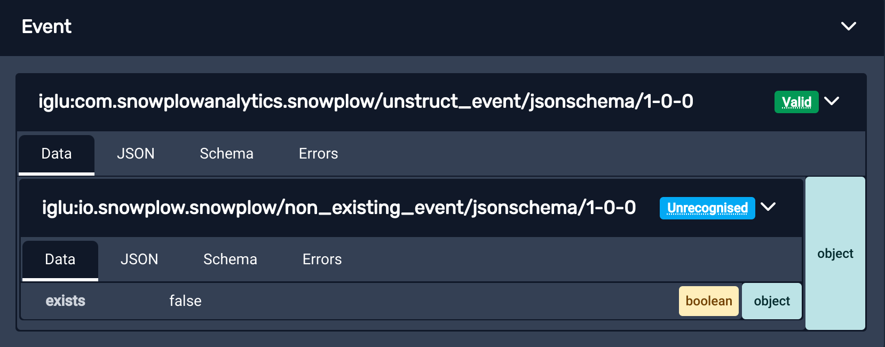

By default, the extension is able to see [Iglu schemas](/docs/fundamentals/schemas/index.md) for Events and Entities generated by the standard Snowplow [tracker](/docs/sources/trackers/index.md) and plugin APIs, as they're publicly available on the public [Iglu Central](/docs/api-reference/iglu/iglu-repositories/iglu-central/index.md) registry.
The Iglu Central registry is a default configuration in all Snowplow Pipelines as a common base, so events validated in the Inspector against these schemas should also validate correctly in your pipeline.

For custom schemas that aren't publicly available in Iglu Central, you need to configure the extension to access your registries so it can access the schemas to perform validation.

If you don't log in or configure registries, the extension won't recognize or be able to validate any custom events/entities, though they will still display.

Snowplow customers with access to the Snowplow Console can log in using the button in the bottom-left of the extension, which will automatically discover schemas defined for any [data structures](/docs/data-product-studio/data-structures/index.md) set up in your development or production Iglu Server environments.

When installed, the extension also creates a "Local Registry", which lets you iterate on schemas without having to deploy them to a real registry.
You can create any number of additional local registries to help organize your work.

You can also configure the extension to access other private schema repositories (such as [Iglu Servers](/docs/api-reference/iglu/iglu-repositories/iglu-server/index.md) or [Static repositories](/docs/api-reference/iglu/iglu-repositories/static-repo/index.md)).

## Registries and schema management

To access the full list of registries configured and find which schemas are accessible, use the "Manage Schemas" button in the "More Options" menu.

The extension will connect to your registries and request a listing of all available schemas.

At the top is a search for filtering the shown schemas, controls for managing registries and local schemas, and then a list of your configured registries.

Underneath is a tree listing of all schemas configured, grouped by vendor, name, format, and version.
Each version has a list of the registries that contained it.

Clicking a registry will toggle selecting the registry.
The schema list below will filter to only show schemas within selected registries.
If there are no registries selected, schemas from all registries will display.
Any search terms will also only search schemas from the selected registries.

Using the "Registries..." button you can:

- Add more custom registries
- Import a list of registries from an existing [Iglu Resolver configuration](/docs/api-reference/iglu/iglu-resolver/index.md)

If you have some registries selected, this button will also allow you to:

- Edit existing registries you've previously configured
- Remove configured registries so they aren't accessible to the extension any more

Selecting just a "local" registry will activate the "Schemas..." button and allow you to manage the schemas it contains.

You can clear the search and registry selections to see all schemas again using the "Clear Filters" button.

### Adding custom registries

You can add or edit the following supported types of registry:
- [Local registries](#local-registries)
- [Data structures API registries](#data-structures-api-registries)
- [Iglu Server registries](#iglu-server-registries)
- [Static registries](#static-registries)

Configuring a registry requires a name and one of these types.
You may also optionally include a priority, and list of vendor prefixes.
Each type of registry may require additional configuration like API keys to function.

Once configured, schemas from the registry load in the "Manage Schemas" view, and events using those schemas get validated against them.

Once the extension can query your private Iglu repositories it will be able to tell you in real time whether your events and entities are failing validation from entirely within the browser.
Below is an example of an event passing validation:

Below is an example of an event failing validation, the reason for this event failing validation is that the schema defines that `example_field_1` allows only the "string" type values, meaning it can't be null.
Hovering over the registry displays text describing which aspect of the payload failed the validation, which is also available in the "Errors" tab.
Clicking the registry copies this error to your clipboard.

## Local registries

Often used for testing changes of schemas still in development, or quickly including a schema when you don't have the full access required to configure a registry.
The extension UI lets you manage the schemas, which it stores on your local machine.

The only required configuration is a name, and the schemas themselves.

You manage the schemas by selecting the registry and using the "Schemas..." button.
You can manually edit the JSON in the extension, or bulk import JSON files from a directory on your machine.

## Data structures API registries

This type uses the [data structures API](/docs/data-product-studio/data-structures/manage/api/index.md) that's part of Snowplow Console.

Most users can just log in to Console via the extension and it will import registries for any Snowplow Console organizations your account has access to.

If you need to provide access for someone that doesn't have a Console account, they can manually configure one using a Console API key.

In order to function, the extension requires:

- Organization ID: find this under **Settings** > **Manage organization** in [Console](https://console.snowplowanalytics.com).
- API Key ID: go to **Settings** > **Manage organization** in Console to manage your API keys.
- API Key: go to **Settings** > **Manage organization** in Console to manage your API keys.

## Iglu Server registries

[Iglu Server](/docs/api-reference/iglu/iglu-repositories/iglu-server/index.md) is a more full-featured dedicated service for hosting server that's more flexible than Static Registries.
You may need this if you are accessing the registry built into [Snowplow Mini](/docs/api-reference/snowplow-mini/index.md).

To authenticate with your server, the extension will require:
- Iglu API Endpoint: this is the base URL the extension will use when contacting the API. If you include a path component, the API request will be `api/*` relative to this path; you may need to add or remove trailing slashes if the API isn't hosted at the root.
- Iglu API Key: see [API keys and the authentication service](/docs/api-reference/iglu/iglu-repositories/iglu-server/index.md#5-api-keys-and-the-authentication-service-apiauth) for instructions on generating an Iglu API key.

When logged into Snowplow Console, these details should be available in [API keys for utilities](https://console.snowplowanalytics.com/iglu-keys) within "Manage organization".

## Static registries

Most other registries, such as those hosted as websites or via [S3](https://aws.amazon.com/s3/) or [GCS](https://cloud.google.com/products/storage/) buckets will use this ["static"](/docs/api-reference/iglu/iglu-repositories/static-repo/index.md) type.

If you can access the schemas directly via a browser, this is probably the right choice.

Static registries managed with [`igluctl`](/docs/api-reference/iglu/igluctl-2/index.md) version 8 or newer will include a "manifest" file listing all the schemas in a registry. (e.g. [the Iglu Central manifest](https://iglucentral.com/schemas))

If the registry doesn't include a manifest listing the contained schemas, the extension will attempt to request all referenced schemas from static registries to see if it's included.
In this case the registries will also not have their schemas listed in "Manage Schemas" - unless they're referenced by tracked events since you last opened the extension.

To connect to your static registry, the extension will need:
- Base URI: the base URL to use when requesting schemas. The extension will request schemas relative to this base, expecting a `schemas/{vendor}/{name}/{format/{version}` format.

Optionally you can also provide:
- Manifest URI: the URI to use for the schema manifest (also known as "schema list", as described in the [release notes](https://github.com/snowplow/igluctl/releases/tag/0.8.0)) file that lists the schemas contained in the registry. If not provided, defaults to `schemas`, to match the `igluctl` default.
