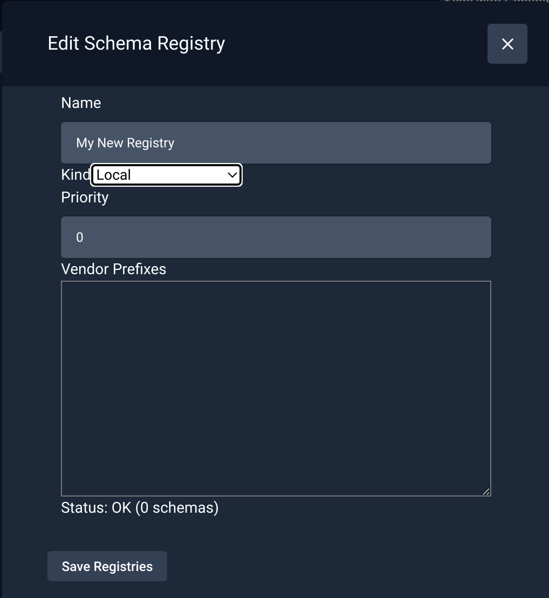
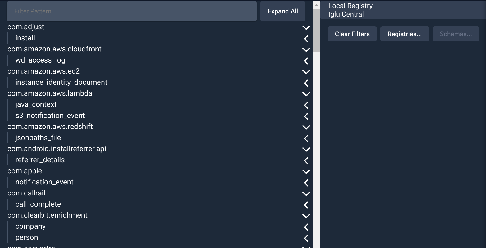
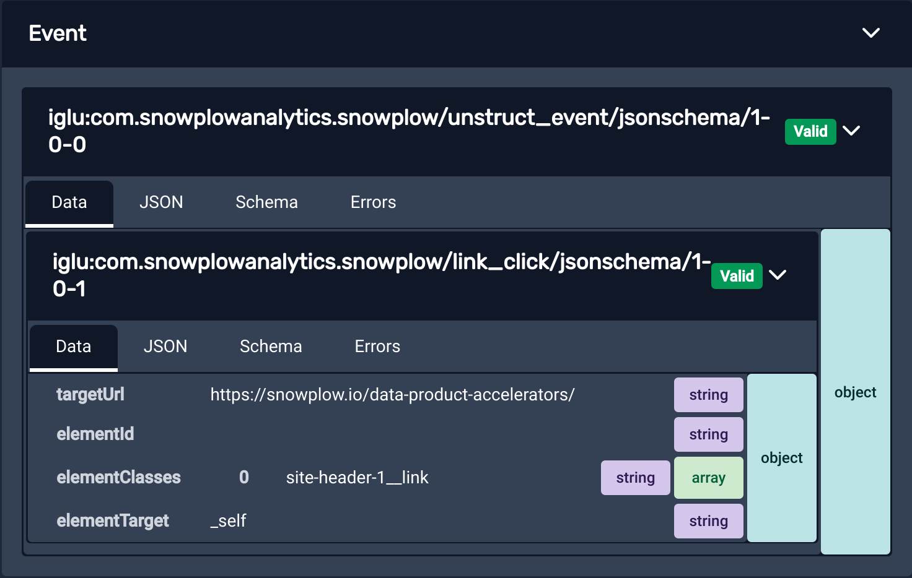
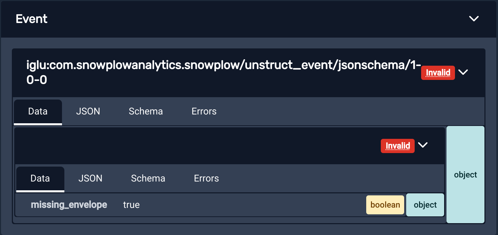

By default, the extension is able to see Iglu schemas for Events and Entities that are generated by the official Snowplow [trackers](/docs/sources/trackers/index.md), as they are publicly available on the public [Iglu Central](/docs/api-reference/iglu/iglu-repositories/iglu-central/index.md) registry.
This registry is configured by default in most Snowplow Pipelines.
By default, the extension will also create a "Local Registry", which lets you iterate on schemas without having to deploy them to a real registry.

However, you can configure the extension to compare events against private schema repositories (that contain your organization's proprietary schemas).
If you skip this step, the extension will not recognize any custom events, and will not be able to validate them.

Clicking on the “Unrecognised” button will present you with the “Edit Schema Registry” dialog (covered in the next section) to configure your own registry:

Alternatively, you can manage your registries and schemas via the ‘Manage Schemas’ button in the top toolbar.

## Registries and schema management
To see a list of all the schemas supported by your currently configured registries, use the ‘Manage Schemas’ button in the top toolbar.
The extension will connect to your registries and request a listing of all available schemas.
The schemas are displayed on the left, and the configured registries on the right.

Selecting registries in the list will filter the schema listing to show only the schemas they contain.
You can also search for schemas using the field at the top of the directory.
Use the ‘Clear Filters’ button to clear these and see the full list of schemas again.

Using the ‘Registries...’ button on the right, you can:

- Add more custom registries
- Edit existing registries you've previously configured
- Remove configured registries so they aren't accessible to the extension any more
- Import a list of registries from an existing [Iglu Resolver configuration](/docs/api-reference/iglu/iglu-resolver/index.md)

Selecting a "local" registry will activate the ‘Schemas...’ button and allow you to manage the schemas it contains.

When adding or editing a registry, the following types are supported:
- [Registries and schema management](#registries-and-schema-management)
- [Local registries](#local-registries)
- [Data Structures API registries](#data-structures-api-registries)
- [Iglu Server registries](#iglu-server-registries)
- [Static registries](#static-registries)

Configuring a registry requires a name and one of these types.
You may also optionally include a priority, and list of vendor prefixes.
Each type of registry may require additional configuration like API keys to function.

Once configured, schemas from the registry should load in the ‘Manage Schemas’ view, and events using those schemas will be checked for validation.

Now that the extension can query your private Iglu repositories the extension will be able to tell you in real time whether your events and entities are failing validation from entirely within the browser.
An example of an event passing validation is shown below:

An example of an event failing validation is shown below, the reason for this event failing validation is that `example_field_1` is specified as allowing only the "string" type, meaning it cannot be null.
Hovering over the "Invalid" warning displays text describing which aspect of the payload failed the validation.
Clicking the warning copies this error to your clipboard.

## Local registries
Usually used for testing changes of schemas still in development, or quickly including a schema when you don't have the full access required to configure a registry.
These schemas are managed within the extension and stored on your own machine.

The only required configuration is a name, and the schemas themselves.

## Data Structures API registries
This type is recommended for use with the [Data Structures API](/docs/data-product-studio/data-structures/manage/api/index.md).

In order to function, the extension requires:

- Organization ID: this is usually found in the URL when logged into Snowplow Console. See more at [Managing Console API authentication](/docs/account-management/index.md#version-2).
- API Key: when logged into Console, should be available in [API keys for managing Snowplow](https://console.snowplowanalytics.com/credentials) (within "Manage organization"). See more at [Managing Console API authentication](/docs/account-management/index.md#version-2).

## Iglu Server registries
[Iglu Server](/docs/api-reference/iglu/iglu-repositories/iglu-server/index.md) is a more full-featured dedicated service for hosting server that is more flexible than Static Registries.
You may need this if you are integrating with [Snowplow Mini](/docs/api-reference/snowplow-mini/index.md).

To authenticate with your server, the extension will require:
- Iglu API Endpoint: This is the base URL the extension will use when contacting the API. If you include a path component, the API request will be made as `api/*`, relative to this path; you may need to add or remove trailing slashes if the API is not hosted at the root.
- Iglu API Key: See [API keys and the authentication service](/docs/api-reference/iglu/iglu-repositories/iglu-server/index.md#5-api-keys-and-the-authentication-service-apiauth) for instructions on generating an Iglu API key.

When logged into Snowplow Console, these details should be available in [API keys for utilities](https://console.snowplowanalytics.com/iglu-keys) (within "Manage organization").

## Static registries
Most other registries, such as those hosted as websites or via [S3](https://aws.amazon.com/s3/) or [GCS](https://cloud.google.com/products/storage/) buckets will use this  ["static"](/docs/api-reference/iglu/iglu-repositories/static-repo/index.md) type.

If you can access the schemas directly via a browser, this is probably the right choice.

Because there is no API for listing the contained schemas, the extension will usually attempt to request any referenced schema from static registries to see if it includes it.
To address this imbalance with the other registry types, [`igluctl`](/docs/api-reference/iglu/igluctl-2/index.md) version 8 added support creating and uploading a file listing all the schemas in a registry.
If the extension detects such a "manifest", it will successfully fetch and display schemas for you without events having to reference the schemas first.

To connect to your static registry, the extension will need:
- Base URI: The base URL to use when requesting schemas. The extension will request schemas relative to this base, expecting a `schemas/{vendor}/{name}/{format/{version}` format.

Optionally you can also provide:
- Manifest URI: The URI to use for the schema manifest (aka schema list, as described in the [release notes](https://github.com/snowplow/igluctl/releases/tag/0.8.0)) file that lists the schemas contained in the registry. If not provided, defaults to `schemas`, to match the `igluctl` default.
