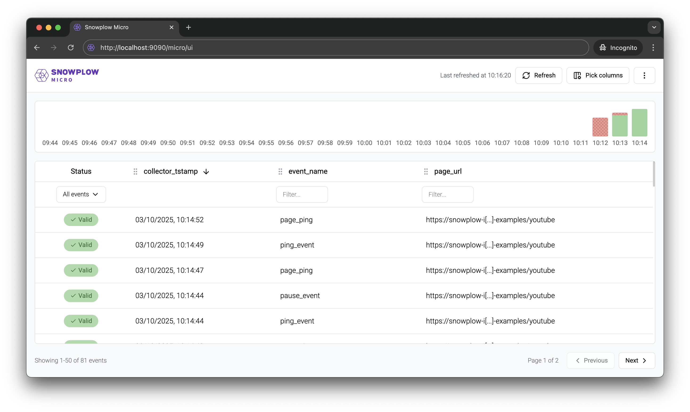

[Snowplow Micro](https://github.com/snowplow/snowplow-micro) is a lightweight version of the Snowplow pipeline. It’s great for:
* Getting familiar with Snowplow
* Debugging and testing, including [automated testing](/docs/data-product-studio/data-quality/snowplow-micro/automated-testing/index.md)

Just like a real Snowplow pipeline, Micro receives, validates and enriches events sent by your [tracking code](/docs/sources/trackers/index.md).

Unlike a real pipeline:
* It does not store the events in a data warehouse or database, although a [UI](/docs/data-product-studio/data-quality/snowplow-micro/ui/index.md) and an [API](/docs/api-reference/snowplow-micro/api/index.md) are available to look at the data
* It’s not meant for production traffic

Follow [these instructions](/docs/data-product-studio/data-quality/snowplow-micro/basic-usage/index.md) to get started in minutes.
