```mdx-code-block
import {versions} from '@site/src/componentVersions';
import CodeBlock from '@theme/CodeBlock';
import Tabs from '@theme/Tabs';
import TabItem from '@theme/TabItem';
import XForwardedForPlugin from "@site/docs/reusable/x-forwarded-for-plugin/_index.md"
```

If you are not running your website or app locally but would still like to use Micro for testing and debugging, there are two options:

| | Option 1<br/>[Exposing Micro via a public domain name](#exposing-micro-via-a-public-domain-name) | Option 2<br/>[Locally resolving an existing domain name to Micro](#locally-resolving-an-existing-domain-name-to-micro) |
|---|:-:|:-:|
| Requires control over the tracking code | Yes | No |
| Accessible from multiple devices | Yes | No |
| Micro receives first-party cookies | No | Yes |
| Micro receives external IP addresses | Yes | No |

## Exposing Micro via a public domain name

This method allows you to get a publicly accessible URL for your Micro, which you can point your tracking code to. You can also send this URL to colleagues for them to inspect the results via the [UI](/docs/data-product-studio/data-quality/snowplow-micro/ui/index.md) (since version 2.0.0) or the [API](/docs/api-reference/snowplow-micro/api/index.md).

```mermaid
flowchart LR
  website(Website or app)
  tracking(Tracking code)
  url(URL like <code>https://22d8-....ngrok.app</code>)
  tunnel{{"<i>Tunneling magic</i> 🪄"}}
  micro(Micro on your machine)

  website --> tracking --> url --> tunnel --> micro
```



The easiest way to achieve this is with a tool like [ngrok](https://ngrok.com/) or [localtunnel](https://theboroer.github.io/localtunnel-www/).

:::note Cookies and IP addresses

Either tool will take care of HTTPS and the required certificates. However, the resulting URL will not be under your domain, so you will not be able to set or receive first-party cookies this way.

You will, however, receive external IP addresses (not something like `192.168.0.42`) when you or others browse the website or app pointing to Micro. This might be useful for testing certain enrichments.

:::

After running Micro as usual, you just need to expose the port (by default, `9090`):

<Tabs groupId="exposing-micro" queryString>
  <TabItem value="ngrok" label="ngrok" default>

[Sign up](https://dashboard.ngrok.com/signup), [download](https://ngrok.com/download) ngrok and follow the instructions to authenticate your client. Then run this command:

```bash
ngrok http 9090
```

You will see the publicly available URL in the output.

  </TabItem>
  <TabItem value="localtunnel" label="localtunnel">

Install:

```bash
npm install -g localtunnel
```

Then run this command:

```bash
lt --port 9090
```

You will see the publicly available URL in the output. Before use, visit this URL in your web browser and click “Continue”.

  </TabItem>
</Tabs>


## Locally resolving an existing domain name to Micro

This method only works on your machine, but it allows you to connect any website or app to your Micro, even if you don’t control the tracking code.


Let’s say you have a website `example.com` with Snowplow tracking that points to a Collector hosted at `c.example.com`.

:::note Cookies and IP addresses

With this approach, because Micro is “pretending” to be behind the actual Collector domain (`c.example.com`), it will receive first-party cookies set for that domain.

However, you will only get local IP addresses (like `192.168.0.42`) in your data, because the traffic never leaves your machine. This might be relevant for testing some enrichments.

<XForwardedForPlugin/>

:::

### Generate a local SSL/TLS certificate

Chances are that the website in question uses HTTPS. If so, you will need to configure Micro to [enable HTTPS](/docs/data-product-studio/data-quality/snowplow-micro/advanced-usage/index.md#enabling-https). Otherwise, feel free to skip this step.

First, install [`mkcert`](https://github.com/FiloSottile/mkcert). This tool allows you to easily generate SSL/TLS certificates that your machine trusts. 

Now, run the following commands in a terminal (make sure to substitute your Collector domain for `c.example.com`):

```bash
# one-time setup
mkcert -install

# generate a certificate
mkcert -pkcs12 c.example.com
```

You should now have a local file called `c.example.com.p12` with the default password `changeit`.

### Match the Collector configuration

To make sure your Micro behaves the same way as the Collector it’s “pretending” to be, copy the relevant parts of your Collector configuration and [pass them to Micro](/docs/data-product-studio/data-quality/snowplow-micro/advanced-usage/index.md#adding-custom-collector-configuration).

The two most important settings are the cookie name (you can set it with `-Dcollector.cookie.name` as shown on the page linked above) and any custom paths (via a configuration file).

### Run Micro

You will need to run Micro as usual, with a few changes:
* [Enable HTTPS](/docs/data-product-studio/data-quality/snowplow-micro/advanced-usage/index.md#enabling-https), if needed
* Use port `80` instead of `9090`
* If HTTPS is enabled, also use port `443` instead of `9543`

If you don’t need HTTPS:

<CodeBlock language="bash">{
`docker run -p 80:9090 snowplow/snowplow-micro:${versions.snowplowMicro}`
}</CodeBlock>

If you need HTTPS (substitute your Collector domain for `c.example.com`):

<CodeBlock language="bash">{
`docker run -p 80:9090 -p 443:9543 \\
  --mount type=bind,source=$(pwd)/c.example.com.p12,destination=/config/ssl-certificate.p12 \\
  -e MICRO_SSL_CERT_PASSWORD=changeit \\
  snowplow/snowplow-micro:${versions.snowplowMicro}`
}</CodeBlock>

### Modify the hosts file

To conclude the setup, you will have to modify your [hosts file](https://en.wikipedia.org/wiki/Hosts_(file)) (`/etc/hosts` on Linux/macOS, `C:\Windows\System32\drivers\etc\hosts` on Windows) to point `c.example.com` — the Collector domain — to your local machine. Add these lines:

```
127.0.0.1 c.example.com
```

_With this change, whenever your system tries to send data to `c.example.com`, it will send it to your Micro instead._ Done!

:::tip

Don’t forget to revert the hosts file change once no longer necessary.

:::
