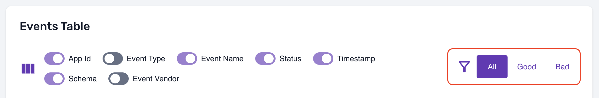
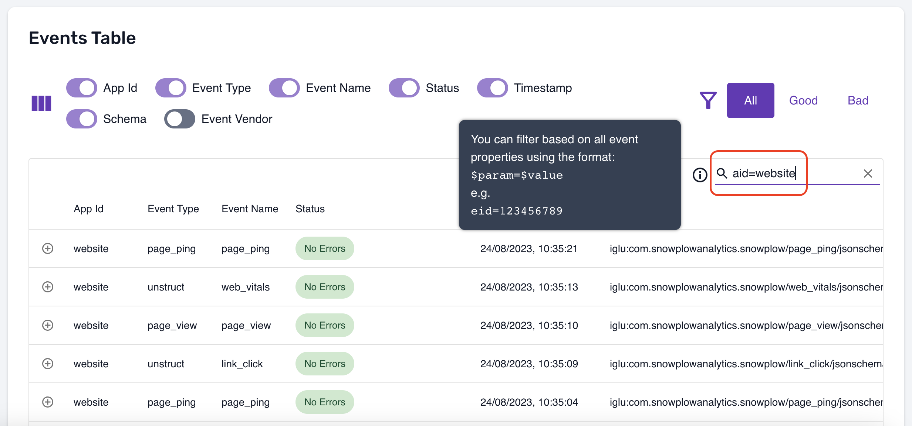
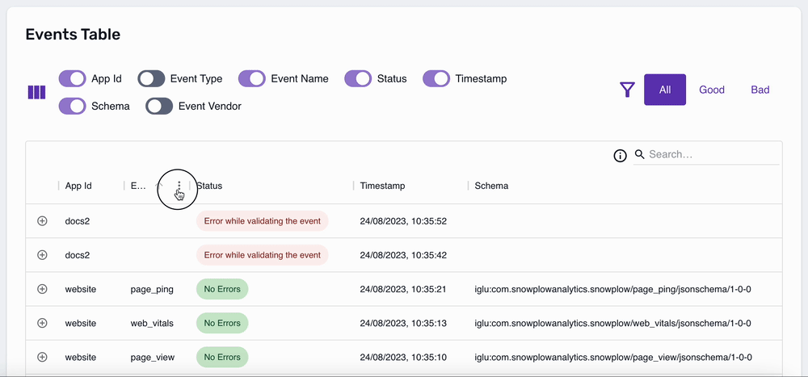
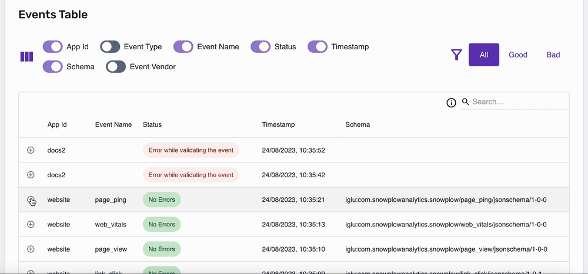
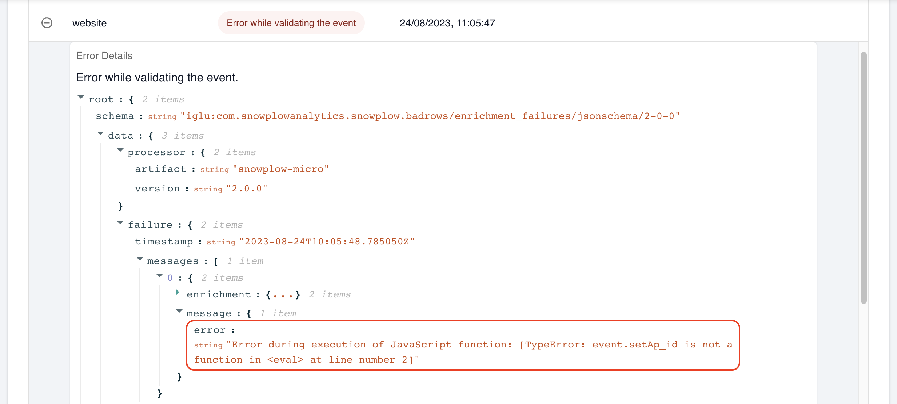

To view the Micro UI, head to [http://localhost:9090/micro/ui](http://localhost:9090/micro/ui) in your web browser (assuming you followed the [basic usage](/docs/data-product-studio/data-quality/snowplow-micro/basic-usage/index.md) instructions).

## Overview

The first thing you will see in the UI is the overview section, which tells you how many good (valid) and bad (failed) events you have received:

Below the overview, there is a table showing all events in more detail:

:::tip Sharing the UI with other people

Want to share this view with a colleague? See the section on [exposing Micro to the outside world](/docs/data-product-studio/data-quality/snowplow-micro/remote-usage/index.md#exposing-micro-via-a-public-domain-name). For example, if you use `ngrok`, you will get a link like `https://1328-...-4103.ngrok-free.app/micro/ui` which you can send to anyone for them to look at the same events.

:::

Note that you can reorder the columns in the table as you wish:

## Filtering events

There are a few ways to filter the events in the table.

First, there is a good/bad event selector:

Second, you can use the search bar, which supports both free text searches and searching within specific fields:

Finally, you can filter each column:

## Exploring event details

For valid events, you can expand the row to look at all the [event fields](/docs/fundamentals/canonical-event/index.md) in JSON:

Equally, for [failed events](/docs/fundamentals/failed-events/index.md), you can explore the failure message:

