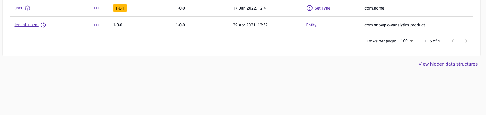

import ThemedImage from '@theme/ThemedImage';

To create a new [data structure](/docs/fundamentals/schemas/index.md) using Snowplow BDP Console, first navigate to **Data structures** in the menu and click the **Create a data structure** button.

You can select from two options: **Create using builder** or **Create using JSON**. The [data structures builder](/docs/data-product-studio/data-structures/manage/builder/index.md) only supports the following types:

- String
- Enumerated list
- Integer
- Decimal
- Boolean

For more complex data structures that require nesting or more advanced data types, use the [JSON editor](/docs/data-product-studio/data-structures/manage/json-editor/index.md).

<ThemedImage
  alt="Choice between builder and JSON editor options"
  width="60%"
  sources={{
    light: require('./images/builder-or-json.png').default,
    dark: require('./images/builder-or-json.png').default
  }}
/>

## Working with drafts

When you create a new data structure your changes are initially saved as a **draft**. Drafts allow you to:

- Make multiple changes without worrying about version numbers
- Experiment freely before committing to a final version
- Review and refine your data structure before deployment

**Important**: Draft data structures are not deployed to your development environment and will not be available for event validation. You must deploy your draft to the development environment when you're ready to test it.

This workflow gives you the flexibility to iterate on your data structure design without the overhead of managing version increments for every small change.

## Editing a data structure

To edit an existing data structure, navigate to **Data Structures** and locate the data structure you wish to edit. You can more easily find your data structure by:

- Using the search facility to search by name or vendor
- Ordering the Name column alphabetically
- Filtering the listing by Type and / or Vendor

Once located, click on the name to view the data structure. You can then select from two options to edit the data structure: [**Edit with builder**](./builder/index.md#editing-a-data-structure-with-the-data-structures-builder) or [**Edit with JSON editor**](./json-editor/index.md#editing-a-data-structure-with-the-json-editor).

:::note
The **Edit with builder** option will be unavailable if the data structure you're viewing is not supported. More complex data structures must be edited with the **JSON Editor**.
:::

## Promoting a data structure

When you're ready to use your data structure, you need to publish it from draft status to your development environment for testing.

Once you are happy with your changes in the development environment, you will want to migrate these changes to your production environment.

:::note

The action of migrating data structures to production is only available to Admin users.

:::

Navigate to **Data Structures** and locate the data structure you wish to migrate. You can more easily find your data structure by:

- Using the search facility to search by name or vendor
- Ordering the Name column alphabetically
- Filtering the listing by Type and / or Vendor

Once located, either click on the name to view the data structure and then click the "Migrate to production" button, or click the three dots to bring up the action menu where you can select "Migrate to production".

At this stage you will see the publish dialog, and depending on how you versioned your edits you will see one of two messages:

If you are **publishing a new schema**, or **have incremented** the version whilst editing then you will see a confirmation of the action. Click **Migrate to Production** to migrate the data structure.

If you **have patched** the version whilst editing then you will see a warning that you must increment before publishing. Patching the version on Production is not a permitted action. [Increment the version number according to the changes you have made](/docs/data-product-studio/data-structures/version-amend/index.md) and click **Migrate to production** to migrate the latest version of your data structure to your production environment.

Your data structure will now be available in your production environment to send events against.

* * *

## Hiding a data structure

Sometimes you will make errors when creating a data structure, or simply be creating new data structures as part of a quick experiment. On these occasions you may wish to hide the schema to clean up the listing in Console.

Navigate to **Data Structures** and locate the data structure you wish to hide. You can more easily find your data structure by:

- Using the search facility to search by name
- Ordering the Name column alphabetically
- Filtering the listing by Type and / or Vendor

Once located either click on the name to view the data structure and then click the **Hide** button, or click the three dots to bring up the action menu where you can select **Hide data structure**.

Follow the dialog instructions to confirm the action.

:::note

Hiding a data structure will not remove it from the registry, it simply hides it from the console listing, this means:

(1) events can still be sent against this structure
(2) you cannot create a new structure of the same name

:::

### Restoring a hidden data structure

If you have hidden a data structure and wish to restore it, navigate to the bottom of the list of data structures and locate the 'View hidden data structures' link.

This will take you to a list of hidden data structures, locate the one you wish to restore and click **Restore data structure** to show it in the main listing.

* * *

## Externally managed data structures

Data structures can be managed from an external repository using our [snowplow-cli](/docs/data-product-studio/data-structures/manage/cli/index.md) tool.

When a data structure is managed this way it becomes locked in the UI disabling all editing. You will see a banner explaining the situation and giving people with the 'publish to production' (default for admin users) capability the ability to unlock.

:::caution
Having a single source of truth for a data structure is a good idea. If your source of truth is an external repository then unlocking and editing will cause conflicts.
:::
