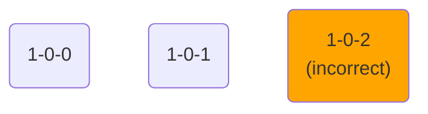
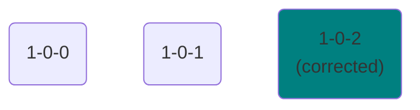
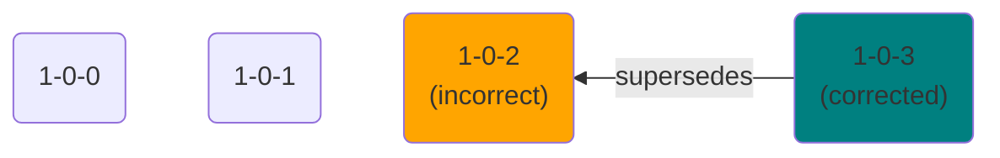
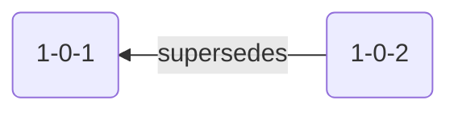
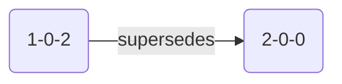
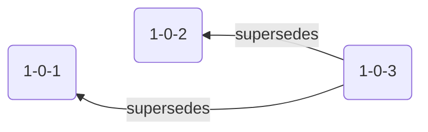
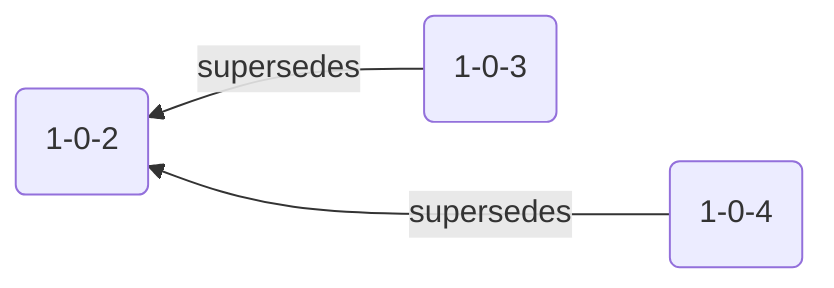
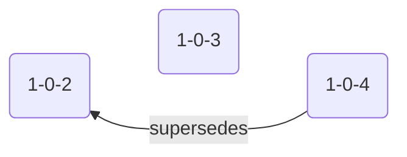
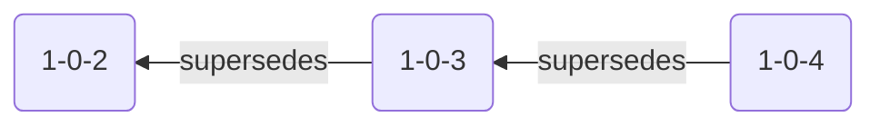

```mdx-code-block
import {versions} from '@site/src/componentVersions';
import CodeBlock from '@theme/CodeBlock';
```

Sometimes, small mistakes creep into your schemas. For example, you might mark an optional field as required, or make a typo in the name of one of the fields. In these cases, you will want to update the schema to correct the mistake.

## Treat schemas as immutable

It might be tempting to somehow “overwrite” the schema without updating the version. But this can bring several problems:
* Events that were previously valid could become invalid against the new changes.
* Your warehouse loader, which updates the table [according to the schema](/docs/api-reference/loaders-storage-targets/schemas-in-warehouse/index.md#versioning), could get stuck if it’s not possible to cast the data in the existing table column to the new definition (e.g. if you change a field type from a string to a number).
* Similarly, data models or other applications consuming the data downstream might not be able to deal with the changes.

The best approach is to just create a new schema version and update your tracking code to use it. However, there are two alternatives for when it’s not ideal.

## Patching the schema

If you are working on a new schema version in a development environment, there is usually little risk in overwriting the schema instead of creating a new version. That’s because the new schema version has not made it to production, so changing it will not corrupt any production data. Moreover, if you overwrite all incorrect schema versions, you will be left with a neat and tidy schema version history.

Before:



After:



We call this approach “patching”. To patch the schema, i.e. apply changes to it without updating the version:
* If you are using Snowplow CDI, select the “Patch” option [in the UI](/docs/data-product-studio/data-structures/manage/index.md) when saving the schema
* If you are using Snowplow Self-Hosted, do not increment the schema version when [uploading it with `igluctl`](/docs/data-product-studio/data-structures/manage/iglu/index.md)

:::danger

Never patch schemas in a production environment. This can break your loading, especially if your patch contains breaking changes (see [above](#treat-schemas-as-immutable)).

Also, never patch a schema version that exists in a production environment, even if you are doing the patching in a development environment. This will lead to problems later when you try to promote that schema to production.

:::

For Snowplow CDI customers, patching is disabled for production pipelines. Snowplow Self-Hosted users have to explicitly enable patching (if desired) in the [Iglu Server configuration](/docs/api-reference/iglu/iglu-repositories/iglu-server/reference/index.md) (`patchesAllowed`) at their own risk.

:::tip Schema caching

Note that various pipeline components, most importantly Enrich (including Enrich embedded in Snowplow Mini and Snowplow Micro), cache schemas to improve performance. The default caching time is 10 minutes (it’s controlled by the [Iglu Resolver configuration](/docs/api-reference/iglu/iglu-resolver/index.md)). This means that the effect of patching a schema will not be immediate.

:::

## Marking the schema as superseded


If your events are failing in production because of an incorrect schema, you might not be able to instantly update the tracking code to use a new schema version. This is a common situation for mobile tracking, for example. You can resolve this by marking the old schema version as superseded by the new schema version.

:::note

You need to be on Enrich 3.8.0+ and Iglu Server 0.11.0+ to use this feature. Additionally, if you are using [Snowplow Mini](/docs/api-reference/snowplow-mini/index.md) or [Snowplow Micro](/docs/testing/snowplow-micro/index.md), you will need version 0.17.0+ or 1.7.1+ respectively.

:::

Before:


After:



Here’s how this works, at a glance:
* Suppose schema `1-0-2` is wrong.
* Draft a new schema version correcting the issue.
* In the new schema, add the following field at the root: `"$supersedes": ["1-0-2"]`.
* [Set the version](/docs/data-product-studio/data-structures/version-amend/index.md) of the new schema as usual, i.e. `1-0-3` if there are no breaking changes or `2-0-0` if there are.
* [Add](/docs/data-product-studio/data-structures/manage/index.md) the new schema to your production environment.
* Events or entities that use schema `1-0-2` will now be automatically updated (in the Enrich application) to use version `1-0-3`, and will be validated against that version. (A special entity will be added to these events to record this fact.)

### Example

Let’s say we have a mobile application. We are sending certain events from this application, and these events contain entities with following schema:

<details>
  <summary>Geolocation <code>1-0-2</code></summary>

```json
{
    "$schema": "https://iglucentral.com/schemas/com.snowplowanalytics.self-desc/schema/jsonschema/1-0-0#",
    "description": "Schema for client geolocation contexts",
    "self": {
        "vendor": "com.acme",
        "name": "geolocation",
        "format": "jsonschema",
        "version": "1-0-2"
    },
    "type": "object",
    "properties": {
        "latitude": {
            "type": "number",
        },
        "longitude": {
            "type": "number",
        }
    },
    "additionalProperties": false
}
```

</details>

Later, we realize that when implementing tracking, we have mistakenly included an `altitude` field in the entity objects:

<details>
  <summary>Wrong tracking code (iOS)</summary>

```swift
let event = ScreenView(name: "Screen")
event.entities.add(
    SelfDescribingJson(schema: "iglu:com.acme/geolocation/jsonschema/1-0-2",
        andDictionary: [
            "latitude": 38.7223,
            "longitude": 9.1393,
            // highlight-next-line
            "altitude": 20 // extra field not defined in the schema
        ])!)
tracker.track(event)
```

</details>

Since `additionalProperties` is set to `false`, all events with the `altitude` field end up as [failed events](/docs/fundamentals/failed-events/index.md).

We can create a new schema with version `1-0-3` that contains the `altitude` field and then use this schema in the next version of the application. This would make the events valid. However, users will not update their application to the new version all at once. Events from the older version will continue to come, therefore there will still be failed events until all users start to use a newer version.

To solve this problem, we simply add the `$supersedes` definition to the new schema.

<details>
  <summary>Geolocation <code>1-0-3</code> with <code>$supersedes</code></summary>

```json
{
    "$schema": "https://iglucentral.com/schemas/com.snowplowanalytics.self-desc/schema/jsonschema/1-0-0#",
    // highlight-next-line
    "$supersedes": ["1-0-2"],
    "description": "Schema for client geolocation contexts",
    "self": {
        "vendor": "com.acme",
        "name": "geolocation",
        "format": "jsonschema",
        "version": "1-0-3"
    },
    "type": "object",
    "properties": {
        "latitude": {
            "type": "number",
        },
        "longitude": {
            "type": "number",
        },
        "altitude": {
            "type": "number",
        }
    },
    "additionalProperties": false
}
```

</details>

Now, when we receive events from the mobile application that use schema `1-0-2`, these events will be updated to use schema `1-0-3` and will be validated against that schema. Therefore, these events will be valid.

To record this fact, an extra entity will be added to all such events:

```json
{
    "schema": "iglu:com.snowplowanalytics.iglu/validation_info/jsonschema/1-0-0",
    "data": {
        "originalSchema": "iglu:com.acme/geolocation/jsonschema/1-0-2",
        "validatedWith": "1-0-3"
    }
}
```

Finally, if we [browse](/docs/data-product-studio/data-structures/manage/index.md) schema version `1-0-2`, we will see that Iglu Server automatically keeps track of which schema supersedes which. Specifically, it will now contain a `$supersededBy` definition:

<details>
  <summary>Geolocation <code>1-0-2</code> with <code>$supersededBy</code></summary>

```json
{
    "$schema": "https://iglucentral.com/schemas/com.snowplowanalytics.self-desc/schema/jsonschema/1-0-0#",
    // highlight-next-line
    "$supersededBy": "1-0-3",
    "description": "Schema for client geolocation contexts",
    "self": {
        "vendor": "com.acme",
        "name": "geolocation",
        "format": "jsonschema",
        "version": "1-0-2"
    },
    "type": "object",
    "properties": {
        "latitude": {
            "type": "number",
        },
        "longitude": {
            "type": "number",
        }
    },
    "additionalProperties": false
}
```

</details>

### Usage

The `$supersedes` field states that the schema version defined in the `self` part supersedes the schema versions listed in the `$supersedes` field (one or more). Its value must be an array of strings (even if it only includes one item). For example:

```json
...
"$supersedes": ["1-0-2", "1-0-3"],
...
```

:::note Patching and superseding

Once you’ve defined the `$supersedes` field for a schema version, you can’t update it — even in the development environment where [patching](#patching-the-schema) is allowed. However, you can change which schema version supersedes which by creating new schema versions.

For example, if version `1-0-2` is defined to supersede version `1-0-1`, and you create version `1-0-3` which also supersedes `1-0-1`, then `1-0-1` will be superseded by the newest version, i.e. `1-0-3`. See diagrams below for more information on how this is determined.

:::

:::tip Schema caching

Note that various pipeline components, most importantly Enrich (including Enrich embedded in Snowplow Mini and Snowplow Micro), cache schemas to improve performance. The default caching time is 10 minutes (it’s controlled by the [Iglu Resolver configuration](/docs/api-reference/iglu/iglu-resolver/index.md)). This means that the effect of superseding a schema will not be immediate.

:::

### Rules

#### A schema version can only supersede previous versions

For example, `1-0-2` can supersede `1-0-1`, but _can’t_ supersede `1-0-3`, `1-1-0`, or `2-0-0`. Iglu Server will reject a schema with a definition that breaks this rule.

<table>
<thead><tr><td align="center">✅ OK</td><td align="center">❌ Invalid</td></tr></thead>
<tbody>
<tr>
<td>



</td>
<td>



</td>
</tr>
</tbody>
</table>

#### A schema version can supersede multiple previous versions at once

Events referencing either of those previous versions will be treated as explained above.

<table>
<thead><tr><td align="center">✅ OK</td></tr></thead>
<tbody>
<tr>
<td>



</td>
</tr>
</tbody>
</table>

#### At any given moment, a schema version can only be superseded by a single schema version

Iglu Server automatically upholds this rule.

For example, if you specify that `1-0-3` supersedes `1-0-2` and (later) that `1-0-4` also supersedes `1-0-2`, the latest schema — `1-0-4` — will automatically become the one that supersedes `1-0-2`.

<table>
<thead><tr><td align="center">Specified</td><td align="center">Becomes</td></tr></thead>
<tbody>
<tr>
<td>



</td>
<td>



</td>
</tr>
</tbody>
</table>

The same happens if you specify “chains”, e.g. `1-0-3` supersedes `1-0-2` and `1-0-4` supersedes `1-0-3`. This will be automatically updated so that `1-0-4` supersedes `1-0-2` and `1-0-3`.

<table>
<thead><tr><td align="center">Specified</td><td align="center">Becomes</td></tr></thead>
<tbody>
<tr>
<td>



</td>
<td>


</td>
</tr>
</tbody>
</table>
