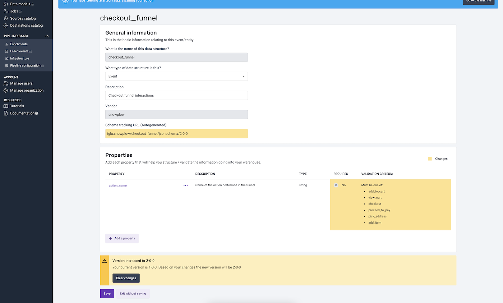
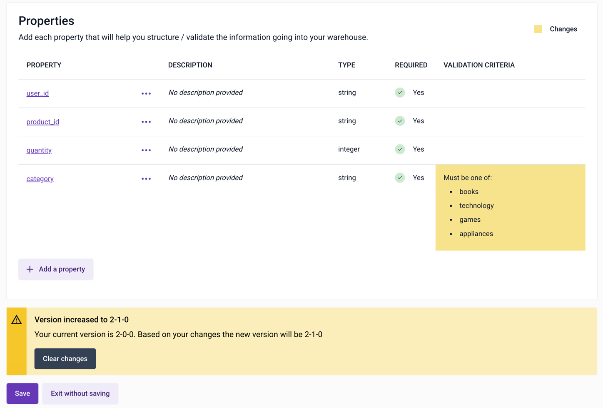

# Versioning with the Data Structures Builder

Versioning is automated when using the Data Structure Builder to create or edit your custom [Data Structures](/docs/fundamentals/schemas/index.md) for your [Events](/docs/fundamentals/events/index.md) and [Entities](/docs/fundamentals/entities/index.md).

**Breaking and non-breaking changes**

At the point of publishing a data structure, there are two options for versioning:
- **Non-breaking** - a non-breaking change is backward compatible with historical data and your warehouse loader.
- **Breaking** - a breaking change is not backwards compatible with historical data and/or your warehouse loader.

The Data Structure builder will automatically select how to version up your data structure depending on the changes you have just made.

